# ADR-001: Kubernetes Migratie Architectuur

| Veld | Waarde |
|------|--------|
| **Status** | Geaccepteerd (geïmplementeerd — zie implementatie status hieronder) |
| **Datum** | 2026-06-09 (besluit), 2026-06-15 (implementatie status update) |
| **Auteur** | Druppie Team |
| **Deciders** | Druppie architectuurteam |
| **Referentie** | [KUBERNETES-STRATEGY.md](./KUBERNETES-STRATEGY.md) |

> **Note (huidige staat):** Deze beslissingen reflecteren de live Hetzner K3s deployment. Het as-built systeem is gedocumenteerd in `docs/AS-BUILT-ARCHITECTURE.md`. Een migratie naar een gedeeld lokaal Rancher cluster is gepland — zie `docs/STORIES-KUBERNETES-VOLGENDE.md` (story M1). Beslissingen die hieronder gemarkeerd zijn als *superseded pending M1* worden herzien voor lokale hardware.

---

## Beslissingsoverzicht

| # | Beslissing | Keuze | Reden |
|---|-----------|-------|-------|
| 4.1 | Hosting | **Hetzner VMs + Ubuntu** | Commodity cloud, geen vendor lock-in, ~€80/mo basis (3 servers + infra + app pool) |
| 4.2 | Platform | **K3s (3 servers + 2 agent pools)** | CNCF certified, 3 servers voor etcd quorum, vaste infra pool + autoscaled app pool |
| 4.3 | Database | **CloudNativePG** | CNCF Sandbox, auto-failover <30s, ingebouwde PgBouncer, 1 operator voor 3 instances |
| 4.4 | Autoscaling | **HPA + KEDA** | HPA voor frontend (CPU), KEDA voor backend (LLM I/O-bound, CPU alleen is te traag) |
| 4.5 | Networking | **Traefik + cert-manager** | K3s standaard, Middleware CRDs, Let's Encrypt via cert-manager |
| 4.6 | Secrets | **Sealed Secrets** | Asymmetrisch versleuteld in git, lage complexiteit, geen extra infra |
| 4.7 | Monitoring | **kube-prometheus-stack** | De-facto standaard, Prometheus + Grafana + Alertmanager in 1 Helm chart |
| 4.8 | Registry | **Gitea Container Registry** | Al aanwezig in Druppie, OCI-compatible, nul extra infra |
| 4.9 | Deployment | **PR-based CI/CD op colab-dev** | GitHub Actions: PR merge naar `colab-dev` triggert build → push → deploy |
| 4.10 | MCP Modules | **Shared volume, vaste replicas** | Worden herbouwd als built-in backend tools, shared volume is tijdelijk en voldoende |
| 4.11 | High Availability | **PDB + anti-affinity + graceful shutdown** | Backend en frontend beschikbaar houden bij node failures en rolling updates |
| 4.12 | Cluster Provisioning | **hetzner-k3s CLI** | Ubuntu, 1 YAML config, 2-3 min cluster, alles ingebouwd (CCM, CSI, autoscaler) |
| 4.13 | Node Autoscaling | **Kubernetes Cluster Autoscaler (Hetzner provider)** | Upstream K8s, auto-provisioneert VMs bij Pending pods, ~60s nieuwe node |

---

## Context

Druppie draait op Docker Compose: een FastAPI backend, React frontend, 9 MCP microservices, Keycloak, Gitea, 3 PostgreSQL databases, en een sandbox-infrastructuur. De backend draait op 1 hardcoded replica. Er is geen autoscaling, geen database HA, en geen production-ready monitoring.

De migratie naar Kubernetes lost drie problemen op:

1. **Schaalbaarheid**: Backend en frontend moeten horizontaal schaalbaar zijn voor wisselende belasting
2. **Betrouwbaarheid**: Single points of failure elimineren (database failover, PDB, anti-affinity)
3. **Onderhoudbaarheid**: Gecentraliseerde monitoring, declaratieve configuratie, reproduceerbare deployments

Uitgangspunten: 100% open source, geen vendor lock-in, portable Helm chart.

Het spike-onderzoek ([KUBERNETES-STRATEGY.md](./KUBERNETES-STRATEGY.md)) bevat de volledige vergelijkingsmatrixen en technische onderbouwing voor alle keuzes hieronder.

---

## Beslissingen

### 4.1 Hosting: Hetzner VMs + Ubuntu — ⚠️ superseded pending local-Rancher migration (STORIES M1)

**Gekozen:** 3x Hetzner Cloud VM (CPX31: 4 vCPU, 8GB RAM, 160GB NVMe) met Ubuntu als OS.

**Waarom:** Cloud VMs zijn commodity. K3s draait op elke Linux machine. Verhuizen naar een andere provider (OVH, Scaleway, on-prem) betekent nieuwe VMs provisionen + K3s installeren + `helm install`. Geen cloud-specifieke API's, geen proprietary services, geen lock-in.

Ubuntu is de meest geteste OS voor K3s, heeft brede documentatie, en langdurige support releases (LTS).

**Afgewezen:**
- Bare metal: hoge CAPEX, fysiek begrensd, niet snel schaalbaar
- Managed Kubernetes (EKS, AKS, GKE): vendor lock-in, proprietary API's
- On-premises: geen data-residency eis die dit rechtvaardigt

### 4.2 Platform: K3s (3-server HA + twee agent pools)

**Gekozen:** K3s met een vast cluster van 3 server nodes (embedded etcd HA) plus twee agent pools: een vaste "infra" pool en een autoscaled "app" pool.

**Waarom:** K3s is CNCF-gecertificeerd (volledige Kubernetes API, identieke conformance tests). Eén binary van 70MB met alles erin: API server, scheduler, controller manager, etcd, containerd, Flannel CNI, CoreDNS, Traefik ingress, local-path storage.

**Node architectuur:**

| Rol | Aantal | Type | Functie | Scaling |
|-----|--------|------|---------|---------|
| **K3s Server** | **3 (vast)** | CPX31 (4 vCPU, 8GB) | Control plane: API server, scheduler, etcd | Niet autoscalable. 3 = minimum voor etcd quorum (1 mag falen) |
| **K3s Agent — infra pool** | **1-2 (vast)** | CPX31 (4 vCPU, 8GB) | Keycloak, Gitea, MCP modules, CNPG, monitoring | Niet autoscalable. Stabiele workloads die niet geëvinceerd mogen worden |
| **K3s Agent — app pool** | **1-10 (autoscaling)** | CPX31 (4 vCPU, 8GB) | Backend, Frontend | Cluster Autoscaler voegt toe/verwijdert op basis van Pending pods |

**Waarom 3 servers:** Etcd vereist een quorum (meerderheid) voor consistency. Met 3 nodes is het quorum 2 — 1 server mag falen zonder dat het cluster uitvalt. 1 server = geen HA (single point of failure). 5 servers = 2 mogen falen, maar overkill voor Druppie's schaal.

**Waarom twee agent pools:** Backend en frontend hebben wisselende load en moeten schalen. Keycloak, Gitea, MCP modules en CNPG hebben constante, voorspelbare load en mogen niet verstoord worden door de Cluster Autoscaler. Het scheiden in twee pools voorkomt dat infra services geëvinceerd worden wanneer de autoscaler nodes verwijdert. Dit houdt de setup het dichtst bij de Docker Compose / Kind architectuur waar alles "gewoon draait".

**Waarom masters geen workloads draaien:** `schedule_workloads_on_masters: false` in hetzner-k3s. De control plane moet geïsoleerd blijven — als workloads alle resources verbruiken, reageert de API server niet meer.

```
┌─ 3x K3s Server (vast) ───────────────────────────────┐
│  etcd quorum + API server + scheduler                 │
│  Geen workloads (NoSchedule taint)                    │
└───────────────────────────────────────────────────────┘

┌─ 1-2x Agent: infra pool (vast) ──────────────────────┐
│  Keycloak (1 pod)    Gitea (1 pod + registry)         │
│  MCP modules (9 pods, shared volume)                  │
│  CloudNativePG (3 DB clusters, 9 pods)                │
│  Monitoring (Prometheus, Grafana, Alertmanager)        │
│  Sealed Secrets, cert-manager, KEDA, Cluster Autoscl. │
│  → Vaste nodes, nooit geëvinceerd                     │
└───────────────────────────────────────────────────────┘

┌─ 1-10x Agent: app pool (autoscaling) ────────────────┐
│  Backend (2-10 pods, HPA + KEDA)                      │
│  Frontend (2-8 pods, HPA)                             │
│  → Cluster Autoscaler beheert dit pool                │
└───────────────────────────────────────────────────────┘
```

**Afgewezen:**
- RKE2: meer resources, complexer, pas nuttig bij multi-cluster management
- OpenShift/OKD: ~8GB+ RAM footprint, afwijkende standaarden (Routes, SCC), Dockerfile aanpassingen nodig
- Vanilla kubeadm: veel handmatig werk, geen ingebouwde tooling
- Kind: alleen voor development/CI, geen persistent storage, geen HA

**Development/CI:** Kind blijft in gebruik voor lokale development en CI pipelines.

### 4.3 Database: CloudNativePG

**Gekozen:** CloudNativePG operator (v1.29.1+) met 3 database clusters: `druppie-db`, `keycloak-db`, `gitea-db`.

> **Implementatie status (juni 2026):** ✅ Voltooid met afwijkingen:
> - **instances=1** per cluster (ADR stelt 3 voor). Reden: kostenbesparing op CPX32 nodes. Upgrade naar `instances: 3` is een one-line values change wanneer een tweede infra node beschikbaar is.
> - **PgBouncer Pooler** (2 instances, transaction-mode) toegevoegd voor druppie-db. Dit was niet in het oorspronkelijke plan maar essentieel gebleken: lost connection pool exhaustion op bij hoge load (125+ rps).
> - Data succesvol gemigreerd van oude StatefulSet PVCs.
> - **Nog ontbreken:** HA replicas (instances=3), backups naar S3/MinIO, geautomatiseerde password sync.

**Waarom:** CloudNativePG is de enige PostgreSQL operator met CNCF Sandbox status. Het beheert de volledige lifecycle: provisioning, streaming replicatie, automatische failover (<30s), continuous backup naar S3/MinIO, point-in-time recovery, zero-downtime rolling updates, en ingebouwde PgBouncer connection pooling.

Eén operator beheert alle drie de databases als aparte `Cluster` CRDs. Geen extra infrastructuur.

**Belangrijk:** Altijd v1.29.1+ gebruiken. Deze release fixt CVE-2026-44477 (CVSS 9.4, Critical) en drie HA failover bugs.

```yaml
apiVersion: postgresql.cnpg.io/v1
kind: Cluster
metadata:
  name: druppie-db
spec:
  instances: 3
  postgresql:
    parameters:
      shared_buffers: "256MB"
      max_connections: "200"
  storage:
    size: 20Gi
    storageClass: local-path
  backup:
    barmanObjectStore:
      destinationPath: "s3://druppie-backups/db"
      endpointURL: "http://minio:9000"
      s3Credentials:
        accessKeyId:
          name: minio-creds
          key: access-key
        secretAccessKey:
          name: minio-creds
          key: secret-key
    retentionPolicy: "30d"
  monitoring:
    enablePodMonitor: true
```

**Afgewezen:**
- CrunchyData PGO: 19 CRDs (vs 6 voor CNPG), complexere configuratie, geen CNCF status
- Zalando PG Operator: minder actief onderhouden, geen ingebouwde backup
- Managed database (cloud): vendor lock-in
- Container PostgreSQL: geen HA, geen failover, geen backup (alleen dev)

### 4.4 Autoscaling: HPA + KEDA

**Gekozen:** HPA (CPU-based) voor frontend, KEDA (dual-trigger) voor backend.

> **Implementatie status (juni 2026):** ✅ Voltooid met belangrijke afwijking:
> - **Dual triggers** in plaats van Prometheus-only: PostgreSQL query (`agent_runs WHERE status='running'`) **+** CPU utilization 55%. Beide nodig: PG trigger vangt LLM I/O-bound werk op, CPU trigger vangt read-heavy GET load op.
> - **minReplicas: 3** (proactieve baseline, niet 2 zoals ADR).
> - **Aggressive scale-up:** +4 pods/30s, `stabilizationWindowSeconds: 0`.
> - `metricType` op trigger niveau (KEDA v2.20 API — NIET in metadata).
> - **Load test bewezen:** 125 rps → p95=508ms, 1→6 pods, 100% success rate.

**Waarom HPA voor beide services:** Frontend is pure static file serving, CPU is een betrouwbare metric. Backend krijgt HPA als basislaag.

**Waarom KEDA extra voor de backend:** LLM calls zijn I/O-bound (wachten op externe API responses), niet CPU-bound. CPU-utilisatie blijft laag terwijl de wachtrij volloopt. KEDA schaalt op `druppie_pending_agent_runs` (een Prometheus metric gebaseerd op een database query), wat de daadwerkelijke workload reflecteert in plaats van CPU-gebruik.

| Service | Min replicas | Max replicas | Scaling trigger |
|---------|-------------|-------------|-----------------|
| Frontend | 2 | 8 | HPA op CPU (70%) |
| Backend | 2 | 10 | HPA op CPU (70%) + KEDA op queue depth (>5 pending) |

**HPA configuratie (backend):**

```yaml
apiVersion: autoscaling/v2
kind: HorizontalPodAutoscaler
metadata:
  name: druppie-backend
spec:
  scaleTargetRef:
    apiVersion: apps/v1
    kind: Deployment
    name: druppie-backend
  minReplicas: 2
  maxReplicas: 10
  metrics:
    - type: Resource
      resource:
        name: cpu
        target:
          type: Utilization
          averageUtilization: 70
  behavior:
    scaleUp:
      stabilizationWindowSeconds: 60
      policies:
        - type: Pods
          value: 2
          periodSeconds: 60
    scaleDown:
      stabilizationWindowSeconds: 300
      policies:
        - type: Percent
          value: 50
          periodSeconds: 60
```

**KEDA configuratie (backend):**

```yaml
apiVersion: keda.sh/v1alpha1
kind: ScaledObject
metadata:
  name: druppie-backend-keda
spec:
  scaleTargetRef:
    name: druppie-backend
  minReplicaCount: 2
  maxReplicaCount: 10
  triggers:
    - type: prometheus
      metadata:
        serverAddress: http://prometheus:9090
        metricName: druppie_pending_agent_runs
        query: sum(druppie_pending_agent_runs)
        threshold: "5"
  advanced:
    horizontalPodAutoscalerConfig:
      behavior:
        scaleDown:
          stabilizationWindowSeconds: 300
          policies:
            - type: Percent
              value: 50
              periodSeconds: 60
```

De `behavior` sectie voorkomt oscillatie: bij AI workloads ontstaan korte spikes, en zonder stabilization window schalen pods constant op en af.

**Afgewezen:**
- Alleen HPA op CPU: te traag voor I/O-bound LLM workloads
- VPA in auto-mode: herstart pods, onacceptabel voor langlopende sessies (alleen recommendation mode)
- Scale-to-zero: niet gewenst bij een governance platform dat altijd beschikbaar moet zijn

### 4.5 Networking: Traefik + cert-manager

**Gekozen:** Traefik (K3s standaard ingress controller) + cert-manager voor TLS. DNS wijst direct naar het IP van de infra node.

**Waarom:** K3s installeert Traefik automatisch. Geen extra configuratie nodig. Traefik biedt Middleware CRDs voor rate limiting en headers (schoner dan NGINX annotations), een dashboard voor real-time traffic monitoring, en IngressRoute CRDs voor complexe routing.

De infra node is een vaste node die altijd beschikbaar is. DNS records (druppie.rijnland.dev, auth.druppie.rijnland.dev, git.druppie.rijnland.dev) wijzen naar het publieke IP van de infra node. Traefik draait op de infra node en routeert verkeer naar de juiste pods via Kubernetes Ingress resources. Dit bespaart de kosten van een aparte load balancer (~€6/mo).

**Let op:** Als de infra node onverhoopt uitvalt, is de site onbereikbaar. Dit is acceptabel voor Phase 1 — de infra node draait stabiele workloads met voorspelbare belasting. Voor Phase 2 kan een failover IP of tweede infra node worden toegevoegd.

cert-manager + Let's Encrypt verzorgt automatische TLS certificaten. Geen handmatig certificaatbeheer.

**Afgewezen:**
- Hetzner Load Balancer: extra €6/mo, niet nodig bij 1 vaste infra node die alle ingress verkeer afhandelt
- NGINX Ingress: geen toegevoegde waarde boven Traefik, annotations worden rommelig bij complexe configuratie
- Cilium Ingress: te zwaar voor huidige behoeften, hogere leercurve
- HAProxy: overkill voor deze schaal

### 4.6 Secrets: Gitignored Values Overlay (beslissing overschreven)

**Gekozen:** Gitignored `values-hetzner.secrets.yaml` overlay. **Oorspronkelijke keuze was Sealed Secrets — overschreven tijdens implementatie.**

> **Implementatie status (juni 2026):** ✅ De gitignored overlay wordt geaccepteerd als definitieve oplossing. Sealed Secrets is uitgesteld naar Phase 2 (indien ooit nodig).

**Waarom afgeweken van Sealed Secrets:** Bij implementatie bleek dat de gitignored overlay simpeler, veiliger (secrets staan letterlijk niet in de repo), en voldoende is voor een klein team. Sealed Secrets voegt een operator, key backup procedures, en encrypted secrets in git toe — complexiteit zonder duidelijke meerwaarde voor deze use case.

**Huidige aanpak:** Secrets in `values-hetzner.secrets.yaml` (gitignored), toegepast via `helm upgrade -f values-hetzner.secrets.yaml`. Backup offline in password manager.

### 4.7 Monitoring: kube-prometheus-stack

**Gekozen:** kube-prometheus-stack (Prometheus + Grafana + Alertmanager).

**Waarom:** De de-facto standaard voor Kubernetes monitoring. Eén `helm install` levert: Prometheus (metrics), Grafana (dashboards), Alertmanager (notificaties), Node-exporter (host metrics), en kube-state-metrics (K8s object metrics).

CloudNativePG exporteert automatisch PostgreSQL metrics via PodMonitor. KEDA, Traefik, en Keycloak hebben native Prometheus endpoints. Alles centraliseert in Grafana.

**Afgewezen:**
- Victoria Metrics: efficiënter, maar een extra abstraction layer die we niet nodig hebben
- Managed monitoring (cloud): vendor lock-in
- Zelfbouw Prometheus stack: teveel configuratiewerk

### 4.8 Container Registry: Gitea Built-in Registry

**Gekozen:** Gitea Container Registry (al aanwezig in Druppie).

**Waarom:** Gitea heeft een ingebouwde OCI-compatible container registry. Nul extra infrastructuur. Images pushen naar dezelfde Gitea instance die al git repos host. Harbor toevoegen als er behoefte komt aan vulnerability scanning of image signing.

**Afgewezen:**
- Harbor: nuttige features (Trivy scanning, Cosign signing) maar extra infra en operationeel overhead die we nu niet nodig hebben
- Docker Distribution: te basic, geen UI
- GitHub GHCR: niet self-hosted
- Zot: onvoldoende community adoptie

### 4.9 Deployment: PR-based CI/CD op `colab-dev`

**Gekozen:** PR-based CI/CD met GitHub Actions. De default branch is `colab-dev` (niet `main`). Pipeline triggert op merge naar `colab-dev` (of een configureerbare branch via workflow variable).

**Waarom:** Druppie's core code host op GitHub. PR-based deploy betekent: elke change gaat via PR review → CI build → automatic deploy na merge. Dit geeft code review als quality gate en een audit trail van elke productie-release.

**Pipeline flow:**

```
PR open → CI: lint + test + build (preview)
PR merge naar colab-dev → CI: build images → push naar Gitea registry → helm upgrade op K3s
```

```yaml
# .github/workflows/deploy.yml
on:
  push:
    branches: [colab-dev]   # Configureerbaar: ook andere branches mogelijk
  pull_request:
    branches: [colab-dev]   # Preview builds op PRs

jobs:
  deploy:
    if: github.event_name == 'push'  # Alleen deployen op merge
    steps:
      - name: Build & push images
        run: |
          docker build -t $REGISTRY/druppie-backend:$SHA ./druppie
          docker push $REGISTRY/druppie-backend:$SHA
      - name: Deploy to K3s
        run: |
          helm upgrade druppie helm/druppie/ \
            --namespace druppie \
            --values helm/druppie/values-prod.yaml \
            --set global.imageRegistry=$REGISTRY/ \
            --set global.imageTag=$SHA \
            --wait --timeout 600s
```

**Branch:** `colab-dev` is de default branch. Deploy target is configureerbaar via de workflow `branches` config. `main` is deprecated en wordt verwijderd.

**Afgewezen:**
- ArgoCD: GitOps met drift detection, maar complexer en vereist een extra server in het cluster. Wordt toegevoegd in Phase 2 als er meerdere omgevingen zijn en drift detection nodig wordt.
- FluxCD: vergelijkbaar met ArgoCD maar zonder web dashboard
- Handmatige `helm upgrade`: geen audit trail, geen quality gate

### 4.10 MCP Modules: Shared Volume, Geen Scaling

**Gekozen:** MCP modules draaien met vaste replicas (1-2 per module) en delen een PVC via de K3s local-path provisioner. Geen onafhankelijke scaling, geen RWX storage driver.

**Waarom deze keuze gerechtvaardigd is:** MCP modules worden in een latere fase herbouwd als built-in backend tools. Ze verdwijnen als losse services en worden onderdeel van de backend applicatie zelf. Dat elimineert de shared volume noodzaak volledig. De investering in onafhankelijke module scaling (Longhorn RWX, per-module HPA, service mesh) is weggegooid geld omdat de architectuur fundamenteel verandert.

Tot die tijd voldoet een simpele shared PVC. De modules hebben lage en voorspelbare belasting. Ze schalen mee met het cluster (meer nodes = meer beschikbaarheid), niet onafhankelijk.

**Afgewezen:**
- Longhorn RWX volumes: alleen nuttig als modules onafhankelijk schalen, wat niet gaat gebeuren
- Sidecar pattern: elke backend replica draait alle modules, te veel resource overhead
- Per-session microservices: te complex voor een tijdelijke oplossing

### 4.11 High Availability: PDB + Anti-affinity + Graceful Shutdown

**Gekozen:** PodDisruptionBudgets, pod anti-affinity, en graceful shutdown voor backend en frontend (app pool). Keycloak, Gitea, MCP modules en CNPG draaien op de vaste infra pool en hoeven geen eigen PDB — de infra nodes worden niet geëvinceerd.

> **Implementatie status (juni 2026):** ✅ Voltooid met afwijking per omgeving:
> - **`values-prod.yaml` (multi-node):** PDB + anti-affinity **ingeschakeld** (`highAvailability.pdb.enabled: true`, `highAvailability.antiAffinity.enabled: true`). Dit is de configuratie die deze beslissing implementeert.
> - **`values-hetzner.yaml` (huidige single-node deployment):** PDB + anti-affinity **uitgeschakeld**. Reden: bij één schedulbare node kan anti-affinity replicas niet over nodes spreiden en zou een PDB met `minAvailable: 1` node drains blokkeren. Dezelfde kostenafweging als CNPG `instances: 1` (§4.3). Wordt automatisch effectief zodra een tweede app-pool node beschikbaar is — een one-line values change.
> - Graceful shutdown (`terminationGracePeriodSeconds`) en de advisory-lock leader election werken in beide omgevingen.

**PDB** garandeert dat Kubernetes nooit alle pods tegelijk weghaalt tijdens onderhoud:

```yaml
apiVersion: policy/v1
kind: PodDisruptionBudget
metadata:
  name: druppie-backend-pdb
spec:
  minAvailable: 1
  selector:
    matchLabels:
      app: druppie-backend
```

**Anti-affinity** spreidt pods over verschillende nodes, zodat één node failure niet alle replicas raakt:

```yaml
affinity:
  podAntiAffinity:
    preferredDuringSchedulingIgnoredDuringExecution:
      - weight: 100
        podAffinityTerm:
          labelSelector:
            matchLabels:
              app: druppie-backend
          topologyKey: kubernetes.io/hostname
```

**Graceful shutdown:** Backend pods moeten lopende LLM calls afronden voor ze stoppen. `terminationGracePeriodSeconds: 60` met SIGTERM handling in FastAPI die nieuwe requests weigert maar actieve afrondt.

**Backend multi-replica:** De backend is stateless. Session task concurrency wordt bewaakt via `SELECT ... FOR UPDATE` op de session row in PostgreSQL (vervangt de vroegere in-memory dict). De `reconstruct_from_db()` functie rebuildt agent state vanuit de database. Bij multi-replica werkt de webhook handler als volgt: update het ToolCall record in de DB, waarna elke backend replica de agent kan oppakken en doorgaan. Database-driven resume, geen nieuwe infrastructuur nodig.

Singleton achtergrondtaken (JobScheduler, sandbox watchdog) gebruiken PostgreSQL advisory locks (`pg_try_advisory_lock`) voor leader election. Alleen de replica die de lock verwerpt start de taak; andere replica's slaan hem over. De lock is verbindingsscoped — als de leader pod sterft, wordt de verbinding verbroken en komt de lock vrij, zodat een andere replica deze bij de volgende herstart kan opeisen. Geen extra infrastructuur nodig.

### 4.12 Cluster Provisioning: hetzner-k3s — ⚠️ superseded pending local-Rancher migration (STORIES M1)

**Gekozen:** `hetzner-k3s` CLI tool (vitobotta/hetzner-k3s, MIT licentie, 3.5k+ GitHub stars).

**Waarom:** Eén YAML configuratie file definieert het hele cluster: 3 master nodes (embedded etcd HA), worker pools met autoscaling, networking, firewall. De tool installeert automatisch: K3s, Hetzner CCM, CSI driver, System Upgrade Controller, en Cluster Autoscaler. Cluster klaar in 2-3 minuten. Ubuntu als OS (default).

**K3s architectuur — Servers vs Agents:**

K3s kent twee nodetypes. **Servers** draaien de control plane (API server, scheduler, controller manager) plus embedded etcd voor cluster state. **Agents** draaien alleen de kubelet en voeren pods uit — geen control plane, geen etcd. Voor HA draaien 3 servers met embedded etcd (1 mag falen, quorum blijft intact). Alle workloads draaien op agents; servers zijn puur control plane (`schedule_workloads_on_masters: false`). De Cluster Autoscaler beheert uitsluitend agent nodes — servers zijn vast.

```yaml
# cluster.yaml — complete cluster definitie
hetzner_token: <token>
cluster_name: druppie
k3s_version: v1.32.3+k3s1

schedule_workloads_on_masters: false   # Masters = puur control plane

masters_pool:                          # K3s SERVERS — control plane + etcd
  instance_type: cpx31                 # 3 servers = HA (etcd quorum)
  instance_count: 3                    # Vast, niet autoscalable
  location: fsn1

worker_node_pools:
- name: infra                          # INFRA POOL — vast
  instance_type: cpx31
  instance_count: 1                    # 1-2 vaste nodes
  location: fsn1
  autoscaling:
    enabled: false                     # Niet autoscalable
  labels:
    pool: infra                        # Keycloak, Gitea, MCP, CNPG, monitoring
  taints: []                           # Geen taint — schedulable voor infra workloads

- name: app                            # APP POOL — autoscaling
  instance_type: cpx31
  instance_count: 1                    # Min 1, max 10
  location: fsn1
  autoscaling:
    enabled: true
    min_instances: 1
    max_instances: 10                  # Cluster Autoscaler beheert
  labels:
    pool: app                          # Backend, Frontend
  taints: []                           # Geen taint — schedulable voor app workloads
```

**Afgewezen:**
- kube-hetzner (Terraform): MicroOS i.p.v. Ubuntu, Terraform leercurve, meer complexiteit
- Custom Terraform: meer werk, zelf alles configureren
- Handmatige setup: niet reproduceerbaar, geen IaC

### 4.13 Node Autoscaling: Cluster Autoscaler (Hetzner) — ⚠️ superseded pending local-Rancher migration (STORIES M1)

**Gekozen:** Officiële Kubernetes Cluster Autoscaler met ingebouwde Hetzner Cloud provider (`--cloud-provider=hetzner`).

**Waarom:** HPA/KEDA schalen pods, maar als alle nodes vol zitten, blijven pods Pending. De Cluster Autoscaler detecteert Pending pods, provisioneert automatisch nieuwe Hetzner VMs via de Cloud API, en laat ze joinen via cloud-init. Bij onderbelasting worden nodes automatisch verwijderd.

**Twee-tier autoscaling architectuur:**

| Tier | Wat | Tool | Trigger | Snelheid |
|------|-----|------|---------|----------|
| **1. Pod scaling** | Pods toevoegen/verwijderen | HPA + KEDA | CPU usage, queue depth | Seconden |
| **2. Node scaling** | VMs toevoegen/verwijderen | Cluster Autoscaler | Pending pods (geen capaciteit) | ~60 seconden |

Flow:
```
Load spike
  → HPA: meer pods nodig
    → Nodes vol? Pods blijven Pending
      → Cluster Autoscaler: nieuwe VM via Hetzner API
        → Cloud-init: K3s agent install + join
          → Node ready → Pending pods ingepland
```

**Afgewezen:**
- Karpenter: geen Hetzner provider beschikbaar, niet op de roadmap
- Handmatig VMs toevoegen: niet automatisch, trage reactietijd
- Terraform-gestuurde scaling: state drift conflict met Cluster Autoscaler

---

## Out of Scope (Niet in Phase 1)

| Onderwerp | Waarom niet nu | Wanneer |
|-----------|----------------|---------|
| **Sandbox migratie** (Docker → K8s) | Docker socket dependency vereist significante refactor. Sandbox blijft op Docker tot Agent Sandbox operator stabiel is (v1alpha1 risico). | Phase 2 |
| **MCP module autoscaling** | Modules worden herbouwd als built-in backend tools. Onafhankelijke scaling is weggegooide investering. | Vervalt |
| **ArgoCD** | Push-based CI/CD is voldoende voor één omgeving. ArgoCD wordt nuttig bij meerdere environments en drift detection. | Phase 2 |
| **Agent Sandbox operator** | v1alpha1 API kan significant veranderen. Eerst de SDK evalueren op Kind. | Phase 2 |
| **Longhorn** | Niet nodig zolang modules geen onafhankelijke RWX volumes nodig hebben. Local-path provisioner volstaat. | Phase 2 (indien nodig) |
| **gVisor / Kata Containers** | Sandbox runtime isolatie. Pas relevant als sandboxes naar K8s migreren. | Phase 2 |
| **Event-driven backend** (message queue) | Backend draait Phase 1 met 2-10 replicas en database-driven resume. Message queue (Redis Streams/NATS) wordt toegevoegd als de belasting het rechtvaardigt. | Phase 2 |
| **Network Policies** | Per-namespace isolatie. Nuttig, maar niet blocking voor Phase 1. | Phase 2 |
| **Harbor registry** | Vulnerability scanning en image signing. Gitea registry volstaat. | Phase 2 |
| **Distributed tracing** (Jaeger/Tempo) | Nuttig bij 20+ services met complexe request flows. Nog niet nodig. | Phase 3 |
| **Database partitioning** | Pas relevant bij >100k tool_calls/llm_calls records. | Phase 3 |

---

## Doelarchitectuur

```mermaid
flowchart TB
    subgraph Internet["Internet"]
        USER["Gebruiker"]
    end

    subgraph GitHub["GitHub (Core Code)"]
        REPO["druppie-kubernetes<br/>branch: colab-dev"]
        GHA["GitHub Actions<br/>CI/CD Pipeline"]
    end

    subgraph Hetzner["Hetzner Cloud"]
        HAPI["Hetzner Cloud API"]

        subgraph Provisioning["Cluster Provisioning"]
            HK3S["hetzner-k3s CLI<br/>1 YAML config"]
        end

        subgraph K3sCluster["K3s Cluster"]
            direction TB

            subgraph MasterNodes["🖥️ K3s Servers — Control Plane (3 vast, etcd HA)"]
                direction LR
                M1["server-1<br/>etcd + API"]
                M2["server-2<br/>etcd + API"]
                M3["server-3<br/>etcd + API"]
            end

            subgraph InfraPool["📦 Infra Pool — K3s Agents (1-2 vast)"]
                direction TB

                subgraph IngressLayer["Ingress"]
                    TRAEFIK["Traefik<br/>(ingress controller)"]
                    CM["cert-manager"]
                end

                subgraph InfraServices["Services"]
                    direction LR
                    KC["Keycloak<br/>1 pod"]
                    GT["Gitea<br/>1 pod<br/>+ Registry"]
                end

                subgraph MCPModules["MCP Modules"]
                    direction LR
                    MC["module-coding"]
                    MD["module-docker"]
                    MO["+ 6 modules"]
                end

                subgraph SharedVol["Shared PVC"]
                    PVC["MCP workspace"]
                end

                subgraph DBLayer["CloudNativePG"]
                    direction LR
                    subgraph DB1["druppie-db"]
                        DB1P["Primary"]
                        DB1R1["Replica"]
                        DB1R2["Replica"]
                    end
                    subgraph DB2["keycloak-db"]
                        DB2P["Primary"]
                        DB2R1["Replica"]
                        DB2R2["Replica"]
                    end
                    subgraph DB3["gitea-db"]
                        DB3P["Primary"]
                        DB3R1["Replica"]
                        DB3R2["Replica"]
                    end
                end

                subgraph PlatformLayer["Platform"]
                    direction LR
                    PROM["Prometheus"]
                    GRAF["Grafana"]
                    SS["Sealed Secrets"]
                    KEDAO["KEDA"]
                    CA["Cluster<br/>Autoscaler"]
                end

                INFRA_LABEL["✅ Vast — nooit geëvinceerd door autoscaler"]
            end

            subgraph AppPool["🚀 App Pool — K3s Agents (1-10 autoscaling)"]
                direction TB

                subgraph AppNode1["app-node-1"]
                    direction LR
                    A1FE["frontend<br/>pod"]
                    A1BE["backend<br/>pod"]
                end

                subgraph AppNode2["app-node-2"]
                    direction LR
                    A2FE["frontend<br/>pod"]
                    A2BE["backend<br/>pod"]
                end

                subgraph AppNodeN["app-node-N<br/>(auto-provisioned)"]
                    direction LR
                    ANFE["frontend<br/>pod"]
                    ANBE["backend<br/>pod"]
                end

                PODSCALE["⬆ POD SCALING (Tier 1)<br/>HPA: CPU 70% · KEDA: queue > 5<br/>Nieuwe pods op bestaande nodes"]
            end

            NODESCALE["⬆ NODE SCALING (Tier 2)<br/>Cluster Autoscaler → Hetzner API: nieuwe VM → cloud-init join<br/>~60 seconden"]
        end
    end

    %% User flow — DNS points directly to infra node
    USER -->|"HTTPS via DNS"| TRAEFIK
    TRAEFIK -->|"/"| A1FE
    TRAEFIK -->|"/"| A2FE
    TRAEFIK -->|"/api"| A1BE
    TRAEFIK -->|"/api"| A2BE
    CM -.->|"TLS"| TRAEFIK

    %% CI/CD
    REPO -->|"PR merge"| GHA
    GHA -->|"docker push"| GT
    GHA -->|"helm upgrade"| K3sCluster

    %% App → Infra connections
    A1BE -->|"MCP calls"| MC
    A2BE -->|"MCP calls"| MC
    MCPModules ---|"r/w"| PVC
    A1BE -->|"auth"| KC
    A2BE -->|"git push"| GT
    A1BE -->|"queries"| DB1
    KC -->|"queries"| DB2
    GT -->|"queries"| DB3

    %% Pod scaling (Tier 1)
    KEDAO -.->|"KEDA trigger"| PODSCALE
    PODSCALE -.->|"meer pods"| AppPool

    %% Node scaling (Tier 2)
    PODSCALE -.->|"nodes vol?"| CA
    CA -.->|"create VM"| HAPI
    HAPI -.->|"new agent"| NODESCALE
    NODESCALE -.-> AppPool

    %% Monitoring
    PROM -.->|"scrape"| AppPool
    PROM -.->|"scrape"| DBLayer

    %% Provisioning
    HK3S -.->|"create cluster"| HAPI

    %% Styling
    style K3sCluster fill:#1a1a2e,color:#e0e0e0
    style Internet fill:#transparent
    style GitHub fill:#24292e,color:#ffffff
    style Hetzner fill:#f0f0f0
    style MasterNodes fill:#2d3436,color:#e0e0e0
    style InfraPool fill:#0984e3,color:#ffffff
    style AppPool fill:#00b894,color:#1a1a2e
    style AppNode1 fill:#16213e,color:#e0e0e0
    style AppNode2 fill:#16213e,color:#e0e0e0
    style AppNodeN fill:#16213e,color:#e0e0e0
    style DBLayer fill:#0f3460,color:#e0e0e0
    style PlatformLayer fill:#1a1a2e,color:#e0e0e0
    style IngressLayer fill:#533483,color:#e0e0e0
    style InfraServices fill:#1a1a2e,color:#e0e0e0
    style SharedVol fill:#2d3436,color:#e0e0e0
    style Provisioning fill:#dfe6e9
    style MCPModules fill:#2d3436,color:#e0e0e0
    style NODESCALE fill:#d63031,color:#ffffff
    style PODSCALE fill:#fdcb6e,color:#1a1a2e
```



---

## Fasering

### Week 1-2: Cluster Setup

- hetzner-k3s CLI installeren, cluster.yaml configureren, cluster aanmaken (2-3 min)
- Cluster provisioning via hetzner-k3s (3 masters + 1-10 autoscaled workers, Ubuntu)
- Traefik ingress verifiëren (K3s standaard)
- kube-prometheus-stack deployen

### Week 3-4: Database + Storage

- CloudNativePG operator installeren (v1.29.1+)
- 3 database clusters aanmaken: druppie-db, keycloak-db, gitea-db
- Failover scenario testen op staging
- Backup naar S3/MinIO configureren en verifiëren

### Week 5-6: Applicatie Deploy

- Helm chart aanpassen voor K3s: `values-prod.yaml`, Traefik config, resource limits
- Gitea Container Registry configureren
- CI/CD pipeline: GitHub Actions bouwt images, pusht naar Gitea registry, `helm upgrade`
- Sealed Secrets installeren, alle secrets versleutelen
- cert-manager + Let's Encrypt voor TLS

### Week 7-8: Autoscaling + HA

- HPA toevoegen voor frontend (2-8 replicas) en backend (2-10 replicas)
- KEDA operator installeren, ScaledObject voor backend (Prometheus trigger)
- PDB's configureren voor backend en frontend
- Pod anti-affinity toevoegen
- Graceful shutdown in FastAPI implementeren
- Load testing en tuning

---

## Risico's en Mitigaties

| Risico | Impact | Kans | Mitigatie |
|--------|--------|------|-----------|
| Backend multi-replica race conditions bij webhooks | Data inconsistentie | ~~Medium~~ Laag | Opgelost: session task concurrency via `SELECT FOR UPDATE` op DB. Singleton taken via PostgreSQL advisory lock leader election. Testen met 3+ replicas op staging. |
| CloudNativePG operationele kennis ontbreekt | DB issues in productie | ~~Medium~~ Laag | ✅ Geïmplementeerd: CNPG draait, PgBouncer actief, data gemigreerd. HA (instances=3) is volgende stap bij tweede infra node. |
| KEDA scaling te agressief of te traag | Oscillatie of vertraging | Laag | Stabilization windows configureren (300s scale-down, 60s scale-up). Tunen op basis van load tests. |
| Sealed Secrets key verloren | Alle secrets ontoegankelijk | Medium | Private key backup procedure documenteren én testen. Key opslaan in offline vault. |
| 3 nodes onvoldoende voor piekbelasting | Performance degradatie | Laag | K3s agent join is triviaal. Nieuwe VM toevoegen bij noodzaak. CPX31 → CPX41 upgrade is 1 klik in Hetzner console. |
| CloudNativePG CVE-2026-44477 | Superuser privilege escalation | Laag | Altijd v1.29.1+. Pin operator versie in Helm values. |
| hetzner-k3s single maintainer dependency | Tool wordt niet meer onderhouden | Laag | Actieve community (3.5k+ stars, laatste update juni 2026). Fallback: eigen Terraform module. Het cluster zelf is standaard K3s — de tool is alleen voor provisioning, niet runtime afhankelijk. |

---

## Kostenschatting

Gebaseerd op Hetzner publieke prijzen (juni 2026).

| Component | Specificatie | Kosten/maand |
|-----------|-------------|--------------|
| K3s servers (3x) | CPX31 (4 vCPU, 8GB RAM, 160GB NVMe) | 3 × €13 = ~€39 |
| Infra agents (1-2x, vast) | CPX31 — Keycloak, Gitea, MCP, CNPG, monitoring | 1-2 × €13 = ~€13-26 |
| App agents (1-10x, autoscaling) | CPX31 — Backend, Frontend | 1 × €13 = ~€13 (idle), schaalt mee met load |
| Extra storage | 200GB block storage (DB data, backups) | ~€10 |
| Backup storage | 100GB (DB backups, MinIO/S3) | ~€5 |
| **Totaal Phase 1 (basis)** | 3 servers + 1 infra + 1 app | **~€80/maand** |
| **Totaal bij belasting** | 3 servers + 2 infra + 3-5 app | **~€119-159/maand** |

Bij schaalvergroting (meer nodes of grotere VMs): CPX41 (8 vCPU, 16GB RAM) is ~€24/mo per node. Dedicated servers (AX42: 8 vCPU, 64GB RAM) zijn ~€49/mo per node.

---

## Consequenties

### Wat dit mogelijk maakt

- Horizontaal schalen van backend en frontend op basis van werkelijke belasting (KEDA + HPA)
- Automatisch node-level schalen: Cluster Autoscaler provisioneert nieuwe Hetzner VMs bij Pending pods (~60s), en verwijdert ze bij onderbelasting
- Database hoge beschikbaarheid met automatische failover (<30s)
- Gecentraliseerde monitoring en alerting via Prometheus + Grafana
- TLS voor alle endpoints via cert-manager + Let's Encrypt
- Versleutelde secrets in git via Sealed Secrets
- Reproduceerbare deployments via Helm + CI/CD
- Cluster provisioning in 2-3 minuten vanuit 1 YAML file (Infrastructure as Code)
- Cluster uitbreiden door een VM toe te voegen (K3s agent join, 1 commando)

### Wat dit beperkt

- Sandbox blijft op Docker Compose. De Docker socket dependency is niet opgelost in Phase 1. Sandbox migratie volgt in Phase 2, afhankelijk van Agent Sandbox operator volwassenheid.
- MCP modules schalen niet onafhankelijk. Dit is bewust: modules worden herbouwd als built-in backend tools, waarna de shared PVC vervalt.
- Geen drift detection. Push-based CI/CD betekent dat handmatige cluster wijzigingen onopgemerkt blijven. ArgoCD (Phase 2) lost dit op.
- Backend is stateless. Session task concurrency via database-level `SELECT FOR UPDATE`. Singleton achtergrondtaken (JobScheduler, sandbox watchdog) via PostgreSQL advisory lock leader election. Een message queue (Redis Streams/NATS) volgt in Phase 2 voor event-driven architectuur als de belasting het rechtvaardigt.
- Geen sandbox runtime isolatie (gVisor/Kata). Pas relevant als sandboxes naar K8s migreren.
- **CNPG draait met instances=1** (geen HA). Single-instance per database op de infra node. Auto-failover (<30s) is beschikbaar via `instances: 3` maar vereist een tweede infra node. PgBouncer (2 instances) geeft connection-level beschikbaarheid.
- **DB pool sizing is kritiek.** Load testing bewees: `pool_size=20` per worker × 4 workers × 5 pods = 1000 connections vs PostgreSQL max 100 = crash. Oplossing: `pool_size=5` + PgBouncer transaction-mode multiplexing. 2 workers per pod is optimaal (niet 10).

### Migratiepad

Druppie blijft draaien op Docker Compose tijdens de migratie. De K3s cluster wordt parallel opgebouwd. Switchover gebeurt in één stap: DNS pointing van de Docker Compose host naar het publieke IP van de infra node. Terugdraaien is een DNS revert.
