# Druppie Kubernetes — As-Built Architecture (PR #237)

> **Status:** As-built documentatie (geverifieerd tegen live cluster + code)
> **Datum:** 2026-06-16
> **Bron:** Branch `pr-222` (PR #237), live cluster state, helm chart, IaC manifests
> **Referentie:** [ADR-KUBERNETES.md](./ADR-KUBERNETES.md) (origineel plan), [DEV-PROD-ARCHITECTURE.md](./DEV-PROD-ARCHITECTURE.md)

---

## Inhoud

1. [Samenvatting](#1-samenvatting)
2. [Architectuurdiagram](#2-architectuurdiagram)
3. [Cluster Topologie](#3-cluster-topologie)
4. [Namespace Overzicht](#4-namespace-overzicht)
5. [Workload Inventaris](#5-workload-inventaris)
6. [Networking — DNS, Ingress, TLS](#6-networking--dns-ingress-tls)
7. [Opslag — Storage Classes & PVCs](#7-opslag--storage-classes--pvcs)
8. [CI/CD Pipeline](#8-cicd-pipeline)
9. [Container Registry Architectuur](#9-container-registry-architectuur)
10. [Autoscaling](#10-autoscaling)
11. [Databases — CloudNativePG](#11-databases--cloudnativepg)
12. [Monitoring](#12-monitoring)
13. [Resource Verbruik](#13-resource-verbruik)
14. [Planned vs As-Built: ADR Discrepancies](#14-planned-vs-as-built-adr-discrepancies)
15. [Known Issues & Technical Debt](#15-known-issues--technical-debt)

---

## 1. Samenvatting

Druppie draait op een **K3s cluster op Hetzner Cloud** met 5 nodes (3 masters + 1 infra worker + 1 app worker). De volledige applicatie — backend, frontend, 8 MCP modules, layout-service, Keycloak, Gitea, 3 PostgreSQL databases — is gedeployed via een Helm chart. Een **self-hosted GitHub Actions runner** (ARC met DinD) in het cluster bouwt 13 Docker images en deployt ze automatisch na merge naar `colab-dev`.

De opstelling wijkt op enkele punten significant af van het oorspronkelijke ADR-001 plan. De belangrijkste verschillen:

| Aspect | ADR Plan | As-Built |
|--------|----------|----------|
| Container registry | Gitea Container Registry | Standalone `registry:2` met dual-path (HTTP push / HTTPS pull) |
| Secrets | Sealed Secrets | Gitignored `values-hetzner.secrets.yaml` overlay |
| Image tagging | Commit SHA (`$SHA`) | hardcoded `:latest` |
| CNPG instances | 3 per database (HA) | 1 per database (geen HA) |
| PDB + anti-affinity | Enabled | Disabled |
| CI/CD runner | Niet gespecificeerd | ARC self-hosted runner met cluster-admin RBAC |

---

## 2. Architectuurdiagram

Onderstaand diagram is gebaseerd op de **werkelijke cluster state** (niet het ADR plan):

```mermaid
flowchart TB
    subgraph Internet["Internet"]
        USER["Gebruiker"]
    end

    subgraph GitHub["GitHub"]
        REPO["nuno-git/druppie-fork<br/>branch: colab-dev"]
        GHA["GitHub Actions<br/>ARC Runner (DinD)"]
    end

    subgraph Hetzner["Hetzner Cloud — fsn1"]
        subgraph K3s["K3s Cluster v1.35.5+k3s1"]

            subgraph Masters["K3s Servers (3x CPX32) — Control Plane"]
                M1["master1<br/>91.99.159.236<br/>etcd + API"]
                M2["master2<br/>188.245.168.235<br/>etcd + API"]
                M3["master3<br/>91.99.82.226<br/>etcd + API"]
            end

            subgraph InfraNode["Infra Worker (1x CPX42)"]
                direction TB

                subgraph Ingress["Ingress + TLS"]
                    TRAEFIK["Traefik v3.7.4<br/>1 replica, nodeSelector: pool=infra"]
                    CM["cert-manager<br/>letsencrypt-prod"]
                end

                subgraph CoreInfra["Core Services"]
                    KC["Keycloak 24.0<br/>1 pod, port 8080"]
                    GT["Gitea 1.21<br/>1 pod, port 3000"]
                    NFS["NFS Server<br/>erichough/nfs-server:2.2.1<br/>hcloud-volume backing"]
                end

                subgraph Modules["MCP Modules (pinned to infra)"]
                    MC["module-coding :9001"]
                    MD["module-deploy :9002"]
                    MR["module-registry :9007"]
                    MA["module-archimate :9006"]
                    MDA["module-data-access :9010"]
                    MFS["module-filesearch :9004"]
                    MLLM["module-llm :9008"]
                    MVS["module-vision :9011"]
                    MWB["module-web :9005"]
                    LS["layout-service :8090"]
                end

                subgraph DBs["CloudNativePG (instances=1)"]
                    DB1["druppie-db<br/>PG 15, 20Gi local-path"]
                    DB2["keycloak-db<br/>PG 15, 5Gi"]
                    DB3["gitea-db<br/>PG 15, 5Gi"]
                    Pooler["PgBouncer<br/>2 instances, transaction-mode"]
                end

                INFRA_IP["IP: 167.233.67.11<br/>DNS target voor alle domains"]
            end

            subgraph AppNode["App Worker (1x CPX32, autoscaled 1-10)"]
                BE1["backend pod<br/>uvicorn 2 workers"]
                BE2["backend pod"]
                BE3["backend pod"]
                FE["frontend pod<br/>npx serve"]
            end

            subgraph RegistryNS["Registry Namespace"]
                REG["registry:2<br/>ClusterIP: 10.43.60.14:5000<br/>50Gi hcloud-volume<br/>Ingress: registry.druppie.rijnland.dev"]
            end

            subgraph ARCNS["ARC Namespace"]
                RUNNER["ARC Runner<br/>summerwind/actions-runner-dind<br/>cluster-admin SA"]
                ARCCtrl["ARC Controller"]
            end

            subgraph Monitor["Monitoring"]
                PROM["Prometheus"]
                GRAF["Grafana"]
                AM["Alertmanager"]
            end

            subgraph KEDANS["KEDA"]
                KEDAOP["KEDA Operator"]
            end
        end
    end

    %% User flow
    USER -->|"HTTPS"| TRAEFIK
    TRAEFIK -->|"/api"| BE1
    TRAEFIK -->|"/"| FE
    TRAEFIK -->|"/auth"| KC
    TRAEFIK -->|"/git"| GT
    CM -.->|"TLS certs"| TRAEFIK

    %% CI/CD flow
    REPO -->|"push/merge"| GHA
    GHA -->|"1. docker build --network=host"| RUNNER
    RUNNER -->|"2. push HTTP"| REG
    REG -->|"3. sync push HTTPS"| REG
    RUNNER -->|"4. helm upgrade"| K3s

    %% Backend connections
    BE1 -->|"queries via PgBouncer"| Pooler
    Pooler --> DB1
    BE1 -->|"MCP calls"| MC
    BE1 -->|"auth"| KC
    BE1 -->|"git operations"| GT

    %% KEDA
    KEDAOP -.->|"poll DB every 5s"| DB1
    KEDAOP -.->|"scale 3-8"| BE1

    %% DNS
    USER -.->|"*.druppie.rijnland.dev → 167.233.67.11"| INFRA_IP

    %% Monitoring
    PROM -.->|"scrape"| AppNode
    PROM -.->|"scrape"| DBs

    %% Styling
    style K3s fill:#1a1a2e,color:#e0e0e0
    style Masters fill:#2d3436,color:#e0e0e0
    style InfraNode fill:#0984e3,color:#ffffff
    style AppNode fill:#00b894,color:#1a1a2e
    style RegistryNS fill:#d63031,color:#ffffff
    style ARCNS fill:#6c5ce7,color:#ffffff
    style Monitor fill:#2d3436,color:#e0e0e0
    style Ingress fill:#533483,color:#e0e0e0
    style DBs fill:#0f3460,color:#e0e0e0
```



---

## 3. Cluster Topologie

**K3s versie:** `v1.35.5+k3s1`
**Datastore:** Embedded etcd (HA, 3 masters = quorum)
**CNI:** Flannel (K3s default)
**Provisioning:** [hetzner-k3s](https://github.com/vitobotta/hetzner-k3s) CLI, config in `iac/cluster.yaml`

| Node | Rol | VM Type | vCPU | RAM | Disk | Publieke IP | Interne IP | Labels | Taints |
|------|-----|---------|------|-----|------|-------------|------------|--------|--------|
| `druppie-master1` | control-plane, etcd | CPX32 | 4 | 8 GB | 160 GB | 91.99.159.236 | 10.0.0.4 | — | — |
| `druppie-master2` | control-plane, etcd | CPX32 | 4 | 8 GB | 160 GB | 188.245.168.235 | 10.0.0.2 | — | — |
| `druppie-master3` | control-plane, etcd | CPX32 | 4 | 8 GB | 160 GB | 91.99.82.226 | 10.0.0.3 | — | — |
| `druppie-pool-infra-worker1` | worker (infra) | CPX42 | 8 | 16 GB | 320 GB | **167.233.67.11** | 10.0.0.5 | `pool=infra` | — |
| `druppie-app-77cb29c542f82130` | worker (app) | CPX32 | 4 | 8 GB | 160 GB | 49.13.222.218 | 10.0.0.6 | `pool=app` | — |

> **DNS:** Alle `*.druppie.rijnland.dev` records wijzen naar `167.233.67.11` (infra worker). Traefik draait op deze node en routeert verkeer naar de juiste services.

> **Masters draaien geen workloads:** `schedule_workloads_on_masters: false` in `cluster.yaml`. De control plane is geisoleerd.

> **App pool is autoscaled:** Cluster Autoscaler beheert deze pool (min 1, max 10). CPX32 VMs worden automatisch geprovisioneerd bij Pending pods (~60s).

### Cloud-init extra packages (app nodes)
```yaml
additional_packages:
  - nfs-common      # NFS RWX volumes
  - docker.io       # compose_up sandbox (module-deploy)
```

---

## 4. Namespace Overzicht

| Namespace | Doel | Aantal pods |
|-----------|------|-------------|
| `druppie` | Hoedapplicatie (backend, frontend, modules, DBs, Keycloak, Gitea) | 19 |
| `arc-system` | GitHub Actions self-hosted runner (ARC) | 2 |
| `registry` | Standalone Docker registry | 1 |
| `kube-system` | K3s system (CoreDNS, CSI, CCM, autoscaler, metrics-server, NFS) | 10 |
| `traefik` | Ingress controller | 1 |
| `cert-manager` | TLS certificaatbeheer | 3 |
| `cnpg-system` | CloudNativePG operator | 1 |
| `keda` | KEDA autoscaling operator | 3 |
| `monitoring` | Prometheus, Grafana, Alertmanager | 6 |
| `local-path-storage` | local-path provisioner | 1 |
| `system-upgrade` | K3s automated upgrades | 1 |

---

## 5. Workload Inventaris

### Druppie Namespace (`druppie`)

| Workload | Type | Replicas | Image | Node Selector | Resources (req/lim) |
|----------|------|----------|-------|---------------|---------------------|
| `druppie-backend` | Deployment | **3** (KEDA 3-8) | `registry.druppie.rijnland.dev/druppie/druppie-backend:latest` | `pool: app` | 500m/1Gi → 2/3Gi |
| `druppie-frontend` | Deployment | 1 (HPA 1-8) | `registry.druppie.rijnland.dev/druppie/druppie-frontend:latest` | `pool: app` | 250m/256Mi → 1/512Mi |
| `druppie-keycloak` | Deployment | 1 | `quay.io/keycloak/keycloak:24.0` | `pool: infra` | 500m/512Mi → 2/2Gi |
| `druppie-gitea` | Deployment | 1 (Recreate) | `gitea/gitea:1.21` | `pool: infra` | 250m/512Mi → 1/1Gi |
| `druppie-layout-service` | Deployment | 1 | `registry.druppie.rijnland.dev/druppie/druppie-layout-service:latest` | `pool: infra` | 100m/128Mi → 500m/256Mi |
| `druppie-module-coding` | Deployment | 1 | `registry.druppie.rijnland.dev/druppie/druppie-module-coding:latest` | `pool: infra` | 250m/512Mi → 2/2Gi |
| `druppie-module-deploy` | Deployment | 1 | `registry.druppie.rijnland.dev/druppie/druppie-module-deploy:latest` | `pool: infra` | 250m/512Mi → 2/2Gi |
| `druppie-module-registry` | Deployment | 1 | `registry.druppie.rijnland.dev/druppie/druppie-module-registry:latest` | `pool: infra` | 250m/256Mi → 1/512Mi |
| `druppie-module-archimate` | Deployment | 1 | `registry.druppie.rijnland.dev/druppie/druppie-module-archimate:latest` | `pool: infra` | 250m/256Mi → 1/512Mi |
| `druppie-module-data-access` | Deployment | 1 | `registry.druppie.rijnland.dev/druppie/druppie-module-data-access:latest` | `pool: infra` | 250m/256Mi → 1/512Mi |
| `druppie-module-filesearch` | Deployment | 1 | `registry.druppie.rijnland.dev/druppie/druppie-module-filesearch:latest` | `pool: infra` | 250m/256Mi → 1/512Mi |
| `druppie-module-llm` | Deployment | 1 | `registry.druppie.rijnland.dev/druppie/druppie-module-llm:latest` | `pool: infra` | 250m/256Mi → 1/512Mi |
| `druppie-module-vision` | Deployment | 1 | `registry.druppie.rijnland.dev/druppie/druppie-module-vision:latest` | `pool: infra` | 250m/256Mi → 1/512Mi |
| `druppie-module-web` | Deployment | 1 | `registry.druppie.rijnland.dev/druppie/druppie-module-web:latest` | `pool: infra` | 250m/256Mi → 1/512Mi |
| `nfs-server` | Deployment | 1 (Recreate) | `erichough/nfs-server:2.2.1` | `pool: infra` | 100m/128Mi → 500m/256Mi |
| `druppie-druppie-db-1` | StatefulSet (CNPG) | 1 | `ghcr.io/cloudnative-pg/postgresql:15-standard-bookworm` | — | 250m/512Mi → 2/2Gi |
| `druppie-druppie-db-pooler-rw` | Deployment (CNPG) | 2 | `ghcr.io/cloudnative-pg/pgbouncer:1.25.1` | — | — |
| `druppie-keycloak-db-1` | StatefulSet (CNPG) | 1 | `ghcr.io/cloudnative-pg/postgresql:15-standard-bookworm` | — | 250m/256Mi → 1/1Gi |
| `druppie-gitea-db-1` | StatefulSet (CNPG) | 1 | `ghcr.io/cloudnative-pg/postgresql:15-standard-bookworm` | — | 250m/256Mi → 1/1Gi |
| `druppie-docker-installer` | DaemonSet | — | Installeert Docker op app nodes | `pool: app` | — |

### Services (poorten)

| Service | Type | Port(s) | Doel |
|---------|------|---------|------|
| `druppie-backend` | NodePort | 8000→30000 | Backend API |
| `druppie-frontend` | NodePort | 5173→30001 | Frontend |
| `druppie-keycloak` | NodePort | 8080→30002 | Keycloak |
| `druppie-gitea` | NodePort | 3000→30003, 2222→31653 | Gitea HTTP + SSH |
| `druppie-layout-service` | ClusterIP | 8090 | Layout service |
| `druppie-module-*` | ClusterIP | 9001-9011 | MCP modules |
| `druppie-druppie-db-rw` | ClusterIP | 5432 | Postgres primary (write) |
| `druppie-druppie-db-r` | ClusterIP | 5432 | Postgres read |
| `druppie-druppie-db-ro` | ClusterIP | 5432 | Postgres read-only |
| `druppie-druppie-db-pooler-rw` | ClusterIP | 5432 | PgBouncer pooler |

### Overige namespaces

| Namespace | Workload | Image |
|-----------|----------|-------|
| `registry` | `registry` | `registry:2` |
| `arc-system` | `druppie-runner` | `summerwind/actions-runner-dind:latest` |
| `arc-system` | `arc-controller` | ARC controller |
| `traefik` | `traefik` | `docker.io/traefik:v3.7.4` |
| `kube-system` | `cluster-autoscaler` | Hetzner provider |
| `kube-system` | `hcloud-csi-*` | Hetzner CSI driver |
| `kube-system` | `hcloud-cloud-controller-manager` | Hetzner CCM |
| `kube-system` | `coredns` | K3s default |
| `kube-system` | `metrics-server` | `registry.k8s.io/metrics-server:v0.8.1` |

---

## 6. Networking — DNS, Ingress, TLS

### DNS Records

Alle records zijn A records die wijzen naar het publieke IP van de infra worker (`167.233.67.11`):

| Domein | Doel |
|-------|------|
| `druppie.rijnland.dev` | Frontend + `/api` → Backend |
| `auth.druppie.rijnland.dev` | Keycloak |
| `git.druppie.rijnland.dev` | Gitea |
| `registry.druppie.rijnland.dev` | Docker Registry |

### Ingress Resources

Alle ingresses gebruiken de `traefik` ingress class met TLS via cert-manager (Let's Encrypt):

| Ingress | Host(s) | TLS Secret | Routes |
|---------|---------|------------|--------|
| `druppie-main` | `druppie.rijnland.dev` | `druppie-tls` | `/` → frontend, `/api` → backend |
| `druppie-keycloak` | `auth.druppie.rijnland.dev` | `druppie-auth-tls` | `/` → keycloak:8080 |
| `druppie-gitea` | `git.druppie.rijnland.dev` | `druppie-git-tls` | `/` → gitea:3000 |
| `registry` | `registry.druppie.rijnland.dev` | `registry-tls` | `/` → registry:5000 |

### CoreDNS Custom Rewrites

In-cluster DNS herschrijvingen (ConfigMap `coredns-custom` in `kube-system`):

```
rewrite name git.druppie.rijnland.dev traefik.traefik.svc.cluster.local
rewrite name registry.druppie.rijnland.dev traefik.traefik.svc.cluster.local
```

Deze zorgen ervoor dat pods die `registry.druppie.rijnland.dev` of `git.druppie.rijnland.dev` resolven, het Traefik ClusterIP krijgen in plaats van het externe IP. Dit voorkomt dat in-cluster traffic via het publieke IP gaat (hairpinning).

### TLS Certificaten

| Certificaat | Issuer | Status |
|-------------|--------|--------|
| `druppie-tls` | letsencrypt-prod | Ready |
| `druppie-auth-tls` | letsencrypt-prod | Ready |
| `druppie-git-tls` | letsencrypt-prod | Ready |
| `registry-tls` | letsencrypt-prod | Ready |

Beide ClusterIssuers zijn aanwezig: `letsencrypt-prod` (actief) en `letsencrypt-staging` (test).

### Traefik

- **Versie:** v3.7.4
- **Replicas:** 1
- **NodeSelector:** `pool: infra`
- **LoadBalancer Type:** Traefik Service is `LoadBalancer` maar `EXTERNAL-IP` is `<pending>` — K3s gebruikt `svclb` (Service Load Balancer) daemonset voor port mapping. Effectief luistert Traefik op poort 80/443 van de infra node.

---

## 7. Opslag — Storage Classes & PVCs

### Storage Classes

| StorageClass | Provisioner | Access Mode | Reclaim Policy | Gebruik |
|-------------|-------------|-------------|----------------|---------|
| `hcloud-volumes` (default) | `csi.hetzner.cloud` | RWO | Delete | Registry data, NFS backing volume |
| `local-path` | `rancher.io/local-path` | RWO | Delete | CNPG databases, Gitea data, dataset |
| `nfs-workspace` | `nfs` | **RWX** | Retain | Backend workspace, sandbox bundles |

### Persistent Volume Claims

| PVC | Namespace | Size | Access | StorageClass | Doel |
|-----|-----------|------|--------|-------------|------|
| `druppie-druppie-db-1` | druppie | 20 Gi | RWO | local-path | Druppie PostgreSQL data |
| `druppie-keycloak-db-1` | druppie | 5 Gi | RWO | local-path | Keycloak PostgreSQL data |
| `druppie-gitea-db-1` | druppie | 5 Gi | RWO | local-path | Gitea PostgreSQL data |
| `druppie-gitea-data` | druppie | 10 Gi | RWO | local-path | Gitea repos/data |
| `druppie-dataset` | druppie | 5 Gi | RWO | local-path | Dataset storage |
| `druppie-workspace` | druppie | 30 Gi | **RWX** | nfs-workspace | Backend workspace (multi-node) |
| `druppie-sandbox-bundles` | druppie | 30 Gi | **RWX** | nfs-workspace | Sandbox bundles (multi-node) |
| `nfs-share` | druppie | 30 Gi | RWO | hcloud-volumes | NFS backing volume |
| `registry-data` | registry | 50 Gi | RWO | hcloud-volumes | Docker registry images |

### NFS Server Architectuur

De RWX storage is geimplementeerd als een **in-cluster NFS server pod**:

```
Hetzner Cloud Volume (30Gi, hcloud-volumes)
  └── PVC: nfs-share (RWO)
       └── Pod: nfs-server (erichough/nfs-server:2.2.1, privileged)
            └── Export: /workspace, /sandbox-bundles via NFSv4
                 └── Static PVs: nfs-workspace-v2, nfs-sandbox-bundles-v2 (RWX)
                      └── PVCs: druppie-workspace, druppie-sandbox-bundles
```

De NFS server draait op de infra node (`nodeSelector: pool: infra`). App nodes mounten via `nfs-common` (geinstalleerd via cloud-init `additional_packages`).

---

## 8. CI/CD Pipeline

### Overzicht

De pipeline draait op een **self-hosted GitHub Actions runner** binnen het cluster. De runner gebruikt **Docker-in-Docker (DinD)** om images te bouwen en pushen. Na de build volgt een automatische Helm deploy.

### Workflow File

`.github/workflows/build-and-deploy.yml` (252 regels)

### Triggers

| Event | Branch | Job | Actie |
|-------|--------|-----|-------|
| `push` | `colab-dev` | `build-and-push` | Volledige build + deploy |
| `pull_request` | `colab-dev` | `build-pr` | Preview build (backend + frontend only) |
| `workflow_dispatch` | — | `build-and-push` | Handmatige trigger |

### Pipeline Flow (build-and-push job)

```
┌──────────────────────────────────────────────────────────────────────┐
│  Job: build-and-push   [self-hosted, druppie]                        │
│  Runner: ARC pod in arc-system namespace (DinD)                      │
│                                                                      │
│  1.  Checkout                                                        │
│  2.  Setup Docker BuildKit (buildx v0.12.1)                         │
│                                                                      │
│  ── BUILD PHASE (13 images, allen met --network=host) ──             │
│  3.  Backend        → Dockerfile .                                   │
│  4.  Frontend       → frontend/Dockerfile frontend/                  │
│  5.  Init           → Dockerfile.init .                              │
│  6.  module-archimate                                                  │
│  7.  module-deploy                                                     │
│  8.  module-registry                                                   │
│  9.  module-coding                                                      │
│  10. module-data-access                                                 │
│  11. module-filesearch                                                  │
│  12. module-llm                                                         │
│  13. module-vision                                                      │
│  14. module-web                                                         │
│  15. layout-service                                                     │
│                                                                      │
│  Elke build:                                                         │
│    DOCKER_BUILDKIT=1 docker build --network=host \                   │
│      -t 10.43.60.14:5000/druppie/<image>:latest \                    │
│      -f <dockerfile> <context>                                        │
│    docker push 10.43.60.14:5000/druppie/<image>:latest               │
│                                                                      │
│  ── SYNC PHASE ──                                                     │
│  16. Re-tag alle 13 images naar registry.druppie.rijnland.dev/druppie│
│      docker tag + docker push (HTTPS via Traefik)                    │
│                                                                      │
│  ── DEPLOY PHASE ──                                                   │
│  17. Installeer helm v3.14.0 + kubectl v1.31.0                      │
│  18. Configureer kubeconfig (in-cluster SA token)                    │
│  19. Genereer values-hetzner.secrets.yaml uit GH secrets             │
│  20. helm upgrade druppie ./helm/druppie \                           │
│        -n druppie --create-namespace \                               │
│        -f values-hetzner.yaml \                                      │
│        -f values-hetzner.secrets.yaml \                              │
│        --wait --timeout 10m                                          │
│  21. Verify: pods, helm list, backend /health                       │
└──────────────────────────────────────────────────────────────────────┘
```

### Frontend Build Args (hardcoded in workflow)

```yaml
VITE_API_URL=https://druppie.rijnland.dev
VITE_KEYCLOAK_URL=https://auth.druppie.rijnland.dev
VITE_KEYCLOAK_REALM=druppie
VITE_KEYCLOAK_CLIENT_ID=druppie-frontend
VITE_GITEA_URL=https://git.druppie.rijnland.dev
```

### PR Preview (build-pr job)

Bouwt alleen backend + frontend met tag `pr-{number}`, pushed naar PUSH_REGISTRY. Geen deploy.

### GitHub Secrets (vereist)

| Secret | Doel |
|--------|------|
| `ZAI_API_KEY` | Z.AI LLM API key |
| `DEEPINFRA_API_KEY` | DeepInfra LLM API key |
| `INTERNAL_API_KEY` | Interne API authenticatie |
| `GITEA_TOKEN` | Gitea access token |
| `MODULE_API_TOKEN` | MCP module authenticatie |

### Runner Configuratie

| Eigenschap | Waarde |
|------------|--------|
| Image | `summerwind/actions-runner-dind:latest` |
| Namespace | `arc-system` |
| Repository | `nuno-git/druppie-fork` |
| Labels | `[self-hosted, druppie]` |
| Resources | req 500m/1Gi, lim 4000m/4Gi |
| ServiceAccount | `arc-runner-sa` (cluster-admin!) |
| Docker daemon | `daemon.json` met `insecure-registries: ["10.43.60.14:5000"]` |

> **Security note:** De runner ServiceAccount heeft `cluster-admin` rechten. Dit is noodzakelijk voor `helm upgrade` across namespaces maar moet worden beperkt in Phase 2.

### Auxiliary Workflow

`.github/workflows/sync-main-to-colab-dev.yml` — Reverse-sync `main` → `colab-dev` na PR merge. Ondanks dat `main` deprecated is, bestaat dit mechanisme nog.

---

## 9. Container Registry Architectuur

De registry is een **standalone `registry:2` deployment** (niet Gitea, zoals in het ADR planned). De registry is via **twee paden** bereikbaar om Traefik timeout problemen bij grote blob uploads te omzeilen:

### Dual-Path Architectuur

```
PUSH PATH (runner → registry):
  Runner DinD
    → docker push 10.43.60.14:5000/druppie/<image>:latest
    → HTTP (direct ClusterIP, bypasses Traefik)
    → registry:2 pod

PULL PATH (containerd → registry):
  Kubelet/containerd
    → pull registry.druppie.rijnland.dev/druppie/<image>:latest
    → HTTPS (via Traefik ingress + TLS)
    → CoreDNS rewrite → Traefik ClusterIP
    → Traefik → registry:2 pod

SYNC STEP (brug tussen push en pull):
  Na alle builds:
    docker tag 10.43.60.14:5000/druppie/:latest \
               registry.druppie.rijnland.dev/druppie/:latest
    docker push registry.druppie.rijnland.dev/druppie/:latest
```

### Waarom twee paden?

Traefik geeft **504 Gateway Timeout** bij grote blob uploads (~4GB backend image) via de Ingress. Door direct naar het ClusterIP te pushen (HTTP, geen Traefik), worden timeouts vermeden. Containerd kan wel via Traefik/TLS pullen — downloads werken probleemloos.

### Registry Specificaties

| Eigenschap | Waarde |
|------------|--------|
| Image | `registry:2` |
| Namespace | `registry` |
| ClusterIP | `10.43.60.14` (statisch) |
| Port | 5000 |
| Storage | 50 Gi PVC op `hcloud-volumes` |
| Auth | Geen (intern alleen) |
| Strategy | `Recreate` (RWO PVC) |
| Delete | Enabled (`REGISTRY_STORAGE_DELETE_ENABLED=true`) |
| Ingress | `registry.druppie.rijnland.dev` (TLS via cert-manager) |

### Docker Daemon Config (runner)

ConfigMap `docker-daemon-config` in `arc-system`:
```json
{
  "insecure-registries": ["10.43.60.14:5000"]
}
```

Deze is gemount als `/etc/docker/daemon.json` in de runner pod, zodat Docker de HTTP registry vertrouwt.

### Registry Catalog (13 repositories)

```
druppie/druppie-backend
druppie/druppie-frontend
druppie/druppie-init
druppie/druppie-layout-service
druppie/druppie-module-archimate
druppie/druppie-module-coding
druppie/druppie-module-data-access
druppie/druppie-module-deploy
druppie/druppie-module-filesearch
druppie/druppie-module-llm
druppie/druppie-module-registry
druppie/druppie-module-vision
druppie/druppie-module-web
```

---

## 10. Autoscaling

Drie-tier autoscaling архитектuur:

### Tier 1: Backend Pod Scaling (KEDA)

KEDA vervangt de standaard CPU HPA voor de backend. Twee triggers:

| Trigger | Type | Threshold | Doel |
|---------|------|-----------|------|
| PostgreSQL query | `postgresql` | `targetQueryValue: 10` | Scale bij >10 running agent_runs |
| CPU | `cpu` | `55%` utilization | Scale bij hoge CPU load |

**KEDA ScaledObject (live uit cluster):**

```yaml
minReplicaCount: 3
maxReplicaCount: 8
pollingInterval: 5          # Poll DB elke 5 seconden
cooldownPeriod: 120         # 2 min voordat scale-down start

triggers:
  - type: cpu
    metricType: Utilization
    metadata:
      value: "55"
  - type: postgresql
    metadata:
      query: SELECT COUNT(*) FROM agent_runs WHERE status = 'running'
      targetQueryValue: "10"
      activationTargetQueryValue: "3"

scaleUp:
  stabilizationWindowSeconds: 0    # Direct scale-up
  policies:
    - type: Pods, value: 4, periodSeconds: 30    # +4 pods per 30s
    - type: Percent, value: 200, periodSeconds: 30

scaleDown:
  stabilizationWindowSeconds: 180  # 3 min stabilisatie
  policies:
    - type: Pods, value: 1, periodSeconds: 120  # -1 pod per 2 min
```

**Waarom twee triggers:** LLM calls zijn I/O-bound (lage CPU, hoge wachttijd). De PostgreSQL trigger vangt dit op door te schalen op het aantal actieve agent runs. De CPU trigger vangt read-heavy GET load op.

### Tier 2: Frontend Pod Scaling (HPA)

```yaml
minReplicas: 1
maxReplicas: 8
targetCPUUtilizationPercentage: 70
```

Frontend is pure static file serving — CPU is een betrouwbare metric.

### Tier 3: Node Scaling (Cluster Autoscaler)

| Instelling | Waarde |
|------------|--------|
| Pool | `app` (CPX32) |
| Min instances | 1 |
| Max instances | 10 |
| Scan interval | 10s |
| Scale-down delay na add | 2m |
| Scale-down unneeded time | 2m |
| Max node provision time | 15m |

De Cluster Autoscaler provisioneert nieuwe Hetzner VMs via de Cloud API wanneer pods Pending zijn door capaciteitstekort. Nieuwe nodes joinen via cloud-init (~60s).

---

## 11. Databases — CloudNativePG

### Operator

- **Versie:** CloudNativePG operator in `cnpg-system` namespace
- **PostgreSQL image:** `ghcr.io/cloudnative-pg/postgresql:15-standard-bookworm`

### Database Clusters

Alle drie de clusters draaien met **instances=1** (geen HA — afwijking van ADR):

| Cluster | Doel | Instances | Storage | StorageClass | PG Tuning |
|---------|------|-----------|---------|--------------|-----------|
| `druppie-druppie-db` | Hoofddatabase | 1 | 20 Gi | local-path | shared_buffers=512MB, work_mem=16MB |
| `druppie-keycloak-db` | Keycloak | 1 | 5 Gi | local-path | shared_buffers=128MB |
| `druppie-gitea-db` | Gitea | 1 | 5 Gi | local-path | shared_buffers=128MB |

### PgBouncer Pooler

Alleen op `druppie-db`:

| Eigenschap | Waarde |
|------------|--------|
| Instances | 2 |
| Type | `rw` (read-write) |
| Mode | transaction |
| max_client_conn | 200 |
| default_pool_size | 10 |
| Image | `ghcr.io/cloudnative-pg/pgbouncer:1.25.1` |

> **Waarom PgBouncer:** Load testing bewees dat `pool_size=20` per worker × 4 workers × 5 pods = 1000 connections vs PostgreSQL max 100 = crash. PgBouncer multiplext connections in transaction mode.

### Connection Flow

```
Backend → druppie-druppie-db-pooler-rw:5432 (PgBouncer) → druppie-druppie-db-1:5432 (PostgreSQL)
```

De `DATABASE_URL` environment variable in de backend wijst naar de pooler service, niet direct naar PostgreSQL.

---

## 12. Monitoring

### Stack

kube-prometheus-stack (geinstalleerd als losse Helm release, niet als subchart):

| Component | Namespace | Resources |
|-----------|-----------|-----------|
| Prometheus | `monitoring` | 1 instance, 2Gi PVC |
| Grafana | `monitoring` | 1 pod, admin access via NodePort 30050 |
| Alertmanager | `monitoring` | 1 instance |
| Node Exporter | `monitoring` | DaemonSet op alle nodes |
| kube-state-metrics | `monitoring` | 1 pod |

### Scraping

Prometheus scrape automatisch:
- Alle pods met annotaties
- CNPG databases (via PodMonitor)
- KEDA metrics
- Traefik metrics
- kubelet/cAdvisor (per node)

---

## 13. Resource Verbruik

### Node Resource Allocation (live meting)

| Node | CPU Used | CPU % | Memory Used | Memory % |
|------|----------|-------|-------------|----------|
| `druppie-pool-infra-worker1` | 409m | 5% | 6222 Mi | 39% |
| `druppie-app-*` | 59m | 1% | 3221 Mi | 41% |
| `druppie-master1` | 112m | 2% | 1529 Mi | 19% |
| `druppie-master2` | 130m | 3% | 2017 Mi | 26% |
| `druppie-master3` | 89m | 2% | 1508 Mi | 19% |

### Infra Node Allocation (gedetailleerd)

| Resource | Requests | Limits |
|----------|----------|--------|
| CPU | 2510m (62%) | 12050m (301%) |
| Memory | 4624 Mi (59%) | 14880 Mi (192%) |

> **Let op:** De infra node (CPX42, 8 vCPU, 16GB) is de drukste node. Het draait alle MCP modules, Keycloak, Gitea, NFS server, 3 databases, PgBouncer, Traefik, cert-manager, en ARC runner.

### Totale Pod Count

| Namespace | Pods |
|-----------|------|
| `druppie` | 19 |
| `kube-system` | 10 |
| `monitoring` | 6 |
| `cert-manager` | 3 |
| `keda` | 3 |
| `arc-system` | 2 |
| Overige | 4 |
| **Totaal** | **~47** |

---

## 14. Planned vs As-Built: ADR Discrepancies

De volgende tabel documenteert de verschillen tussen het oorspronkelijke ADR-001 plan en de daadwerkelijke implementatie:

| # | Aspect | ADR Plan (§) | As-Built | Impact |
|---|--------|--------------|----------|--------|
| 1 | **Container Registry** | Gitea Container Registry (§4.8) | Standalone `registry:2` met dual-path push/pull | Gitea registry niet gebruikt; extra component toegevoegd |
| 2 | **Secrets Management** | Sealed Secrets (§4.6) | Gitignored `values-hetzner.secrets.yaml` | Simpeler, geen operator nodig; secrets niet in git |
| 3 | **Image Tagging** | Commit SHA (`$SHA`) | hardcoded `:latest` | Geen rollback-by-tag, geen audit trail van welke commit live is |
| 4 | **CNPG Instances** | 3 per database (HA) (§4.3) | 1 per database | Geen database HA, geen auto-failover; kostenbesparing |
| 5 | **PDB + Anti-affinity** | Enabled (§4.11) | Beide disabled | Geen bescherming bij node drain; acceptabel met 1 infra node |
| 6 | **CI/CD Runner** | Niet gespecificeerd (§4.9) | ARC self-hosted runner (DinD) in cluster | Runner deelt resources met workloads |
| 7 | **Runner RBAC** | Nvt | `cluster-admin` | Security risk — moet worden beperkt |
| 8 | **VM Types** | CPX31 voor alles (§4.1) | CPX32 (masters+app), CPX42 (infra) | CPX31 niet beschikbaar; infra node zwaarder voor meer workloads |
| 9 | **Registry Push Path** | Niet gespecificeerd | Direct ClusterIP (HTTP), bypasses Traefik | Traefik 504 timeout op grote blobs opgelost |
| 10 | **CoreDNS Rewrites** | Niet gespecificeerd | 2 rewrite rules voor git + registry domains | Voorkomt DNS hairpinning in-cluster |
| 11 | **Docker Builds** | Standaard `docker build` | `docker build --network=host` | Noodzakelijk voor DinD netwerk isolatie (Microsoft packages) |
| 12 | **NFS RWX Storage** | Shared PVC via local-path (§4.10) | In-cluster NFS server pod op hcloud volume | Echte RWX voor multi-node backend scaling |
| 13 | **Keycloak Mode** | Niet gespecificeerd | `start-dev` (niet production `start`) | Development mode — moet worden veranderd voor productie |
| 14 | **Sync Workflow** | Niet gespecificeerd | `sync-main-to-colab-dev.yml` reverse-sync | `main` is "deprecated" maar heeft nog steeds sync mechanisme |
| 15 | **Values File** | `values-prod.yaml` | `values-hetzner.yaml` | Environment-specifieke naming |

---

## 15. Known Issues & Technical Debt

| # | Issue | Severity | Beschrijving |
|---|-------|----------|-------------|
| 1 | `:latest` tagging | Medium | Geen immutable image tags. Rollback is onmogelijk zonder oude image te bewaren. Elke deploy overschrijft `:latest`. |
| 2 | Runner cluster-admin | Medium | ARC runner SA heeft cluster-admin rechten cluster-wide. Moet worden beperkt tot `druppie` namespace. |
| 3 | Keycloak `start-dev` | Medium | Keycloak draait in development mode. Productie zou `start` moeten gebruiken met een proper database initialisatie. |
| 4 | CNPG instances=1 | Low | Geen database HA. Acceptabel voor dev, maar `instances: 3` is nodig voor productie. |
| 5 | PDB disabled | Low | PodDisruptionBudgets zijn disabled. Bij node drain kunnen alle pods tegelijk worden verwijderd. |
| 6 | `cluster.secrets.yaml` | **High** | Bevat een **plaintext Hetzner API token** in git. Moet worden geroteerd en verwijderd uit git history. |
| 7 | Docker daemon install timing | Low | Op automatisch gescalede app nodes kan er een timing gap zijn tussen node join en Docker installatie. Pods kunnen vastlopen in `Init:0/3`. |
| 8 | Node debugger pods | Low | Twee `node-debugger-druppie-pool-infra-worker1-*` pods in Error/StartError state in `default` namespace. Pre-existing, niet gerelateerd aan huidige work. |
| 9 | Traefik EXTERNAL-IP pending | Low | Traefik LoadBalancer service heeft `<pending>` EXTERNAL-IP. Werkt via K3s ServiceLB daemonset (port mapping op de node). Geen probleem functioneel, maar kan verwarrend zijn. |
| 10 | `values-hetzner.secrets.yaml` | Low | Bestand kan in working tree aanwezig zijn. Moet geverifieerd worden dat het in `.gitignore` staat en niet is gecommit. |

---

## Bijlage A: Bestandswijzigingen in PR #237

```
102 files changed, 42,385 insertions(+), 473 deletions(-)
```

Belangrijkste toevoegingen:
- `helm/druppie/values-hetzner.yaml` (198 regels)
- `helm/druppie/values-prod.yaml` (102 regels)
- `helm/druppie/values-local.yaml` (125 regels)
- `iac/registry/registry.yaml` (116 regels)
- `iac/arc-runners/` (3 files, runner + RBAC + daemon config)
- `iac/coredns-custom.override` (2 regels)
- `iac/cluster.yaml` (129 regels)
- `iac/metrics-server.yaml` (203 regels)
- `.github/workflows/build-and-deploy.yml` (252 regels)
- `testing/autoscaling/` (load test scripts + results)

## Bijlage B: GitHub Actions Secrets Vereist

| Secret | Waarde bron | Gebruikt in |
|--------|------------|-------------|
| `ZAI_API_KEY` | Z.AI dashboard | Backend LLM calls |
| `DEEPINFRA_API_KEY` | DeepInfra dashboard | Backend LLM calls (fallback) |
| `INTERNAL_API_KEY` | Zelf gegenereerd | Interne service authenticatie |
| `GITEA_TOKEN` | Gitea admin | Git operaties |
| `MODULE_API_TOKEN` | Zelf gegenereerd | MCP module authenticatie |
