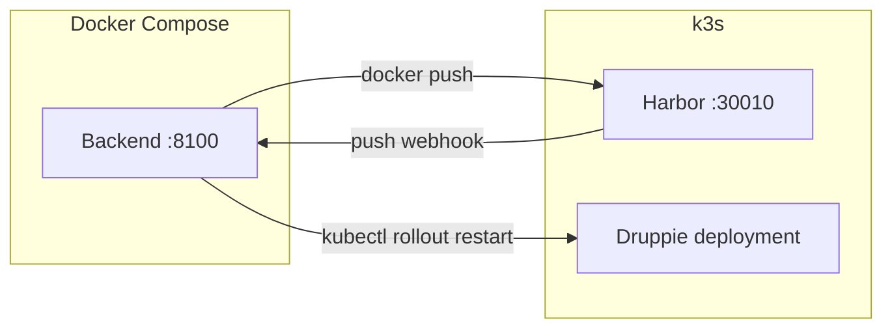
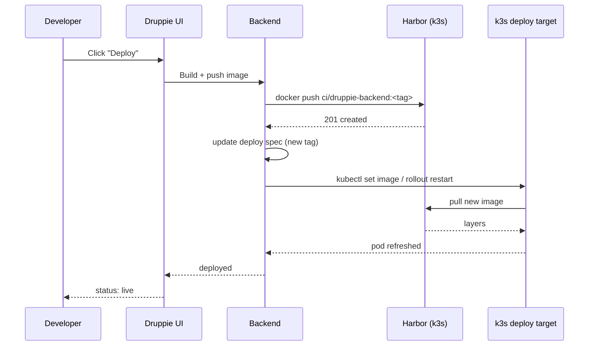

# Dev Environment Setup Guide

This guide walks through setting up the full Druppie development environment on a single VM. The environment is a hybrid of two layers:

- **Docker Compose** runs the Druppie application (backend, frontend, Keycloak, Gitea, MCP servers).
- **k3s** runs Harbor (the container registry) and acts as the deployment target that CI/CD rolls images out to.

Everything runs on one host. Compose owns the app and the developer tooling. k3s owns the registry and the place images get deployed.

> **Scope.** This is the local single-VM setup. For the multi-node Rancher RKE2 production architecture, see [dev-environment-architecture.md](./dev-environment-architecture.md).

---

## Architecture Overview

```
┌─────────────────────────────────────────────────────────────────────────┐
│                            Single Dev VM                                │
│                                                                         │
│  ┌────────────────────── Docker Compose ────────────────────────────┐   │
│  │                                                                  │   │
│  │  Druppie app (profile: dev)                                      │   │
│  │  ┌──────────────────────────────┐                                │   │
│  │  │ backend  :8100  (host)       │                                │   │
│  │  │ frontend :5273               │                                │   │
│  │  │ keycloak :8180  (realm:      │                                │   │
│  │  │   druppie, OIDC SSO)         │                                │   │
│  │  │ gitea    :3100               │                                │   │
│  │  │ adminer  :8081               │                                │   │
│  │  │ postgres :5432               │                                │   │
│  │  │ 9x MCP servers :9001-9012    │                                │   │
│  │  └──────────────────────────────┘                                │   │
│  └──────────────────────────────────────────────────────────────────┘   │
│                                                                         │
│  ┌──────────────────────── k3s (local cluster) ──────────────────────┐  │
│  │                                                                   │  │
│  │  namespace: harbor                                                │  │
│  │  ┌─────────────────────────────────────────────────────────────┐  │  │
│  │  │ Harbor registry  NodePort :30010  (admin/Harbor12345)       │  │  │
│  │  │   project: ci                                                │  │  │
│  │  └─────────────────────────────────────────────────────────────┘  │  │
│  │                                                                   │  │
│  │  namespace: druppie  (deployment target for CI/CD rollouts)       │  │
│  └───────────────────────────────────────────────────────────────────┘  │
│                                                                         │
│  backend container ──kubectl + kubeconfig──► k3s API (:6443)            │
└─────────────────────────────────────────────────────────────────────────┘
```

The two layers connect in two places:

1. **Registry**. The backend builds images and pushes them to Harbor on k3s.
2. **Deploy**. The backend holds a kubeconfig and runs `kubectl rollout restart` against k3s when Harbor fires a push webhook.



---

## Prerequisites

Install these on the host before you start.

| Requirement | Notes |
|-------------|-------|
| Docker + Docker Compose plugin | `docker compose version` should work. |
| sysbox runtime | `sysbox-runc` for agent sandboxes. Check with `docker info \| grep runtime`. Install from [nestybox/sysbox](https://github.com/nestybox/sysbox). |
| k3s (local) | `kubectl get nodes` must succeed. Defaults to `KUBECONFIG=$HOME/.kube/config`. |
| Helm 3.x | Harbor installs via the official chart. |
| curl | Used by the setup scripts and health checks. |
| RAM | 16GB minimum, 32GB recommended. |

You also need an LLM API key copied into `.env` (see [Environment Variables Reference](#environment-variables-reference)).

---

## Quick Start

Three commands from a fresh clone to a running stack with a registry:

```bash
# 1. Configure environment (add your LLM key inside .env)
cp .env.example .env

# 2. Start the Druppie app (first run includes --profile init)
docker compose --profile dev --profile init up -d --build

# 3. Install Harbor on the local k3s cluster
sudo ./scripts/setup-harbor-k8s.sh
```

Open the app at `http://localhost:5273` and log in with `admin` / `Admin123!`. Harbor is at `http://localhost:30010` (`admin` / `Harbor12345`).

---

## 1. Core Dev Environment (Docker Compose)

The Druppie app is fully defined in `docker-compose.yml`. Profiles select which services run.

### Start the dev profile

First-time setup (or after a reset) includes `--profile init` so Keycloak and Gitea get configured:

```bash
docker compose --profile dev --profile init up -d
```

Daily use drops `--profile init` because the init container only runs once and tracks completion with the `init_marker` volume:

```bash
docker compose --profile dev up -d      # start
docker compose --profile dev down       # stop
docker compose --profile dev up -d --build   # rebuild after Dockerfile changes
```

### Verify services are healthy

```bash
curl -sf http://localhost:8100/health && echo "  backend OK"
curl -sf http://localhost:8180/realms/druppie/.well-known/openid-configuration >/dev/null && echo "  keycloak OK"
curl -sf http://localhost:5273 >/dev/null && echo "  frontend OK"
```

API docs live at `http://localhost:8100/docs`.

### Default credentials and URLs

| Service | URL | Login |
|---------|-----|-------|
| Frontend | http://localhost:5273 | Test users below |
| API docs | http://localhost:8100/docs | none |
| Keycloak Admin | http://localhost:8180 | admin / admin |
| Gitea | http://localhost:3100 | gitea_admin / GiteaAdmin123 |
| Adminer (DB) | http://localhost:8081 | druppie / druppie_secret |
| Harbor (k3s) | http://localhost:30010 | admin / Harbor12345 |

**Keycloak test users** (realm `druppie`):

| User | Password | Role |
|------|----------|------|
| admin | Admin123! | admin |
| architect | Architect123! | architect |
| developer | Developer123! | developer |
| analyst | Analyst123! | business_analyst |
| normal_user | User123! | user |

---

## 2. Container Registry (Harbor on k3s)

Harbor holds the images CI builds. There are two supported ways to install it:

| Script | Approach | Where | Port | When to use |
|--------|----------|-------|------|-------------|
| `scripts/setup-harbor-k8s.sh` | Helm chart on k3s | k3s namespace `harbor` | 30010 | **Preferred.** k3s already runs, registry lives with the deploy target. |
| `scripts/setup-harbor.sh` | Sibling docker-compose project | `/opt/harbor` | 8181 | Fallback when k3s is not available. |

Pick one. Running both on the same host wastes RAM and risks confusion. The rest of this section covers the k3s install.

### Install Harbor

```bash
sudo ./scripts/setup-harbor-k8s.sh
```

The script is idempotent (`helm upgrade --install`), so re-running it applies updated values. It checks helm and kubectl, adds the Harbor Helm repo, installs the chart with TLS off and the optional add-ons (Trivy, Notary, Chartmuseum) disabled, waits for the health endpoint, and creates the default `ci` project.

### Verify

```bash
# Health endpoint through the nodePort
curl -sf http://localhost:30010/api/v2.0/health && echo OK

# Pods should all be Running
sudo ./scripts/setup-harbor-k8s.sh status

# Log in from the host Docker client (user: admin)
docker login localhost:30010
```

Because TLS is off, add `localhost:30010` to Docker's `insecure-registries` in `/etc/docker/daemon.json` and restart Docker before `docker login`:

```json
{ "insecure-registries": ["localhost:30010"] }
```

### Create robot accounts for CI

Robot accounts give CI a scoped push/pull token without sharing the admin password.

**UI:** open `http://localhost:30010`, go to the `ci` project, then **Robot Accounts** > **New Robot Account**, grant push+pull, and copy the token.

**API:**

```bash
curl -sf -u "admin:Harbor12345" -X POST \
  "http://localhost:30010/api/v2.0/projects/ci/robots" \
  -H "Content-Type: application/json" \
  -d '{"name":"ci-push","level":"project","actions":["push","pull"],"duration":-1}'
```

Store the returned secret in your CI secret store and reference it from the backend.

### Configure the auto-deploy webhook

Harbor fires a webhook on image push. The backend listens for it and triggers a rollout. Point the webhook at the backend:

- **Target URL:** `http://localhost:8100/api/registry/webhook`
- **Event type:** `pushImage`
- **Condition:** all images in the `ci` project

**UI:** `ci` project > **Webhooks** > add the URL above.

**API:**

```bash
curl -sf -u "admin:Harbor12345" -X POST \
  "http://localhost:30010/api/v2.0/projects/ci/webhook/policies" \
  -H "Content-Type: application/json" \
  -d '{
    "name":"auto-deploy",
    "enabled":true,
    "targets":[{"type":"http","address":"http://localhost:8100/api/registry/webhook","skip_cert_verify":true}],
    "event_types":["pushImage"]
  }'
```

> When the backend runs inside Compose, `localhost:8100` is the host port. Harbor pods reach the backend through the nodePort, so use a stable address. See [Backend kubectl Access](#4-backend-kubectl-access) for wiring.

---

## 3. CI/CD Flow

### How the deploy loop works



Two triggers can start a rollout:

1. **Manual.** A developer clicks Deploy in the UI. The backend builds the image, pushes to Harbor, and immediately runs `kubectl rollout restart` because it has cluster access.
2. **Webhook.** A push to Harbor fires the `pushImage` webhook at `/api/registry/webhook`. The backend parses the event and rolls out the affected deployment.

Both paths end at the same place: the backend talks to k3s and the pod pulls the new image.

### Triggering a deploy manually

```bash
TOKEN=$(curl -s -X POST "http://localhost:8180/realms/druppie/protocol/openid-connect/token" \
  -H "Content-Type: application/x-www-form-urlencoded" \
  -d "grant_type=password&client_id=druppie-frontend&username=admin&password=Admin123!" \
  | python3 -c "import sys,json; print(json.load(sys.stdin)['access_token'])")

curl -s -X POST "http://localhost:8100/api/deploy" \
  -H "Authorization: Bearer $TOKEN" \
  -H "Content-Type: application/json" \
  -d '{"component":"backend","tag":"'"$(git rev-parse --short HEAD)"'"}'
```

The exact endpoint name follows the backend's deploy API; check `http://localhost:8100/docs` for the current route.

---

## 4. Backend kubectl Access

For the deploy loop to work, the backend container needs a kubeconfig that reaches k3s and a `kubectl` binary.

### Mount kubeconfig into the backend container

k3s writes its admin kubeconfig to `/etc/rancher/k3s/k3s.yaml`. Copy it to a path the host owns, fix the server address (k3s defaults to `127.0.0.1:6443`, which is wrong from inside a container), then mount it.

```bash
# On the host
mkdir -p "$HOME/.kube"
sudo k3s kubectl config view --raw > "$HOME/.kube/config-druppie"
# Make the server reachable from inside the compose network
sudo sed -i 's|https://127.0.0.1:6443|https://host.docker.internal:6443|' "$HOME/.kube/config-druppie"
sudo chown "$USER":"$USER" "$HOME/.kube/config-druppie"
```

Then add a volume mount to the backend service in `docker-compose.yml` (or an override file):

```yaml
services:
  druppie-backend-dev:
    volumes:
      - ${HOME}/.kube/config-druppie:/kube/config:ro
    environment:
      KUBECONFIG: /kube/config
```

Restart the backend:

```bash
docker compose --profile dev up -d druppie-backend-dev
```

### Environment variables

| Variable | Purpose | Example |
|----------|---------|---------|
| `KUBECONFIG` | Path to the kubeconfig inside the container. | `/kube/config` |
| `KUBECONFIG_PATH` | Host-side path the compose file mounts. | `$HOME/.kube/config-druppie` |
| `KUBECTL_PATH` | Optional explicit `kubectl` binary path. | `/usr/local/bin/kubectl` |
| `REGISTRY_URL` | Harbor address used for push/pull. | `localhost:30010` |
| `REGISTRY_PROJECT` | Default Harbor project. | `ci` |

---

## Port Reference

Default host ports. The real values come from `.env` (see `BACKEND_PORT`, `KEYCLOAK_PORT`, etc.). The numbers below are the `.env.example` defaults.

| Service | Port | Profile | Notes |
|---------|------|---------|-------|
| Frontend | 5273 | dev / prod | `FRONTEND_PORT` |
| Backend API | 8100 | dev / prod | `BACKEND_PORT`, docs at `/docs` |
| Keycloak | 8180 | infra / dev / prod | `KEYCLOAK_PORT`, realm `druppie` |
| Gitea | 3100 | infra / dev / prod | `GITEA_PORT` |
| Adminer | 8081 | infra / dev / prod | `ADMINER_PORT` |
| PostgreSQL | 5432 | infra / dev / prod | internal |
| MCP servers | 9001-9012 | infra / dev / prod | `MCP_*_PORT` |
| Harbor | 30010 | (k3s) | `HARBOR_PORT`, NodePort |
| k3s API | 6443 | (k3s) | cluster API |

> Base container ports differ from host ports. Keycloak listens on 8080 inside Compose and is published on `KEYCLOAK_PORT` (8180). The backend listens on 8000 and publishes on `BACKEND_PORT` (8100). Use `scripts/apply-port-offset.sh` to shift a whole stack when ports collide.

---

## Troubleshooting

**Sandbox won't start.** Sandboxes need sysbox. Confirm the runtime is registered:

```bash
docker info | grep -i runtime
docker run --rm --runtime=sysbox-runc hello-world
```

If sysbox is missing, install `sysbox-ce` from [nestybox/sysbox](https://github.com/nestybox/sysbox) and restart Docker. Also check `SANDBOX_RUNTIME` in `.env` (`sysbox-runc` for sysbox isolation, `docker` for plain containers).

**Harbor pods pending.** Usually a storage issue. k3s ships the local-path provisioner, so PVCs should bind fast. If they hang:

```bash
kubectl get pv,pvc -n harbor
kubectl describe pvc -n harbor
```

Pods stuck in `Pending` after PVCs bind usually means not enough RAM on the node. Harbor runs roughly eight pods and wants a few GB free.

**Backend can't reach k3s.** The backend logs will show `kubectl` timeouts or connection refused. Check three things:

```bash
# 1. Kubeconfig exists inside the container
docker compose exec druppie-backend-dev ls -l "$KUBECONFIG"

# 2. kubectl works from inside the container
docker compose exec druppie-backend-dev kubectl get nodes

# 3. The server address is reachable (not 127.0.0.1)
docker compose exec druppie-backend-dev kubectl config view --minify | grep server
```

The server line must point at `host.docker.internal:6443` or the host IP, not `127.0.0.1`. See [Backend kubectl Access](#4-backend-kubectl-access).

**Harbor `docker login` fails with HTTPS error.** TLS is off, so Docker rejects the plain HTTP registry. Add `localhost:30010` to `insecure-registries` in `/etc/docker/daemon.json` and restart Docker.

**Port already in use.** Two stacks on the same port will fight. Stop one, or shift a stack with `scripts/apply-port-offset.sh`.

---

## Environment Variables Reference

All variables come from `.env` (copy `.env.example` to start). Required ones are marked.

### LLM (required)

| Variable | Purpose | Default |
|----------|---------|---------|
| `LLM_PROVIDER` | Provider selector: `zai`, `deepinfra`, `deepseek`, `azure_foundry`, `ollama`. | `zai` |
| `ZAI_API_KEY` | Z.AI API key. Required when `LLM_PROVIDER=zai`. | none |
| `DEEPINFRA_API_KEY` | DeepInfra API key. Required when `LLM_PROVIDER=deepinfra`. | none |
| `LLM_FORCE_PROVIDER` | Override every agent to one provider/model. Optional. | none |

### Ports

| Variable | Default | Service |
|----------|---------|---------|
| `BACKEND_PORT` | 8100 | Backend API |
| `FRONTEND_PORT` | 5273 | Frontend |
| `KEYCLOAK_PORT` | 8180 | Keycloak |
| `GITEA_PORT` | 3100 | Gitea |
| `ADMINER_PORT` | 8081 | Adminer |
| `MCP_CODING_PORT` | 9001 | MCP coding |
| `MCP_DOCKER_PORT` | 9002 | MCP docker |

### Sandbox

| Variable | Purpose | Default |
|----------|---------|---------|
| `SANDBOX_RUNTIME` | Runtime for sandboxes. Use `sysbox-runc` for VM-style isolation. | `docker` |
| `SANDBOX_API_SECRET` | Shared secret between backend and sandbox control plane. | `sandbox-dev-secret` |
| `SANDBOX_MODEL` | Optional model override for the coding agent. | none |
| `SANDBOX_MEMORY_LIMIT` | Per-sandbox memory cap. | `4g` (commented) |
| `SANDBOX_CPU_LIMIT` | Per-sandbox CPU cap. | `2` (commented) |

### Harbor (k3s install)

| Variable | Purpose | Default |
|----------|---------|---------|
| `HARBOR_NAMESPACE` | k3s namespace for Harbor. | `harbor` |
| `HARBOR_PORT` | Harbor nodePort. | `30010` |
| `HARBOR_ADMIN_PASSWORD` | Harbor admin password. | `Harbor12345` |
| `HARBOR_PROJECT` | Default project created on install. | `ci` |
| `HARBOR_RELEASE_NAME` | Helm release name. | `harbor` |

### Harbor (docker-compose sibling install, `scripts/setup-harbor.sh`)

| Variable | Purpose | Default |
|----------|---------|---------|
| `HARBOR_DIR` | Install directory. | `/opt/harbor` |
| `HARBOR_HOST` | Hostname (must not be `localhost`). | `harbor.local` |
| `HARBOR_PORT` | Compose port (same variable, different default context). | `8181` |
| `HARBOR_ADMIN_PASSWORD` | Admin password. | `Harbor12345` |
| `HARBOR_PROJECT` | Default project. | `ci` |

### Backend kubectl / deploy

| Variable | Purpose | Example |
|----------|---------|---------|
| `KUBECONFIG` | In-container path to kubeconfig. | `/kube/config` |
| `KUBECONFIG_PATH` | Host path mounted into the backend. | `$HOME/.kube/config-druppie` |
| `KUBECTL_PATH` | Optional explicit kubectl binary. | `/usr/local/bin/kubectl` |
| `REGISTRY_URL` | Harbor address for push/pull. | `localhost:30010` |
| `REGISTRY_PROJECT` | Default Harbor project. | `ci` |

### Instance / multi-tenancy

| Variable | Purpose | Default |
|----------|---------|---------|
| `DRUPPIE_INSTANCE` | Prefix for named volumes, supports multiple stacks on one host. | `druppie` |
| `COMPOSE_PROJECT_NAME` | Compose project name. | `druppie` |
| `PORT_OFFSET` | Shift a whole stack's ports. Applied by `scripts/apply-port-offset.sh`. | none |

---

## Reset and Recovery

| Goal | Command |
|------|---------|
| Clear app data, keep users and Keycloak | `docker compose --profile reset-db run --rm reset-db` |
| Wipe all data volumes, re-init Keycloak and Gitea | `docker compose --profile reset-hard run --rm reset-hard` then `docker compose --profile dev up -d --build` |
| Destroy everything (containers, volumes, images) and rebuild | `docker compose --profile nuke run --rm nuke` |
| Remove Harbor from k3s | `sudo ./scripts/setup-harbor-k8s.sh uninstall` |
| Purge sandbox dependency cache (npm, pip, uv) | `docker compose --profile reset-cache run --rm reset-cache` |

Always run `--build` after a reset, because the MCP servers have no volume mount and need rebuilt images.
