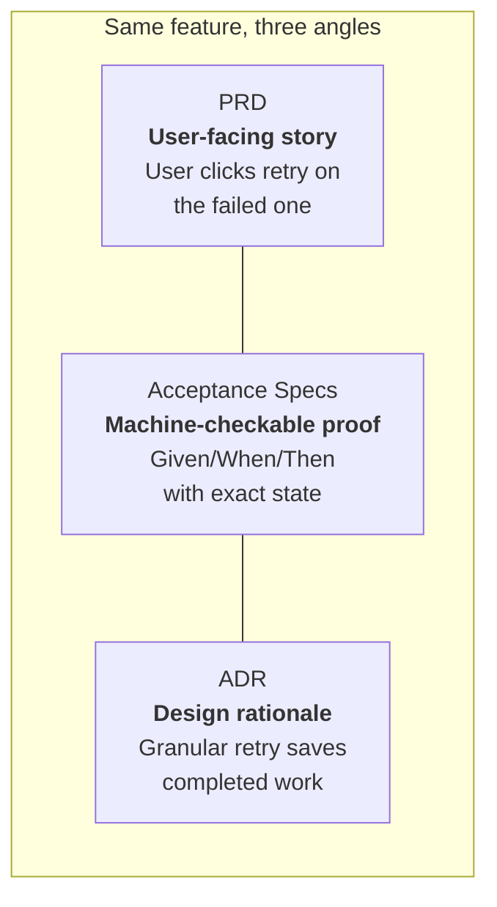
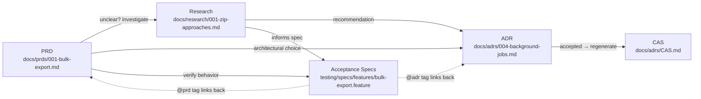
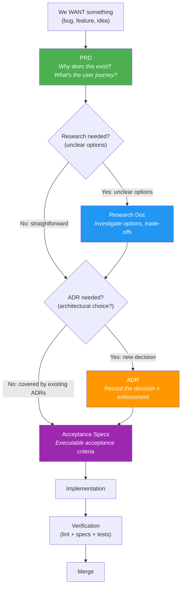

# Spec-Driven Documentation Framework

This document describes the complete specification-driven framework for the Druppie platform. It covers all artifact types and the enforcement loop that keeps them honest.

**Status:** Active
**Branch:** `feature/vast-documentatieformat`
**Last updated:** 2026-06-09

---

## Table of Contents

1. [Overview](#1-overview)
2. [Framework Structure](#2-framework-structure)
3. [Directory Structure](#3-directory-structure)
4. [Artifact Lifecycle](#4-artifact-lifecycle)
5. [The Enforcement Loop (The Harness)](#5-the-enforcement-loop-the-harness)
6. [Putting It All Together — Feature Walkthrough](#6-putting-it-all-together--feature-walkthrough)
7. [Tooling Stack](#7-tooling-stack)
8. [Getting Started](#8-getting-started)

---

## 1. Overview

Druppie's documentation framework ensures that every decision is captured, every behavior is described in readable executable form, and every rule is automatically checked — so the product stays consistent even as team members and AI agents come and go.

The framework is built on a key insight from Michal's talk: **humans and LLMs both suffer from limited context**. People forget. LLMs context-compact. Without captured decisions, teams end up like the five monkeys — following rules without knowing why.

### Core Principles

1. **Text-based, agent-readable** — Every artifact is Markdown that humans and AI agents can read
2. **Enforced, not just documented** — Rules have corresponding lint/CI checks
3. **Living, not static** — The Current Architecture Specification (CAS) auto-updates from accepted ADRs
4. **Linked, not isolated** — PRDs link to ADRs, acceptance specs link to PRDs, everything traces back

---

## 2. Framework Structure

The framework is organized into two tiers:

- **Tier 1 — Artifact Types:** per-feature, in the traceability chain. These have templates, enforcement gates, and link-back tags.
- **Tier 2 — Reference Docs:** cross-cutting, not per-feature. Regular Markdown consulted during implementation.

### Tier 1 — Artifact Types

Per-feature artifacts that form the traceability chain. Each one links to the others so any behavior can be traced from "why does this exist?" all the way to "does it actually work?"

| Artifact | Purpose | Format | Location |
|----------|---------|--------|----------|
| **PRD** | Describe why a feature exists, the problem, user journey | Lightweight Markdown | `docs/prds/` |
| **Research** | Investigate options before committing to a decision (optional) | Markdown with trade-off tables | `docs/research/` |
| **ADR** | Record why a technical decision was made and how it's enforced (optional) | Markdown with YAML frontmatter | `docs/adrs/` |
| **Acceptance Specs** | Executable specification of what the system does | Gherkin `.feature` files | `testing/specs/` |
| **CAS** | Current Architecture Specification — living snapshot of all active rules | Auto-generated Markdown | `docs/adrs/CAS.md` |

Of these five, **Acceptance Specs are always written** for any feature that needs verification. **Research and ADR are optional** — they only get written when the situation calls for them (see [Research vs ADR](#research-vs-adr--whats-the-difference)).

### Tier 2 — Reference Documentation

Reference docs are **cross-cutting, not per-feature**. They describe stable knowledge that applies across many features — not the traceability chain for a single feature.

- They live in `docs/<topic>/`
- They don't have mandatory templates, enforcement gates, or link-back tags
- They're consulted during implementation, not produced per feature

| Reference Doc | Purpose | Location |
|---------------|---------|----------|
| **Design System** | Component library, visual rules, usage constraints | `docs/design-system/` |
| **API contracts** | Endpoint shapes, request/response schemas, versioning | `docs/api/` (or similar) |
| **Infrastructure specs** | Deployment topology, runtime config, sandbox setup | `docs/` (e.g. `docs/SANDBOX.md`) |
| **Data model docs** | Entity relationships, migration notes | `docs/` |
| **Security policies** | Auth flows, role model, secret handling | `docs/` |

These are regular Markdown files. An agent or human reads the relevant reference doc when a feature touches its domain (e.g., consult the Design System when building UI), but the reference doc itself isn't part of the per-feature traceability chain.

### What Goes Where

Each artifact answers a different question. Using the subagent retry feature as a concrete example:

| Artifact | Answers | Contains | Example: Subagent Retry |
|----------|---------|----------|------------------------|
| **PRD** | Why does this exist? What does the user want? | Problem, goal, user journey, constraints | "Users need to retry a failed subagent without losing work from successful ones" |
| **Research** | What are the options? Which one do we pick? | Findings, comparison tables, recommendation | (Skipped — straightforward, one obvious approach) |
| **ADR** | Why did we pick X? How is it enforced? | Context, decision, consequences, enforcement | "We chose granular per-subagent retry because full restart wastes completed work" |
| **Acceptance Specs** | What must the system do? Does it work? | Gherkin Given/When/Then scenarios | "Given 3 parallel subagents, When user clicks retry on B, Then only B resets" |

The same feature flows through multiple artifacts, each from a different angle:



> **Acceptance Specs are domain-agnostic.** They aren't limited to backend behavior — they can describe any observable system behavior:
> - **Backend:** "Given an admin user, When they request all sessions, Then they get all sessions"
> - **Frontend:** "Given a modal is open, When the user presses Escape, Then the modal closes"
> - **Infrastructure:** "Given a deployment is rolled out, When health checks fail, Then rollback triggers"
>
> The same Given/When/Then format and the same tooling (`behave` + Gherkin `.feature` files) apply regardless of domain.

### Research vs ADR — What's the difference?

Research and ADR serve different purposes and sit at different stages of the decision process.

**Research = "We're figuring this out."** This is the investigation phase. Open questions, trade-off analysis, prototyping. Not every ADR needs research behind it.

**ADR = "We've decided."** This is a committed decision. No more debate. The choice is recorded, the reasoning is preserved, and the enforcement rules are configured.

Research is **optional**. Skip it when:

- The choice is obvious ("We use PostgreSQL for the main database")
- Existing ADRs already cover the domain ("ADR-003 already says we use background jobs for long-running tasks")
- The feature is straightforward enough that there's only one sensible approach

You only write a research doc when multiple viable options exist and the trade-offs aren't clear from existing context.

### How Artifacts Link Together



---

## 3. Directory Structure

```
docs/
├── adrs/                          # Architecture Decision Records
│   ├── TEMPLATE.md                # Template for new ADRs
│   ├── 001-*.md                   # Sequential ADR files
│   ├── 002-*.md
│   └── CAS.md                     # Auto-generated Current Architecture Spec
├── research/                      # Research documents (pre-ADR investigation)
│   └── TEMPLATE.md
├── prds/                          # Product Requirements Documents
│   └── TEMPLATE.md
├── design-system/                 # Reference doc: frontend design system
│   ├── README.md                  # Component index + visual rules
│   └── components/                # Per-component documentation
│       └── button.md
├── specs/                         # Existing: platform standards
│   └── platform-standards.md
├── BACKLOG.md                     # Existing
├── FEATURES.md                    # Existing
├── TECHNICAL.md                   # Existing
├── TESTING.md                     # Existing
├── SANDBOX.md                     # Existing
└── SPEC-FRAMEWORK.md              # This file

testing/
├── tools/                         # Existing: YAML tool tests
├── agents/                        # Existing: YAML agent tests
├── checks/                        # Existing: assertion bundles
├── profiles/                      # Existing: judges, HITL
└── specs/                         # Acceptance specs (Gherkin .feature files)
    ├── features/                  # Gherkin .feature files
    │   ├── approval-workflow.feature
    │   └── session-lifecycle.feature
    └── steps/                     # Python step definitions
        ├── approval_steps.py
        ├── session_steps.py
        └── environment.py

druppie/skills/                    # Skills (existing)
├── (skill directories)
└── ...

scripts/
├── generate_cas.py                # Generate CAS.md from accepted ADRs
├── validate_doc_links.py          # Validate cross-references
└── validate_adr_status.py         # Validate ADR frontmatter

# Enforcement config (root of repo)
lefthook.yml                       # Git hooks
.importlinter                      # Architecture import rules
```

---

## 4. Artifact Lifecycle

### The Correct Flow: Want → PRD → (Research?) → (ADR?) → Acceptance Specs → Build

Every feature starts with a want. Then we write a PRD to define what we're building. If the technical approach is unclear, we research options. Then, if a decision needs recording, we commit to it in an ADR. We always write acceptance specs to prove the feature works, and then we build.



Key points:

- **PRD always comes first.** Before you research, before you decide, you need to know what you're building and why.
- **Research is optional.** Only write a research doc when multiple viable options exist and the trade-offs aren't obvious.
- **ADR captures the decision.** If existing ADRs already cover the architectural choice, skip writing a new one.
- **Acceptance Specs are the proof.** Scenarios are executable acceptance criteria that link back to the PRD and ADR.

### ADR Status Model

| Status | Meaning | Agent visibility |
|--------|---------|-----------------|
| `proposed` | Under review, not yet accepted | Not loaded by agents |
| `accepted` | Active rule, currently enforced | Loaded via CAS |
| `deprecated` | Still valid but should not be used for new work | Visible but flagged |
| `superseded` | Replaced by a newer ADR (`superseded_by` field) | Not loaded by agents |

### Supersession Flow

When a new ADR replaces an old one:

1. Create new ADR with `status: accepted`
2. Update old ADR: `status: superseded`, add `superseded_by: "NNN"`
3. Same PR updates enforcement rules (lint config, CI)
4. Regenerate CAS — old rule disappears, new rule appears
5. Agents on next task load fresh CAS and never see the old rule

### PRD Status Model

PRDs follow the same governance lifecycle as ADRs:

| Status | Meaning | Agent visibility |
|--------|---------|-----------------|
| `proposed` | Under review, not yet accepted | Not loaded by agents |
| `accepted` | Active feature definition, currently the truth | Loaded via linked specs |
| `deprecated` | No longer relevant, do not use for new work | Visible but flagged |
| `superseded` | Replaced by a newer PRD (`superseded_by` field) | Not loaded by agents |

**Supersession flow:** create the new PRD with `status: accepted`, then update the old PRD to `status: superseded` with a `superseded_by` field pointing to the new PRD id. Any linked acceptance specs now follow the new PRD.

### Acceptance Spec Status

Acceptance Specs (`.feature` files) do not carry their own status field. Their status is **derived from the linked PRD**:

| Linked PRD status | Spec status | Meaning |
|-------------------|-------------|---------|
| `proposed` | draft | Spec is written but not yet binding |
| `accepted` | active | Spec is the current truth — must pass |
| `deprecated` | deprecated | Spec is archived, no longer enforced |
| `superseded` | deprecated | Spec is archived, superseding PRD's specs take over |

---

## 5. The Enforcement Loop (The Harness)

The harness ensures that every declared rule is automatically verified at commit time and in CI.

```
Developer/Agent writes code
          │
          ▼
  ┌──────────────────┐
  │  pre-commit hook  │  ← fast checks
  │  • ruff lint      │
  │  • black format   │
  │  • import-linter  │
  │  • doc link check │
  │  • ADR validation │
  └──────┬───────────┘
         │ passes
         ▼
  Push to remote → CI pipeline
         │
         ▼
  ┌─────────────────────────────┐
  │  1. Lint & format           │
  │  2. Architecture compliance │
  │  3. Type checking           │
  │  4. Spec suite              │
  │  5. YAML tool/agent tests   │
  │  6. Doc link validation     │
  │  7. CAS freshness check     │
  └──────┬──────────────────────┘
         │ fails? → agent/human gets exact rule violation + link to ADR
         ▼
       Merge if green
```

### What the Loop Checks

| Check | Tool | What it catches |
|-------|------|----------------|
| Python lint | ruff | Style, unused imports, complexity |
| Python format | black | Formatting consistency |
| Architecture layers | import-linter | API importing DB, domain importing services |
| Doc cross-references | validate_doc_links.py | Broken links between PRD↔ADR↔Acceptance Specs |
| ADR consistency | validate_adr_status.py | Superseded without replacement, invalid status |
| CAS freshness | validate_doc_links.py | CAS.md stale vs accepted ADRs |
| Acceptance specs | behave | Acceptance criteria violations |
| Integration tests | YAML framework | Full pipeline regressions |

### Agent Failure Recovery

When an agent's commit fails the harness:

1. Agent sees the exact error (lint message, import violation)
2. Error message links to the relevant ADR (e.g., `See ADR-001: Layered Architecture`)
3. Agent reads the ADR for context on *why* the rule exists
4. Agent fixes the violation and re-commits
5. Loop continues until all checks pass

---

## 6. Putting It All Together — Feature Walkthrough

### Scenario: "Bulk Export" feature

**Step 1: PRD** — "We need bulk export." The user-facing story comes first.
- What does the user want? Export all reports from a project as a downloadable file.
- Output: `docs/prds/001-bulk-export.md`
- Defines the user journey, constraints, and acceptance criteria

**Step 2: Research** — "Streaming ZIP vs background job?" Only because the approach is unclear.
- The PRD raises a question: how do you generate a file that could be large?
- Output: `docs/research/001-zip-approaches.md`
- Result: streaming ZIP is brittle for large datasets; background jobs with a download link is more reliable
- (If the approach had been obvious, this step would be skipped entirely)

**Step 3: ADR** — "We chose background jobs." The decision is committed.
- Output: `docs/adrs/004-background-jobs-for-exports.md` (status: proposed)
- After review: status → accepted
- CAS regenerated automatically
- Links back to PRD-001 and Research-001

**Step 4: Acceptance Specs** — "When user clicks Export All, background job created." Verification.
- Output: `testing/specs/features/bulk-export.feature`
- Tagged: `@prd docs/prds/001-bulk-export.md`
- Scenarios: successful export, exceeding max reports, concurrent export prevention
- Each scenario links back to the PRD and ADR via tags

> This walkthrough uses a backend example, but acceptance specs can cover any domain — frontend interactions, infrastructure behavior, or any other observable system property. See [Acceptance Specs are domain-agnostic](#what-goes-where).

**Step 5: Implementation** — Agent implements following accepted specs and ADRs.
- Loads CAS, ADR-004, PRD-001
- Writes code following layered architecture
- Consults relevant reference docs (e.g., Design System for any UI touched)
- Pre-commit hook runs: lint passes, import-linter passes

**Step 6: Verification** — Acceptance specs run, tests pass.

**Step 7: Merge** — CI runs full suite, CAS freshness check passes, merge to `colab-dev`.

---

## 7. Tooling Stack

| Layer | Tool | Purpose |
|-------|------|---------|
| Git hooks | [lefthook](https://github.com/evilmartians/lefthook) | Fast pre-commit/pre-push checks |
| Python lint | [ruff](https://docs.astral.sh/ruff/) | Style, complexity, imports |
| Python format | [black](https://github.com/psf/black) | Formatting |
| Architecture lint | [import-linter](https://github.com/seddonym/import-linter) | Layer import rules |
| Acceptance specs | [behave](https://github.com/behave/behave) | Gherkin feature runner |
| Integration tests | YAML framework (existing) | Full MCP pipeline tests |
| Doc validation | Custom scripts | Cross-reference checking |
| CAS generation | `scripts/generate_cas.py` | Auto-generate from ADRs |

---

## 8. Getting Started

### For Humans

1. **New to the project?** Read `docs/adrs/CAS.md` — it's the current architecture state
2. **Making a decision?** Use the ADR template in `docs/adrs/TEMPLATE.md`
3. **Building a feature?** Write a PRD first using `docs/prds/TEMPLATE.md`
4. **Investigating options?** Document research in `docs/research/TEMPLATE.md`
5. **Adding a frontend component?** Follow `docs/design-system/README.md`

### For AI Agents

Follow the artifact lifecycle in [Section 4](#4-artifact-lifecycle):

1. **Before any task:** Load `docs/adrs/CAS.md` for the current architecture state
2. **Feature work:** Start from the PRD template (`docs/prds/TEMPLATE.md`), write acceptance specs, then implement
3. **Writing an ADR:** Use `docs/adrs/TEMPLATE.md`, set status to `proposed`, request review
4. **After ADR acceptance:** Run `python scripts/generate_cas.py` to regenerate CAS

### First-Time Setup

```bash
# Install enforcement tools
pip install import-linter lefthook
cd frontend && npm install && cd ..

# Install lefthook git hooks
lefthook install

# Generate initial CAS (if not present)
python scripts/generate_cas.py

# Validate everything
python scripts/validate_doc_links.py docs/
python scripts/validate_adr_status.py
lint-imports
```

---

## Preventing "Monkey-Ladder" Amnesia

This framework prevents the five-monkeys problem through three mechanisms:

1. **ADRs capture the "why"** — Every non-trivial decision has context, rationale, and consequences documented. New team members and agents read ADRs to understand *why* things are the way they are.

2. **The harness enforces the "what"** — Rules aren't just documented, they're linted. You can't accidentally violate an architecture rule without getting caught. The error message points you to the ADR explaining why the rule exists.

3. **The CAS provides the "now"** — Agents don't need to sift through a history of decisions. They read one document — the CAS — that tells them the current state of the architecture. Individual ADRs are available when they need the full rationale.

**Humans leaving:** Decisions live in permanent ADRs. Lint rules enforce them automatically.

**LLM context compaction:** Important constraints survive because the agent re-reads documents after rule violations. The loop re-injects the relevant ADR/PRD/spec scenario on every failure.

**Consistency:** Architecture rules, reference docs, and the design system act as automated guards. Tabs vs spaces, import ordering, layer violations — these are not for discussion. They are rules, and they are enforced.

---

*"May the spec be with you."*
