# ADR-001: Kubernetes Migration Architecture

| Field | Value |
|------|--------|
| **Status** | Accepted (implemented — see implementation status below) |
| **Date** | 2026-06-09 (decision), 2026-06-15 (implementation status update) |
| **Author** | Druppie Team |
| **Deciders** | Druppie architecture team |
| **Reference** | [KUBERNETES-STRATEGY.md](../research/006-kubernetes-strategy.md) |

> **Note (current state):** These decisions reflect the live Hetzner K3s deployment. The as-built system is documented in `docs/research/007-kubernetes-as-built-analysis.md`. A migration to a shared local Rancher cluster is planned. Decisions marked below as *superseded pending local-Rancher migration* will be revised for local hardware.

---

## Decision Overview

| # | Decision | Choice | Rationale |
|---|-----------|-------|-------|
| 4.1 | Hosting | **Hetzner VMs + Ubuntu** | Commodity cloud, no vendor lock-in, ~€80/mo base (3 servers + infra + app pool) |
| 4.2 | Platform | **K3s (3 servers + 2 agent pools)** | CNCF certified, 3 servers for etcd quorum, fixed infra pool + autoscaled app pool |
| 4.3 | Database | **CloudNativePG** | CNCF Sandbox, auto-failover <30s, built-in PgBouncer, 1 operator for 3 instances |
| 4.4 | Autoscaling | **HPA + KEDA** | HPA for frontend (CPU), KEDA for backend (LLM I/O-bound, CPU alone is too slow) |
| 4.5 | Networking | **Traefik + cert-manager** | K3s default, Middleware CRDs, Let's Encrypt via cert-manager |
| 4.6 | Secrets | **Sealed Secrets** | Asymmetrically encrypted in git, low complexity, no extra infra |
| 4.7 | Monitoring | **kube-prometheus-stack** | De facto standard, Prometheus + Grafana + Alertmanager in 1 Helm chart |
| 4.8 | Registry | **Gitea Container Registry** | Already present in Druppie, OCI-compatible, zero extra infra |
| 4.9 | Deployment | **PR-based CI/CD on colab-dev** | GitHub Actions: PR merge to `colab-dev` triggers build → push → deploy |
| 4.10 | MCP Modules | **Shared volume, fixed replicas** | Being rebuilt as built-in backend tools, shared volume is temporary and sufficient |
| 4.11 | High Availability | **PDB + anti-affinity + graceful shutdown** | Keep backend and frontend available during node failures and rolling updates |
| 4.12 | Cluster Provisioning | **hetzner-k3s CLI** | Ubuntu, 1 YAML config, 2-3 min cluster, everything built in (CCM, CSI, autoscaler) |
| 4.13 | Node Autoscaling | **Kubernetes Cluster Autoscaler (Hetzner provider)** | Upstream K8s, auto-provisions VMs on Pending pods, ~60s for a new node |

---

## Context

Druppie runs on Docker Compose: a FastAPI backend, React frontend, 9 MCP microservices, Keycloak, Gitea, 3 PostgreSQL databases, and a sandbox infrastructure. The backend runs on 1 hardcoded replica. There is no autoscaling, no database HA, and no production-ready monitoring.

The migration to Kubernetes solves three problems:

1. **Scalability**: Backend and frontend must be horizontally scalable for varying load
2. **Reliability**: Eliminate single points of failure (database failover, PDB, anti-affinity)
3. **Maintainability**: Centralized monitoring, declarative configuration, reproducible deployments

Guiding principles: 100% open source, no vendor lock-in, portable Helm chart.

The spike investigation ([KUBERNETES-STRATEGY.md](../research/006-kubernetes-strategy.md)) contains the full comparison matrices and technical justification for all choices below.

---

## Decisions

### 4.1 Hosting: Hetzner VMs + Ubuntu — ⚠️ superseded pending local-Rancher migration

**Chosen:** 3x Hetzner Cloud VM (CPX31: 4 vCPU, 8GB RAM, 160GB NVMe) with Ubuntu as the OS.

**Why:** Cloud VMs are commodity. K3s runs on any Linux machine. Moving to a different provider (OVH, Scaleway, on-prem) means provisioning new VMs + installing K3s + `helm install`. No cloud-specific APIs, no proprietary services, no lock-in.

Ubuntu is the most tested OS for K3s, has broad documentation, and long-term support releases (LTS).

**Rejected:**
- Bare metal: high CAPEX, physically constrained, not quickly scalable
- Managed Kubernetes (EKS, AKS, GKE): vendor lock-in, proprietary APIs
- On-premises: no data-residency requirement that justifies it

### 4.2 Platform: K3s (3-server HA + two agent pools)

**Chosen:** K3s with a fixed cluster of 3 server nodes (embedded etcd HA) plus two agent pools: a fixed "infra" pool and an autoscaled "app" pool.

**Why:** K3s is CNCF-certified (full Kubernetes API, identical conformance tests). A single 70MB binary with everything included: API server, scheduler, controller manager, etcd, containerd, Flannel CNI, CoreDNS, Traefik ingress, local-path storage.

**Node architecture:**

| Role | Count | Type | Function | Scaling |
|-----|--------|------|---------|---------|
| **K3s Server** | **3 (fixed)** | CPX31 (4 vCPU, 8GB) | Control plane: API server, scheduler, etcd | Not autoscalable. 3 = minimum for etcd quorum (1 may fail) |
| **K3s Agent — infra pool** | **1-2 (fixed)** | CPX31 (4 vCPU, 8GB) | Keycloak, Gitea, MCP modules, CNPG, monitoring | Not autoscalable. Stable workloads that must not be evicted |
| **K3s Agent — app pool** | **1-10 (autoscaling)** | CPX31 (4 vCPU, 8GB) | Backend, Frontend | Cluster Autoscaler adds/removes based on Pending pods |

**Why 3 servers:** Etcd requires a quorum (majority) for consistency. With 3 nodes the quorum is 2 — 1 server may fail without the cluster going down. 1 server = no HA (single point of failure). 5 servers = 2 may fail, but overkill for Druppie's scale.

**Why two agent pools:** Backend and frontend have varying load and must scale. Keycloak, Gitea, MCP modules and CNPG have constant, predictable load and must not be disrupted by the Cluster Autoscaler. Separating them into two pools prevents infra services from being evicted when the autoscaler removes nodes. This keeps the setup closest to the Docker Compose / Kind architecture where everything "just runs".

**Why masters run no workloads:** `schedule_workloads_on_masters: false` in hetzner-k3s. The control plane must remain isolated — if workloads consume all resources, the API server stops responding.

```
┌─ 3x K3s Server (fixed) ──────────────────────────────┐
│  etcd quorum + API server + scheduler                 │
│  No workloads (NoSchedule taint)                      │
└───────────────────────────────────────────────────────┘

┌─ 1-2x Agent: infra pool (fixed) ─────────────────────┐
│  Keycloak (1 pod)    Gitea (1 pod + registry)         │
│  MCP modules (9 pods, shared volume)                  │
│  CloudNativePG (3 DB clusters, 9 pods)                │
│  Monitoring (Prometheus, Grafana, Alertmanager)        │
│  Sealed Secrets, cert-manager, KEDA, Cluster Autoscl. │
│  → Fixed nodes, never evicted                         │
└───────────────────────────────────────────────────────┘

┌─ 1-10x Agent: app pool (autoscaling) ────────────────┐
│  Backend (2-10 pods, HPA + KEDA)                      │
│  Frontend (2-8 pods, HPA)                             │
│  → Cluster Autoscaler manages this pool               │
└───────────────────────────────────────────────────────┘
```

**Rejected:**
- RKE2: more resources, more complex, only useful for multi-cluster management
- OpenShift/OKD: ~8GB+ RAM footprint, divergent standards (Routes, SCC), Dockerfile changes required
- Vanilla kubeadm: a lot of manual work, no built-in tooling
- Kind: development/CI only, no persistent storage, no HA

**Development/CI:** Kind remains in use for local development and CI pipelines.

### 4.3 Database: CloudNativePG

**Chosen:** CloudNativePG operator (v1.29.1+) with 3 database clusters: `druppie-db`, `keycloak-db`, `gitea-db`.

> **Implementation status (June 2026):** ✅ Completed with deviations:
> - **instances=1** per cluster (ADR proposes 3). Reason: cost savings on CPX32 nodes. Upgrading to `instances: 3` is a one-line values change once a second infra node is available.
> - **PgBouncer Pooler** (2 instances, transaction-mode) added for druppie-db. This was not in the original plan but proved essential: it resolves connection pool exhaustion under high load (125+ rps).
> - Data successfully migrated from the old StatefulSet PVCs.
> - **Still missing:** HA replicas (instances=3), backups to S3/MinIO, automated password sync.

**Why:** CloudNativePG is the only PostgreSQL operator with CNCF Sandbox status. It manages the full lifecycle: provisioning, streaming replication, automatic failover (<30s), continuous backup to S3/MinIO, point-in-time recovery, zero-downtime rolling updates, and built-in PgBouncer connection pooling.

A single operator manages all three databases as separate `Cluster` CRDs. No extra infrastructure.

**Important:** Always use v1.29.1+. This release fixes CVE-2026-44477 (CVSS 9.4, Critical) and three HA failover bugs.

```yaml
apiVersion: postgresql.cnpg.io/v1
kind: Cluster
metadata:
  name: druppie-db
spec:
  instances: 3
  postgresql:
    parameters:
      shared_buffers: "256MB"
      max_connections: "200"
  storage:
    size: 20Gi
    storageClass: local-path
  backup:
    barmanObjectStore:
      destinationPath: "s3://druppie-backups/db"
      endpointURL: "http://minio:9000"
      s3Credentials:
        accessKeyId:
          name: minio-creds
          key: access-key
        secretAccessKey:
          name: minio-creds
          key: secret-key
    retentionPolicy: "30d"
  monitoring:
    enablePodMonitor: true
```

**Rejected:**
- CrunchyData PGO: 19 CRDs (vs 6 for CNPG), more complex configuration, no CNCF status
- Zalando PG Operator: less actively maintained, no built-in backup
- Managed database (cloud): vendor lock-in
- Container PostgreSQL: no HA, no failover, no backup (dev only)

### 4.4 Autoscaling: HPA + KEDA

**Chosen:** HPA (CPU-based) for frontend, KEDA (dual-trigger) for backend.

> **Implementation status (June 2026):** ✅ Completed with an important deviation:
> - **Dual triggers** instead of Prometheus-only: PostgreSQL query (`agent_runs WHERE status='running'`) **+** CPU utilization 55%. Both needed: the PG trigger catches LLM I/O-bound work, the CPU trigger catches read-heavy GET load.
> - **minReplicas: 3** (proactive baseline, not 2 as in the ADR).
> - **Aggressive scale-up:** +4 pods/30s, `stabilizationWindowSeconds: 0`.
> - `metricType` at the trigger level (KEDA v2.20 API — NOT in metadata).
> - **Load test proven:** 125 rps → p95=508ms, 1→6 pods, 100% success rate.

**Why HPA for both services:** The frontend is pure static file serving, CPU is a reliable metric. The backend gets HPA as a base layer.

**Why KEDA additionally for the backend:** LLM calls are I/O-bound (waiting on external API responses), not CPU-bound. CPU utilization stays low while the queue fills up. KEDA scales on `druppie_pending_agent_runs` (a Prometheus metric based on a database query), which reflects the actual workload instead of CPU usage.

| Service | Min replicas | Max replicas | Scaling trigger |
|---------|-------------|-------------|-----------------|
| Frontend | 2 | 8 | HPA on CPU (70%) |
| Backend | 2 | 10 | HPA on CPU (70%) + KEDA on queue depth (>5 pending) |

**HPA configuration (backend):**

```yaml
apiVersion: autoscaling/v2
kind: HorizontalPodAutoscaler
metadata:
  name: druppie-backend
spec:
  scaleTargetRef:
    apiVersion: apps/v1
    kind: Deployment
    name: druppie-backend
  minReplicas: 2
  maxReplicas: 10
  metrics:
    - type: Resource
      resource:
        name: cpu
        target:
          type: Utilization
          averageUtilization: 70
  behavior:
    scaleUp:
      stabilizationWindowSeconds: 60
      policies:
        - type: Pods
          value: 2
          periodSeconds: 60
    scaleDown:
      stabilizationWindowSeconds: 300
      policies:
        - type: Percent
          value: 50
          periodSeconds: 60
```

**KEDA configuration (backend):**

```yaml
apiVersion: keda.sh/v1alpha1
kind: ScaledObject
metadata:
  name: druppie-backend-keda
spec:
  scaleTargetRef:
    name: druppie-backend
  minReplicaCount: 2
  maxReplicaCount: 10
  triggers:
    - type: prometheus
      metadata:
        serverAddress: http://prometheus:9090
        metricName: druppie_pending_agent_runs
        query: sum(druppie_pending_agent_runs)
        threshold: "5"
  advanced:
    horizontalPodAutoscalerConfig:
      behavior:
        scaleDown:
          stabilizationWindowSeconds: 300
          policies:
            - type: Percent
              value: 50
              periodSeconds: 60
```

The `behavior` section prevents oscillation: AI workloads produce short spikes, and without a stabilization window pods would constantly scale up and down.

**Rejected:**
- HPA on CPU only: too slow for I/O-bound LLM workloads
- VPA in auto-mode: restarts pods, unacceptable for long-running sessions (recommendation mode only)
- Scale-to-zero: not desirable for a governance platform that must always be available

### 4.5 Networking: Traefik + cert-manager

**Chosen:** Traefik (K3s default ingress controller) + cert-manager for TLS. DNS points directly to the IP of the infra node.

**Why:** K3s installs Traefik automatically. No extra configuration needed. Traefik offers Middleware CRDs for rate limiting and headers (cleaner than NGINX annotations), a dashboard for real-time traffic monitoring, and IngressRoute CRDs for complex routing.

The infra node is a fixed node that is always available. DNS records (druppie.rijnland.dev, auth.druppie.rijnland.dev, git.druppie.rijnland.dev) point to the public IP of the infra node. Traefik runs on the infra node and routes traffic to the correct pods via Kubernetes Ingress resources. This saves the cost of a separate load balancer (~€6/mo).

**Note:** If the infra node unexpectedly goes down, the site becomes unreachable. This is acceptable for Phase 1 — the infra node runs stable workloads with predictable load. For Phase 2, a failover IP or a second infra node can be added.

cert-manager + Let's Encrypt handles automatic TLS certificates. No manual certificate management.

**Rejected:**
- Hetzner Load Balancer: extra €6/mo, not needed with 1 fixed infra node handling all ingress traffic
- NGINX Ingress: no added value over Traefik, annotations become messy with complex configuration
- Cilium Ingress: too heavy for current needs, steeper learning curve
- HAProxy: overkill for this scale

### 4.6 Secrets: Gitignored Values Overlay (decision overridden)

**Chosen:** Gitignored `values-hetzner.secrets.yaml` overlay. **The original choice was Sealed Secrets — overridden during implementation.**

> **Implementation status (June 2026):** ✅ The gitignored overlay is accepted as the definitive solution. Sealed Secrets is deferred to Phase 2 (if ever needed).

**Why we deviated from Sealed Secrets:** During implementation the gitignored overlay proved simpler, safer (secrets are literally not in the repo), and sufficient for a small team. Sealed Secrets adds an operator, key backup procedures, and encrypted secrets in git — complexity without clear added value for this use case.

**Current approach:** Secrets in `values-hetzner.secrets.yaml` (gitignored), applied via `helm upgrade -f values-hetzner.secrets.yaml`. Backup kept offline in a password manager.

### 4.7 Monitoring: kube-prometheus-stack

**Chosen:** kube-prometheus-stack (Prometheus + Grafana + Alertmanager).

**Why:** The de facto standard for Kubernetes monitoring. A single `helm install` delivers: Prometheus (metrics), Grafana (dashboards), Alertmanager (notifications), Node-exporter (host metrics), and kube-state-metrics (K8s object metrics).

CloudNativePG automatically exports PostgreSQL metrics via PodMonitor. KEDA, Traefik, and Keycloak have native Prometheus endpoints. Everything centralizes in Grafana.

**Rejected:**
- Victoria Metrics: more efficient, but an extra abstraction layer we don't need
- Managed monitoring (cloud): vendor lock-in
- Home-built Prometheus stack: too much configuration work

### 4.8 Container Registry: Gitea Built-in Registry

**Chosen:** Gitea Container Registry (already present in Druppie).

**Why:** Gitea has a built-in OCI-compatible container registry. Zero extra infrastructure. Push images to the same Gitea instance that already hosts git repos. Add Harbor if a need arises for vulnerability scanning or image signing.

**Rejected:**
- Harbor: useful features (Trivy scanning, Cosign signing) but extra infra and operational overhead we don't need right now
- Docker Distribution: too basic, no UI
- GitHub GHCR: not self-hosted
- Zot: insufficient community adoption

### 4.9 Deployment: PR-based CI/CD on `colab-dev`

**Chosen:** PR-based CI/CD with GitHub Actions. The default branch is `colab-dev` (not `main`). The pipeline triggers on merge to `colab-dev` (or a configurable branch via a workflow variable).

**Why:** Druppie's core code is hosted on GitHub. PR-based deploy means: every change goes through PR review → CI build → automatic deploy after merge. This provides code review as a quality gate and an audit trail of every production release.

**Pipeline flow:**

```
PR open → CI: lint + test + build (preview)
PR merge to colab-dev → CI: build images → push to Gitea registry → helm upgrade on K3s
```

```yaml
# .github/workflows/deploy.yml
on:
  push:
    branches: [colab-dev]   # Configurable: other branches are also possible
  pull_request:
    branches: [colab-dev]   # Preview builds on PRs

jobs:
  deploy:
    if: github.event_name == 'push'  # Only deploy on merge
    steps:
      - name: Build & push images
        run: |
          docker build -t $REGISTRY/druppie-backend:$SHA ./druppie
          docker push $REGISTRY/druppie-backend:$SHA
      - name: Deploy to K3s
        run: |
          helm upgrade druppie helm/druppie/ \
            --namespace druppie \
            --values helm/druppie/values-prod.yaml \
            --set global.imageRegistry=$REGISTRY/ \
            --set global.imageTag=$SHA \
            --wait --timeout 600s
```

**Branch:** `colab-dev` is the default branch. The deploy target is configurable via the workflow `branches` config. `main` is deprecated and will be removed.

**Rejected:**
- ArgoCD: GitOps with drift detection, but more complex and requires an extra server in the cluster. Will be added in Phase 2 when there are multiple environments and drift detection becomes necessary.
- FluxCD: comparable to ArgoCD but without a web dashboard
- Manual `helm upgrade`: no audit trail, no quality gate

### 4.10 MCP Modules: Shared Volume, No Scaling

**Chosen:** MCP modules run with fixed replicas (1-2 per module) and share a PVC via the K3s local-path provisioner. No independent scaling, no RWX storage driver.

**Why this choice is justified:** MCP modules will be rebuilt in a later phase as built-in backend tools. They disappear as standalone services and become part of the backend application itself. That fully eliminates the need for the shared volume. The investment in independent module scaling (Longhorn RWX, per-module HPA, service mesh) is wasted money because the architecture fundamentally changes.

Until then, a simple shared PVC suffices. The modules have low and predictable load. They scale along with the cluster (more nodes = more availability), not independently.

**Rejected:**
- Longhorn RWX volumes: only useful if modules scale independently, which will not happen
- Sidecar pattern: every backend replica runs all modules, too much resource overhead
- Per-session microservices: too complex for a temporary solution

### 4.11 High Availability: PDB + Anti-affinity + Graceful Shutdown

**Chosen:** PodDisruptionBudgets, pod anti-affinity, and graceful shutdown for backend and frontend (app pool). Keycloak, Gitea, MCP modules and CNPG run on the fixed infra pool and need no PDB of their own — the infra nodes are not evicted.

> **Implementation status (June 2026):** ✅ Completed with a per-environment deviation:
> - **`values-prod.yaml` (multi-node):** PDB + anti-affinity **enabled** (`highAvailability.pdb.enabled: true`, `highAvailability.antiAffinity.enabled: true`). This is the configuration that implements this decision.
> - **`values-hetzner.yaml` (current single-node deployment):** PDB + anti-affinity **disabled**. Reason: with a single schedulable node, anti-affinity cannot spread replicas across nodes and a PDB with `minAvailable: 1` would block node drains. The same cost trade-off as CNPG `instances: 1` (§4.3). Becomes automatically effective as soon as a second app-pool node is available — a one-line values change.
> - Graceful shutdown (`terminationGracePeriodSeconds`) and the advisory-lock leader election work in both environments.

**PDB** guarantees that Kubernetes never removes all pods at once during maintenance:

```yaml
apiVersion: policy/v1
kind: PodDisruptionBudget
metadata:
  name: druppie-backend-pdb
spec:
  minAvailable: 1
  selector:
    matchLabels:
      app: druppie-backend
```

**Anti-affinity** spreads pods across different nodes, so a single node failure does not affect all replicas:

```yaml
affinity:
  podAntiAffinity:
    preferredDuringSchedulingIgnoredDuringExecution:
      - weight: 100
        podAffinityTerm:
          labelSelector:
            matchLabels:
              app: druppie-backend
          topologyKey: kubernetes.io/hostname
```

**Graceful shutdown:** Backend pods must finish in-flight LLM calls before they stop. `terminationGracePeriodSeconds: 60` with SIGTERM handling in FastAPI that refuses new requests but completes active ones.

**Backend multi-replica:** The backend is stateless. Session task concurrency is guarded via `SELECT ... FOR UPDATE` on the session row in PostgreSQL (replacing the former in-memory dict). The `reconstruct_from_db()` function rebuilds agent state from the database. In a multi-replica setup the webhook handler works as follows: update the ToolCall record in the DB, after which any backend replica can pick up the agent and continue. Database-driven resume, no new infrastructure needed.

Singleton background tasks (JobScheduler, sandbox watchdog) use PostgreSQL advisory locks (`pg_try_advisory_lock`) for leader election. Only the replica that acquires the lock starts the task; other replicas skip it. The lock is connection-scoped — if the leader pod dies, the connection is broken and the lock is released, so another replica can claim it on the next restart. No extra infrastructure needed.

### 4.12 Cluster Provisioning: hetzner-k3s — ⚠️ superseded pending local-Rancher migration

**Chosen:** `hetzner-k3s` CLI tool (vitobotta/hetzner-k3s, MIT license, 3.5k+ GitHub stars).

**Why:** A single YAML configuration file defines the entire cluster: 3 master nodes (embedded etcd HA), worker pools with autoscaling, networking, firewall. The tool automatically installs: K3s, Hetzner CCM, CSI driver, System Upgrade Controller, and Cluster Autoscaler. Cluster ready in 2-3 minutes. Ubuntu as the OS (default).

**K3s architecture — Servers vs Agents:**

K3s has two node types. **Servers** run the control plane (API server, scheduler, controller manager) plus embedded etcd for cluster state. **Agents** run only the kubelet and execute pods — no control plane, no etcd. For HA, 3 servers run with embedded etcd (1 may fail, quorum stays intact). All workloads run on agents; servers are pure control plane (`schedule_workloads_on_masters: false`). The Cluster Autoscaler manages agent nodes exclusively — servers are fixed.

```yaml
# cluster.yaml — complete cluster definition
hetzner_token: <token>
cluster_name: druppie
k3s_version: v1.32.3+k3s1

schedule_workloads_on_masters: false   # Masters = pure control plane

masters_pool:                          # K3s SERVERS — control plane + etcd
  instance_type: cpx31                 # 3 servers = HA (etcd quorum)
  instance_count: 3                    # Fixed, not autoscalable
  location: fsn1

worker_node_pools:
- name: infra                          # INFRA POOL — fixed
  instance_type: cpx31
  instance_count: 1                    # 1-2 fixed nodes
  location: fsn1
  autoscaling:
    enabled: false                     # Not autoscalable
  labels:
    pool: infra                        # Keycloak, Gitea, MCP, CNPG, monitoring
  taints: []                           # No taint — schedulable for infra workloads

- name: app                            # APP POOL — autoscaling
  instance_type: cpx31
  instance_count: 1                    # Min 1, max 10
  location: fsn1
  autoscaling:
    enabled: true
    min_instances: 1
    max_instances: 10                  # Managed by Cluster Autoscaler
  labels:
    pool: app                          # Backend, Frontend
  taints: []                           # No taint — schedulable for app workloads
```

**Rejected:**
- kube-hetzner (Terraform): MicroOS instead of Ubuntu, Terraform learning curve, more complexity
- Custom Terraform: more work, configure everything yourself
- Manual setup: not reproducible, no IaC

### 4.13 Node Autoscaling: Cluster Autoscaler (Hetzner) — ⚠️ superseded pending local-Rancher migration

**Chosen:** Official Kubernetes Cluster Autoscaler with the built-in Hetzner Cloud provider (`--cloud-provider=hetzner`).

**Why:** HPA/KEDA scale pods, but if all nodes are full, pods stay Pending. The Cluster Autoscaler detects Pending pods, automatically provisions new Hetzner VMs via the Cloud API, and lets them join via cloud-init. Under low load, nodes are automatically removed.

**Two-tier autoscaling architecture:**

| Tier | What | Tool | Trigger | Speed |
|------|-----|------|---------|----------|
| **1. Pod scaling** | Add/remove pods | HPA + KEDA | CPU usage, queue depth | Seconds |
| **2. Node scaling** | Add/remove VMs | Cluster Autoscaler | Pending pods (no capacity) | ~60 seconds |

Flow:
```
Load spike
  → HPA: more pods needed
    → Nodes full? Pods stay Pending
      → Cluster Autoscaler: new VM via Hetzner API
        → Cloud-init: K3s agent install + join
          → Node ready → Pending pods scheduled
```

**Rejected:**
- Karpenter: no Hetzner provider available, not on the roadmap
- Manually adding VMs: not automatic, slow response time
- Terraform-driven scaling: state drift conflicts with the Cluster Autoscaler

---

## Out of Scope (Not in Phase 1)

| Topic | Why not now | When |
|-----------|----------------|---------|
| **Sandbox migration** (Docker → K8s) | The Docker socket dependency requires a significant refactor. The sandbox stays on Docker until the Agent Sandbox operator is stable (v1alpha1 risk). | Phase 2 |
| **MCP module autoscaling** | Modules are being rebuilt as built-in backend tools. Independent scaling is a wasted investment. | Dropped |
| **ArgoCD** | Push-based CI/CD is sufficient for a single environment. ArgoCD becomes useful with multiple environments and drift detection. | Phase 2 |
| **Agent Sandbox operator** | The v1alpha1 API may change significantly. Evaluate the SDK on Kind first. | Phase 2 |
| **Longhorn** | Not needed as long as modules require no independent RWX volumes. The local-path provisioner suffices. | Phase 2 (if needed) |
| **gVisor / Kata Containers** | Sandbox runtime isolation. Only relevant once sandboxes migrate to K8s. | Phase 2 |
| **Event-driven backend** (message queue) | The backend runs Phase 1 with 2-10 replicas and database-driven resume. A message queue (Redis Streams/NATS) is added when the load justifies it. | Phase 2 |
| **Network Policies** | Per-namespace isolation. Useful, but not blocking for Phase 1. | Phase 2 |
| **Harbor registry** | Vulnerability scanning and image signing. The Gitea registry suffices. | Phase 2 |
| **Distributed tracing** (Jaeger/Tempo) | Useful with 20+ services and complex request flows. Not needed yet. | Phase 3 |
| **Database partitioning** | Only relevant with >100k tool_calls/llm_calls records. | Phase 3 |

---

## Target Architecture

```mermaid
flowchart TB
    subgraph Internet["Internet"]
        USER["User"]
    end

    subgraph GitHub["GitHub (Core Code)"]
        REPO["druppie-kubernetes<br/>branch: colab-dev"]
        GHA["GitHub Actions<br/>CI/CD Pipeline"]
    end

    subgraph Hetzner["Hetzner Cloud"]
        HAPI["Hetzner Cloud API"]

        subgraph Provisioning["Cluster Provisioning"]
            HK3S["hetzner-k3s CLI<br/>1 YAML config"]
        end

        subgraph K3sCluster["K3s Cluster"]
            direction TB

            subgraph MasterNodes["🖥️ K3s Servers — Control Plane (3 fixed, etcd HA)"]
                direction LR
                M1["server-1<br/>etcd + API"]
                M2["server-2<br/>etcd + API"]
                M3["server-3<br/>etcd + API"]
            end

            subgraph InfraPool["📦 Infra Pool — K3s Agents (1-2 fixed)"]
                direction TB

                subgraph IngressLayer["Ingress"]
                    TRAEFIK["Traefik<br/>(ingress controller)"]
                    CM["cert-manager"]
                end

                subgraph InfraServices["Services"]
                    direction LR
                    KC["Keycloak<br/>1 pod"]
                    GT["Gitea<br/>1 pod<br/>+ Registry"]
                end

                subgraph MCPModules["MCP Modules"]
                    direction LR
                    MC["module-coding"]
                    MD["module-docker"]
                    MO["+ 6 modules"]
                end

                subgraph SharedVol["Shared PVC"]
                    PVC["MCP workspace"]
                end

                subgraph DBLayer["CloudNativePG"]
                    direction LR
                    subgraph DB1["druppie-db"]
                        DB1P["Primary"]
                        DB1R1["Replica"]
                        DB1R2["Replica"]
                    end
                    subgraph DB2["keycloak-db"]
                        DB2P["Primary"]
                        DB2R1["Replica"]
                        DB2R2["Replica"]
                    end
                    subgraph DB3["gitea-db"]
                        DB3P["Primary"]
                        DB3R1["Replica"]
                        DB3R2["Replica"]
                    end
                end

                subgraph PlatformLayer["Platform"]
                    direction LR
                    PROM["Prometheus"]
                    GRAF["Grafana"]
                    SS["Sealed Secrets"]
                    KEDAO["KEDA"]
                    CA["Cluster<br/>Autoscaler"]
                end

                INFRA_LABEL["✅ Fixed — never evicted by the autoscaler"]
            end

            subgraph AppPool["🚀 App Pool — K3s Agents (1-10 autoscaling)"]
                direction TB

                subgraph AppNode1["app-node-1"]
                    direction LR
                    A1FE["frontend<br/>pod"]
                    A1BE["backend<br/>pod"]
                end

                subgraph AppNode2["app-node-2"]
                    direction LR
                    A2FE["frontend<br/>pod"]
                    A2BE["backend<br/>pod"]
                end

                subgraph AppNodeN["app-node-N<br/>(auto-provisioned)"]
                    direction LR
                    ANFE["frontend<br/>pod"]
                    ANBE["backend<br/>pod"]
                end

                PODSCALE["⬆ POD SCALING (Tier 1)<br/>HPA: CPU 70% · KEDA: queue > 5<br/>New pods on existing nodes"]
            end

            NODESCALE["⬆ NODE SCALING (Tier 2)<br/>Cluster Autoscaler → Hetzner API: new VM → cloud-init join<br/>~60 seconds"]
        end
    end

    %% User flow — DNS points directly to infra node
    USER -->|"HTTPS via DNS"| TRAEFIK
    TRAEFIK -->|"/"| A1FE
    TRAEFIK -->|"/"| A2FE
    TRAEFIK -->|"/api"| A1BE
    TRAEFIK -->|"/api"| A2BE
    CM -.->|"TLS"| TRAEFIK

    %% CI/CD
    REPO -->|"PR merge"| GHA
    GHA -->|"docker push"| GT
    GHA -->|"helm upgrade"| K3sCluster

    %% App → Infra connections
    A1BE -->|"MCP calls"| MC
    A2BE -->|"MCP calls"| MC
    MCPModules ---|"r/w"| PVC
    A1BE -->|"auth"| KC
    A2BE -->|"git push"| GT
    A1BE -->|"queries"| DB1
    KC -->|"queries"| DB2
    GT -->|"queries"| DB3

    %% Pod scaling (Tier 1)
    KEDAO -.->|"KEDA trigger"| PODSCALE
    PODSCALE -.->|"more pods"| AppPool

    %% Node scaling (Tier 2)
    PODSCALE -.->|"nodes full?"| CA
    CA -.->|"create VM"| HAPI
    HAPI -.->|"new agent"| NODESCALE
    NODESCALE -.-> AppPool

    %% Monitoring
    PROM -.->|"scrape"| AppPool
    PROM -.->|"scrape"| DBLayer

    %% Provisioning
    HK3S -.->|"create cluster"| HAPI

    %% Styling
    style K3sCluster fill:#1a1a2e,color:#e0e0e0
    style Internet fill:#transparent
    style GitHub fill:#24292e,color:#ffffff
    style Hetzner fill:#f0f0f0
    style MasterNodes fill:#2d3436,color:#e0e0e0
    style InfraPool fill:#0984e3,color:#ffffff
    style AppPool fill:#00b894,color:#1a1a2e
    style AppNode1 fill:#16213e,color:#e0e0e0
    style AppNode2 fill:#16213e,color:#e0e0e0
    style AppNodeN fill:#16213e,color:#e0e0e0
    style DBLayer fill:#0f3460,color:#e0e0e0
    style PlatformLayer fill:#1a1a2e,color:#e0e0e0
    style IngressLayer fill:#533483,color:#e0e0e0
    style InfraServices fill:#1a1a2e,color:#e0e0e0
    style SharedVol fill:#2d3436,color:#e0e0e0
    style Provisioning fill:#dfe6e9
    style MCPModules fill:#2d3436,color:#e0e0e0
    style NODESCALE fill:#d63031,color:#ffffff
    style PODSCALE fill:#fdcb6e,color:#1a1a2e
```



---

## Phasing

### Week 1-2: Cluster Setup

- Install the hetzner-k3s CLI, configure cluster.yaml, create the cluster (2-3 min)
- Cluster provisioning via hetzner-k3s (3 masters + 1-10 autoscaled workers, Ubuntu)
- Verify Traefik ingress (K3s default)
- Deploy kube-prometheus-stack

### Week 3-4: Database + Storage

- Install the CloudNativePG operator (v1.29.1+)
- Create 3 database clusters: druppie-db, keycloak-db, gitea-db
- Test the failover scenario on staging
- Configure and verify backup to S3/MinIO

### Week 5-6: Application Deploy

- Adapt the Helm chart for K3s: `values-prod.yaml`, Traefik config, resource limits
- Configure the Gitea Container Registry
- CI/CD pipeline: GitHub Actions builds images, pushes to the Gitea registry, `helm upgrade`
- Install Sealed Secrets, encrypt all secrets
- cert-manager + Let's Encrypt for TLS

### Week 7-8: Autoscaling + HA

- Add HPA for frontend (2-8 replicas) and backend (2-10 replicas)
- Install the KEDA operator, ScaledObject for the backend (Prometheus trigger)
- Configure PDBs for backend and frontend
- Add pod anti-affinity
- Implement graceful shutdown in FastAPI
- Load testing and tuning

---

## Risks and Mitigations

| Risk | Impact | Likelihood | Mitigation |
|--------|--------|------|-----------|
| Backend multi-replica race conditions on webhooks | Data inconsistency | ~~Medium~~ Low | Resolved: session task concurrency via `SELECT FOR UPDATE` on the DB. Singleton tasks via PostgreSQL advisory lock leader election. Test with 3+ replicas on staging. |
| Lack of CloudNativePG operational knowledge | DB issues in production | ~~Medium~~ Low | ✅ Implemented: CNPG is running, PgBouncer active, data migrated. HA (instances=3) is the next step with a second infra node. |
| KEDA scaling too aggressive or too slow | Oscillation or delay | Low | Configure stabilization windows (300s scale-down, 60s scale-up). Tune based on load tests. |
| Sealed Secrets key lost | All secrets inaccessible | Medium | Document and test the private key backup procedure. Store the key in an offline vault. |
| 3 nodes insufficient for peak load | Performance degradation | Low | K3s agent join is trivial. Add a new VM when necessary. CPX31 → CPX41 upgrade is 1 click in the Hetzner console. |
| CloudNativePG CVE-2026-44477 | Superuser privilege escalation | Low | Always v1.29.1+. Pin the operator version in Helm values. |
| hetzner-k3s single maintainer dependency | Tool no longer maintained | Low | Active community (3.5k+ stars, last update June 2026). Fallback: own Terraform module. The cluster itself is standard K3s — the tool is only for provisioning, not a runtime dependency. |

---

## Cost Estimate

Based on Hetzner public pricing (June 2026).

| Component | Specification | Cost/month |
|-----------|-------------|--------------|
| K3s servers (3x) | CPX31 (4 vCPU, 8GB RAM, 160GB NVMe) | 3 × €13 = ~€39 |
| Infra agents (1-2x, fixed) | CPX31 — Keycloak, Gitea, MCP, CNPG, monitoring | 1-2 × €13 = ~€13-26 |
| App agents (1-10x, autoscaling) | CPX31 — Backend, Frontend | 1 × €13 = ~€13 (idle), scales with load |
| Extra storage | 200GB block storage (DB data, backups) | ~€10 |
| Backup storage | 100GB (DB backups, MinIO/S3) | ~€5 |
| **Total Phase 1 (base)** | 3 servers + 1 infra + 1 app | **~€80/month** |
| **Total under load** | 3 servers + 2 infra + 3-5 app | **~€119-159/month** |

When scaling up (more nodes or larger VMs): CPX41 (8 vCPU, 16GB RAM) is ~€24/mo per node. Dedicated servers (AX42: 8 vCPU, 64GB RAM) are ~€49/mo per node.

---

## Consequences

### What this enables

- Horizontal scaling of backend and frontend based on actual load (KEDA + HPA)
- Automatic node-level scaling: the Cluster Autoscaler provisions new Hetzner VMs on Pending pods (~60s), and removes them under low load
- Database high availability with automatic failover (<30s)
- Centralized monitoring and alerting via Prometheus + Grafana
- TLS for all endpoints via cert-manager + Let's Encrypt
- Encrypted secrets in git via Sealed Secrets
- Reproducible deployments via Helm + CI/CD
- Cluster provisioning in 2-3 minutes from 1 YAML file (Infrastructure as Code)
- Cluster expansion by adding a VM (K3s agent join, 1 command)

### What this constrains

- The sandbox stays on Docker Compose. The Docker socket dependency is not resolved in Phase 1. Sandbox migration follows in Phase 2, depending on Agent Sandbox operator maturity.
- MCP modules do not scale independently. This is deliberate: modules are being rebuilt as built-in backend tools, after which the shared PVC is dropped.
- No drift detection. Push-based CI/CD means manual cluster changes go unnoticed. ArgoCD (Phase 2) solves this.
- The backend is stateless. Session task concurrency via database-level `SELECT FOR UPDATE`. Singleton background tasks (JobScheduler, sandbox watchdog) via PostgreSQL advisory lock leader election. A message queue (Redis Streams/NATS) follows in Phase 2 for an event-driven architecture if the load justifies it.
- No sandbox runtime isolation (gVisor/Kata). Only relevant once sandboxes migrate to K8s.
- **CNPG runs with instances=1** (no HA). Single-instance per database on the infra node. Auto-failover (<30s) is available via `instances: 3` but requires a second infra node. PgBouncer (2 instances) provides connection-level availability.
- **DB pool sizing is critical.** Load testing proved: `pool_size=20` per worker × 4 workers × 5 pods = 1000 connections vs PostgreSQL max 100 = crash. Solution: `pool_size=5` + PgBouncer transaction-mode multiplexing. 2 workers per pod is optimal (not 10).

### Migration path

Druppie keeps running on Docker Compose during the migration. The K3s cluster is built up in parallel. Switchover happens in a single step: pointing DNS from the Docker Compose host to the public IP of the infra node. Rolling back is a DNS revert.
