# Aanbevolen Architectuur: Dev, Preview & Prod op Local Rancher RKE2

> **Status:** Definitief architectuurvoorstel  
> **Datum:** 2026-06-23  
> **Gebaseerd op:** [research-dev-environments.md](./research-dev-environments.md)  

---

## Current Implementation Status (k3s dev)

This table shows how the current k3s development cluster compares to the target RKE2
architecture described in the rest of this document.

| Component | Target (RKE2) | Current (k3s dev) | Status |
|-----------|--------------|-------------------|--------|
| Cluster | RKE2 8 nodes | k3s single node | ✅ Working |
| Container runtime | Kata Containers | Docker (sysbox optional) | ⚠️ No Kata |
| Harbor | In cluster | In cluster (k3s) | ✅ |
| Keycloak | In namespace | In namespace | ✅ |
| Frontend | Helm deployed | Helm deployed, image from Harbor | ✅ |
| Backend | Helm deployed | Helm deployed, Docker socket mounted | ✅ |
| Guacamole | In cluster | In cluster (standalone manifest) | ✅ |
| Dev VM creation | Kata pods | Docker containers (sysbox) | ✅ Working |
| PriorityClasses | 5 classes | 5 classes applied | ✅ |
| Secrets (3-layer) | Vault + ESO | Static (Layer 1 only) | ❌ Not implemented |
| FluxCD | GitOps auto-deploy | Not installed | ❌ |
| Vault | External | Not installed | ❌ |
| Traefik Ingress | Per-dev-VM routing | Not configured | ❌ |
| CI/CD | Gitea Actions | Workflow + act-runner (manual test passed) | ⚠️ Partial |
| Blue-green deploy | Zero-downtime | Default RollingUpdate (1 replica) | ❌ No zero-downtime |
| Monitoring | Prometheus + Grafana | Running | ✅ |

For the step-by-step setup of the current k3s dev cluster, see
[K3S-DEV-SETUP.md](./K3S-DEV-SETUP.md).

---

## Top-Level Architectuur

```mermaid
flowchart TB
    subgraph Internet["Internet / DNS"]
        USER["Gebruiker · druppie.rijnland.dev"]
        DEV_USER["Developer · dev-branch.druppie.rijnland.dev"]
        REVIEWER["Reviewer · PR preview URL"]
    end

    subgraph Rancher["Rancher RKE2 Cluster (1TB RAM, Xeon, 4× RTX 6000 Pro)"]
        direction TB

    %% ── Infrastructure Layer ──
    subgraph Infra["Infrastructure"]
            direction LR
            TRAEFIK["Traefik Ingress + TLS"]
            CM["cert-manager · Let's Encrypt"]
            LONGHORN["Longhorn Storage"]
            VAULT["Vault (extern) + ESO (in cluster)"]
            GITEA["Gitea (extern) + Actions CI"]
            FLUXCD["FluxCD (extern)"]
            HARBOR["Harbor Registry (in cluster)"]
            PROM["Prometheus + Grafana"]
            GPU_OP["NVIDIA GPU Operator"]
        end

        %% ── Prod + Dev Namespaces (FluxCD auto-deploy) ──
        subgraph ProdNS["Namespace: druppie-prod"]
            PROD_KC["Keycloak"]
            PROD_BE["Backend 3-8× (KEDA)"]
            PROD_FE["Frontend 1-8× (HPA)"]
            PROD_MCP["9× MCP Modules"]
            PROD_CNPG["CNPG PostgreSQL (HA, 3 instances)"]
            PROD_GITEA["Gitea"]
            PROD_NFS["NFS RWX Workspace"]
        end

        subgraph DevNS["Namespace: druppie-colab-dev"]
            DEV_KC["Keycloak"]
            DEV_BE["Backend 2×"]
            DEV_FE["Frontend 2×"]
            DEV_MCP["9× MCP Modules"]
            DEV_CNPG["CNPG PostgreSQL"]
            DEV_GITEA["Gitea"]
        end

        %% ── Kata Pods (managed by Druppie, not FluxCD) ──
        subgraph KataPods["Kata Container Pods"]
            direction TB

            subgraph DevVM1["Dev VM: dev-feature-xyz"]
                D1_CODE["code-server :8080"]
                D1_SSH["SSH :22"]
                D1_RDP["RDP :3389"]
                D1_STACK["Druppie Stack · Hot Reload<br/>backend :8000 · frontend :5273<br/>9× modules · PG :5432<br/>Lokale Gitea :3000 (DinD)<br/>Mock Auth · Docker-in-Docker"]
                D1_HOME["50Gi Longhorn PVC"]
            end

            subgraph DevVM2["Dev VM: dev-feature-abc"]
                D2_IDE["code-server · SSH · RDP"]
                D2_STACK["Druppie Stack · Hot Reload"]
                D2_HOME["50Gi Longhorn PVC"]
            end

            subgraph AgentVM1["Agent Sandbox"]
                A1_STACK["Druppie Stack · Headless<br/>git clone · agent code run"]
                A1_EPHEMERAL["Ephemeral · TTL: 5 min"]
            end

            subgraph AgentVM2["Agent Sandbox"]
                A2_STACK["Druppie Stack · Headless"]
                A2_EPHEMERAL["Ephemeral"]
            end
        end

        %% ── FluxCD GitOps ──
        subgraph FluxLayer["FluxCD (GitOps, extern)"]
            FL_MAIN["main → druppie-prod<br/>Auto-deploy"]
            FL_COLAB["colab-dev → druppie-colab-dev<br/>Auto-deploy"]
        end

        %% ── Druppie Backend (Provisioning Controller) ──
        subgraph DruppieController["Druppie Backend (Provisioning)"]
            DC_API["Dev VM API<br/>create / stop / delete / status"]
            DC_AGENT["k8s_manager.py<br/>Agent sandbox provisioning"]
        end
    end

    %% ── Connections ──
    USER -->|"druppie.rijnland.dev"| TRAEFIK
    DEV_USER -->|"dev-*.druppie.rijnland.dev"| TRAEFIK
    REVIEWER -->|"PR preview URL"| TRAEFIK

    TRAEFIK -->|"/api /"| ProdNS
    TRAEFIK -->|"dev.colab.*"| DevNS
    TRAEFIK -->|"dev-feature-*"| DevVM1
    TRAEFIK -->|"dev-feature-*"| DevVM2

    DC_API -->|"create/stop pod"| KataPods
    DC_AGENT -->|"spawn agent sandbox"| AgentVM1

    VAULT -->|"Laag 2: ESO sync<br/>user creds (SSH, LLM)"| DevVM1
    VAULT -->|"Laag 2: ESO sync"| DevVM2

    GITEA -->|"git clone/push<br/>(developer's persoonlijke repo)"| KataPods
    GITEA -->|"Gitea Actions: build images"| HARBOR
    HARBOR -->|"13 Druppie images"| ProdNS
    HARBOR -->|"13 Druppie images"| DevNS
    HARBOR -->|"Kata base image<br/>(dev VM + agent sandbox)"| KataPods

    FL_MAIN -->|"Helm deploy"| ProdNS
    FL_COLAB -->|"Helm deploy"| DevNS

    %% ── Styling ──
    style Rancher fill:#1a1a2e,color:#e0e0e0,stroke:#0f3460,stroke-width:3px
    style Infra fill:#2d3436,color:#e0e0e0,stroke:#636e72
    style ProdNS fill:#0984e3,color:#ffffff,stroke:#74b9ff
    style DevNS fill:#00b894,color:#1a1a2e,stroke:#55efc4
    style KataPods fill:#e17055,color:#ffffff,stroke:#fab1a0
    style FluxLayer fill:#6c5ce7,color:#ffffff,stroke:#a29bfe
    style Infra fill:#2d3436,color:#e0e0e0,stroke:#636e72
    style HARBOR fill:#d63031,color:#ffffff
    style DruppieController fill:#fdcb6e,color:#1a1a2e,stroke:#ffeaa7
```

---

## Node Topology & Workload Placement

Het cluster heeft **8 fysieke nodes** (na provisioning). Namespaces zijn logische isolatie — pods uit verschillende namespaces draaien op dezelfde node. Fysieke scheiding tussen prod en dev is **niet nodig** — we gebruiken PriorityClasses (prod wordt bij pressure beschermd, dev VMs geëvinceerd).

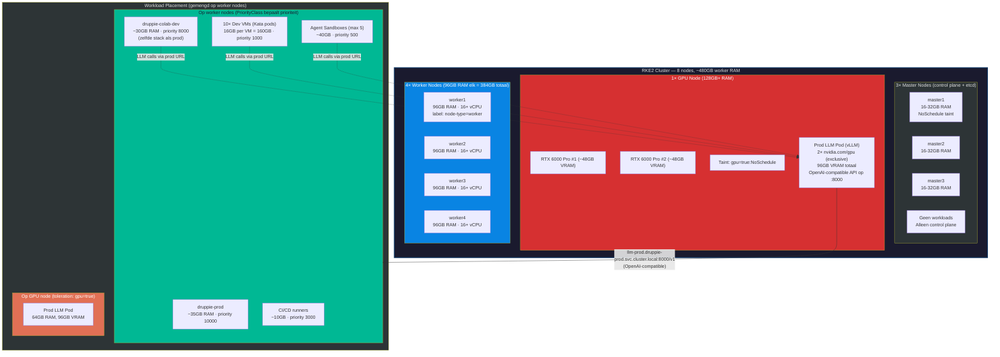

### GPU Strategie — prod only, gedeeld via URL

De GPU node (2× RTX 6000 Pro, 96GB VRAM totaal) is **exclusief voor de prod LLM pod**. Dev VMs, colab-dev, en agent sandboxes gebruiken géén lokale GPU — zij benaderen de prod LLM via een interne service URL.

```
GPU Node (128GB+ RAM, exclusief)
└── Prod LLM Pod (vLLM of Ollama)
    ├── 2× nvidia.com/gpu (exclusive limit, 96GB VRAM)
    ├── Taint toleration: gpu=true:NoSchedule
    └── Exposeert OpenAI-compatible endpoint:
        http://llm-prod.druppie-prod.svc.cluster.local:8000/v1

Dev VMs + Colab-dev + Agent Sandboxes
└── LLM_PROVIDER=internal
    LLM_BASE_URL=http://llm-prod.druppie-prod.svc.cluster.local:8000/v1
    → Alle LLM calls gaan naar prod LLM pod
    → Geen GPU node nodig in dev/colab-dev
```

**Waarom niet MIG of time-slicing:** Met 1 GPU node geeft partitionering prod inferentie minder VRAM. Exclusief voor prod is simpeler en geeft beste prod performance. Devs testen tegen dezelfde modellen via de URL.

### Node labels en taints (door Druppie team te zetten)

```bash
# GPU node — exclusief voor LLM workload
kubectl label node <gpu-node> node-type=gpu gpu=true
kubectl taint node <gpu-node> gpu=true:NoSchedule

# Worker nodes — alle andere workloads
kubectl label node <worker-1> node-type=worker
kubectl label node <worker-2> node-type=worker
kubectl label node <worker-3> node-type=worker
# (Master nodes hebben al NoSchedule taint van RKE2)
```

### Namespace isolatie — wat het wél en niet doet

| Wat namespaces isoleren | Wat ze NIET isoleren |
|------------------------|---------------------|
| ✅ ResourceQuota (RAM/CPU per namespace) | ❌ Fysieke node (pods delen nodes) |
| ✅ NetworkPolicy (netwerkverkeer blokkeren) | ❌ Kernel (vandaar Kata voor dev VMs) |
| ✅ RBAC (wie mag wat) | ❌ CPU/RAM (tenzij nodeSelector) |
| ✅ DNS (prod services niet zomaar bereikbaar) | |

### Prod/dev isolatie — PriorityClasses (géén aparte nodes)

Prod, colab-dev, dev VMs en agents draaien op **dezelfde worker nodes**. Geen verspilling van nodes aan dedicated prod. Isolatie komt van PriorityClasses: bij node pressure evicteert K8s eerst dev VMs, dan agents — prod blijft altijd draaien.

```yaml
# PriorityClasses
apiVersion: scheduling.k8s.io/v1
kind: PriorityClass
metadata: { name: druppie-prod }
value: 10000          # Altijd gescheduled, nooit geëvinceerd
---
apiVersion: scheduling.k8s.io/v1
kind: PriorityClass
metadata: { name: druppie-colab-dev }
value: 8000           # Hoog, maar onder prod
---
apiVersion: scheduling.k8s.io/v1
kind: PriorityClass
metadata: { name: druppie-ci }
value: 3000           # CI runners
---
apiVersion: scheduling.k8s.io/v1
kind: PriorityClass
metadata: { name: druppie-dev-vm }
value: 1000           # Lage prioriteit — geëvinceerd bij pressure
---
apiVersion: scheduling.k8s.io/v1
kind: PriorityClass
metadata: { name: druppie-agent }
value: 500            # Laagste — agents zijn ephemeral
```

**Gedrag bij node memory pressure:**

```
Node krijgt memory pressure (bijv. dev VM draait zware build)
  │
  └→ K8s kubelet: "Ik moet pods evicten"
       │
       └→ Eviction order (laagste priority eerst):
            agent sandbox (500)     → EVICTED ✗
            dev VM (1000)           → EVICTED ✗ (PVC blijft, dev kan herstarten)
            CI runner (3000)        → EVICTED ✗
            colab-dev (8000)        → STAYS ✓
            prod (10000)            → STAYS ✓
```

Prod overleeft altijd. Dev VMs worden geëvinceerd — PVC blijft behouden, developer klikt "Restart" in Druppie UI.

---

## Dev VM — Close-up

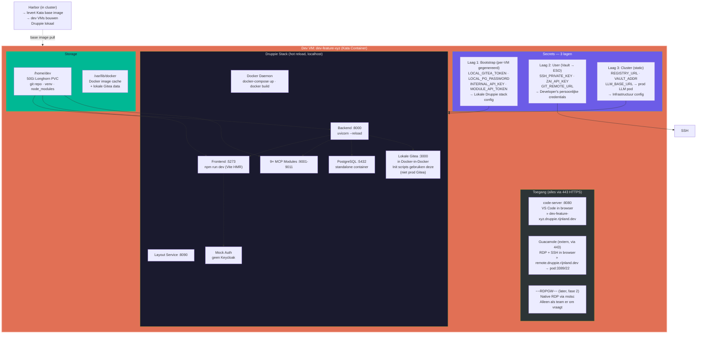

---

## Dev VM Base Image — shared across all branches

Alle dev VMs (en agent sandboxes) gebruiken **één shared base image** in Harbor, gebouwd vanuit de `colab-dev` branch. Dit maakt startup snel: containerd cached de image layers op de node, dus alleen de eerste dev VM per node is traag.

### Image layers

```
dev-vm-base:latest (in Harbor, ~4-5GB)
  ├── Layer 1: Ubuntu 22.04 + Python 3.12 + Node 20 + Git + Docker
  ├── Layer 2: code-server + SSH + xrdp + lokale Gitea
  ├── Layer 3: Druppie repo cloned at colab-dev HEAD
  ├── Layer 4: node_modules (frontend)
  └── Layer 5: venv (backend)
```

Gebouwd door Gitea Actions CI op push naar `colab-dev` (samen met de 13 prod images).

### Startup flow (per feature branch)

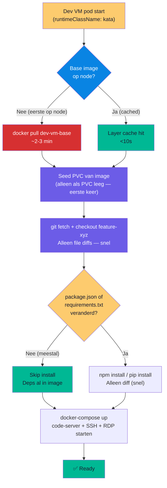

### Waarom dit snel is

| Scenario | Zonder base image | Met shared base image |
|----------|------------------|----------------------|
| Eerste dev VM op node | 2-5 min (clone + install) | 2-3 min (image pull) |
| 2e-10e dev VM op node | 2-5 min (opnieuw install) | **<30s** (image cached) |
| Restart (PVC exists) | <30s | <30s |
| Reset (PVC weg) | 2-5 min | **<30s** (image cached) |
| Nieuwe branch, zelfde node | 2-5 min | **<30s** (image cached, alleen git checkout) |

De key insight: feature branches veranderen zelden `package.json` of `requirements.txt`. Dus `git checkout feature-xyz` (alleen code diffs) + skip dep install = bijna instant.

---

## Remote Access Gateway (Guacamole + optioneel RDPGW)

Extern is alleen poort 443 (HTTPS) beschikbaar op `*.rijnland.dev`. RDP (3389) en SSH (22) zijn niet rechtstreeks bereikbaar. Oplossing: een remote access gateway die deze protocollen tunnelt over HTTPS.

### Apache Guacamole — primair

Guacamole is een clientless remote desktop gateway. RDP, SSH en VNC sessies lopen in de browser, allemaal over poort 443. Geen client installatie nodig.

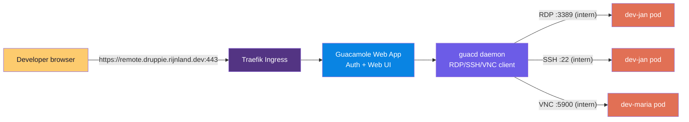

**Wat Guacamole biedt:**
- RDP desktop in browser (XFCE desktop van dev VM)
- SSH terminal in browser (voor quick commands)
- VNC in browser (alternatief voor RDP)
- File transfer (via RDP drive mapping)
- Clipboard sharing (copy/paste tussen browser en remote)
- Audio forwarding
- Eigen user database of Keycloak OIDC integratie

**Deploy in cluster:**
```yaml
# Namespace: remote-access
# Helm chart: apache-guacamole (beschikbaar via community charts)
#
# Componenten:
#   - guacamole-web    (Web UI + auth, ~512MB)
#   - guacd            (daemon, RDP/SSH/VNC client, ~256MB)
#   - postgresql       (session storage, ~256MB)
#
# Ingress: remote.druppie.rijnland.dev → guacamole-web:8080
# Totaal: ~1GB RAM
```

### Hoe Guacamole werkt

Guacamole is géén per-host proxy. Er is **één deployment achter één URL** (`remote.druppie.rijnland.dev`). Een developer authenticeert één keer en ziet een lijst met verbindingen waarvoor hij geautoriseerd is. Dit lost het "lijstje met machines en wachtwoorden bijhouden"-probleem op dat Guacamole oorspronkelijk voor ontworpen is.

**Drie componenten:**

| Component | Rol |
|-----------|-----|
| **Web applicatie** (Java server + JavaScript client in de browser) | Authenticatie afhandelen, verbindingsdefinities opslaan, de HTML5 client UI serveren. Implementeert zelf géén remote-desktop protocol. |
| **guacd** | Native C proxy daemon. Ontvangt het Guacamole protocol van de web app, laadt een protocol plugin (`libguac-client-rdp`, `-vnc` of `-ssh`) en maakt de daadwerkelijke verbinding met de remote VM. Luistert standaard op TCP 4822. |
| **libguac** | Gedeelde C library waarop guacd en de protocol plugins leunen. |

**Verbindingsmodel.** Elke dev VM (`dev-jan-vm`, enz.) wordt geregistreerd als één *connection* in Guacamole's database: een benoemde configuratie met protocol, hostname, poort, credentials en weergaveparameters. Op de VM zelf draait niets Guacamole-specifieks, alleen een normale RDP of SSH service.

**Waarom één URL, niet per-VM subdomeinen.** Een per-VM subdomein patroon (`dev-jan-vm.rijnland.dev`) vereist óf een aparte Guacamole deployment per VM (verspillend: aparte guacd, DB, certificaat en user store), óf een reverse-proxy die elk subdomein terugrouteert naar dezelfde Guacamole. Dat laatste koopt niets dat het home-scherm niet al biedt, en het herintroduceert precies het probleem dat Guacamole moest oplossen: onthouden welke machine en welke credentials je ook alweer nodig had.

**Per-VM isolatie via RBAC.** Elke connection heeft object-level permissies: `READ` (vereist om te verbinden), `UPDATE`, `DELETE` en `ADMINISTER`. Permissies worden per-user of per-user-group verleend. Voorbeeld: maak connection `dev-jan-vm`, verleen `READ` aan user `jan`. Als Jan inlogt ziet haar home-scherm exact `dev-jan-vm`; Mary ziet alleen `dev-mary-vm`; admins zien alles. Groeps-overerving is recursief, dus een `developers` groep kan baseline toegang verlenen aan alle leden.

**Deep-links (optioneel, voor portal integratie).** Directe links naar een specifieke connection hebben de vorm `/guacamole/#/client/<encoded-id>`, waarbij `<encoded-id>` de base64url is van de null-joined tuple `[connection_id, type, dataSource]`. De gebruiker moet nog steeds authenticeren; een deep-link slaat alleen de home-screen klik over. Handig voor een "Open mijn VM" knop in de Druppie frontend, maar geen manier om login te omzeilen.

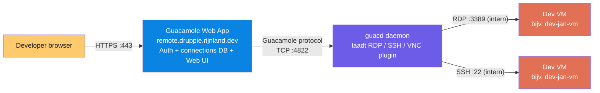

### Login & Authenticatie (Keycloak OIDC SSO)

Guacamole heeft een officiële OpenID Connect extensie. Daarmee hergebruiken we de bestaande Keycloak installatie (realm `druppie`, dezelfde users als de Druppie frontend: `admin`, `architect`, `developer`, `analyst`, `normal_user`). Een developer logt één keer in bij Keycloak en is daarna zowel in de Druppie frontend als in Guacamole ingelogd.

**SSO flow:**

1. Developer navigeert naar `remote.druppie.rijnland.dev`.
2. Guacamole (met de OpenID Connect extensie aan) redirect naar het Keycloak authorization endpoint voor realm `druppie`.
3. Developer authenticeert bij Keycloak, met dezelfde credentials als de Druppie frontend (`admin` / `Admin123!`, enz.).
4. Keycloak redirect terug naar Guacamole met een authorization code / id_token.
5. Guacamole valideert het token, mapt de OIDC subject naar een lokale Guacamole user (bij eerste login auto-aangemaakt indien zo geconfigureerd), en toont het home-scherm gefilterd op de connections van die user.

**Auto-provisioning.** Guacamole kan zo geconfigureerd worden dat de lokale user-record bij eerste OIDC login automatisch wordt aangemaakt. Er hoeft dus geen handmatige user-duplicatie tussen Keycloak en Guacamole.

**Authorisatie is los van authenticatie.** Keycloak beantwoordt "wie ben je?"; Guacamole's eigen RBAC beantwoordt "welke VMs mag je zien?". De provisioning API (zie de Deploy flow hieronder) verleent `READ` op de juiste connection aan de juiste user, nadat de VM is aangemaakt.

**Single logout (optioneel).** Keycloak SSO logout propageert naar alle geïntegreerde apps, dus uitloggen bij Keycloak logt ook uit Guacamole.

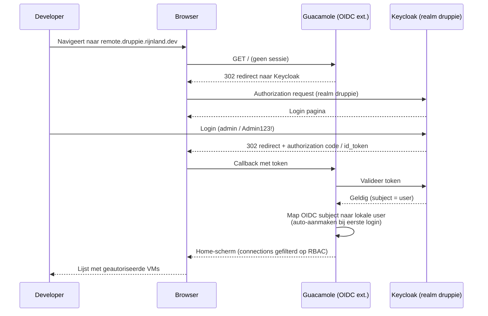

### RDPGW — later (fase 2)

Voor ontwikkelaars die de native Windows RDP client (mstsc) willen gebruiken i.p.v. browser. [bolkedebruin/rdpgw](https://github.com/bolkedebruin/rdpgw) is een Go-based RD Gateway voor K8s. **Niet in de eerste fase** — Guacamole dekt RDP en SSH. RDPGW toevoegen als er behoefte is aan native mstsc.

```
Windows mstsc
  → remote-rdp.druppie.rijnland.dev:443 (Traefik)
  → RDPGW (Go binary, ~100MB)
  → dev-jan:3389 (intern)
```

- Native RDP ervaring (mstsc, Remmina, Microsoft Remote Desktop)
- Alleen RDP (geen SSH)
- Lichter dan Guacamole (~100MB vs ~1GB)
- Go binary, K8s-native, Helm chart beschikbaar
- **Prioriteit: Laag — alleen als team native RDP vraagt**

### Overzicht toegangsmethoden

| Methode | URL | Poort extern | Wat | Client nodig? |
|---------|-----|-------------|-----|--------------|
| **code-server** | `dev-jan.druppie.rijnland.dev` | 443 HTTPS | VS Code in browser + preview | Nee |
| **Guacamole RDP** | `remote.druppie.rijnland.dev` | 443 HTTPS | RDP desktop in browser | Nee |
| **Guacamole SSH** | `remote.druppie.rijnland.dev` | 443 HTTPS | SSH terminal in browser | Nee |
| ~~RDPGW~~ (later) | ~~`remote-rdp.druppie.rijnland.dev`~~ | 443 HTTPS | Native RDP via mstsc | Ja — fase 2 |

Alle externe toegang gaat via poort 443. Geen poort 22 of 3389 naar buiten.

---

## Deploy → Werk → Stop flow

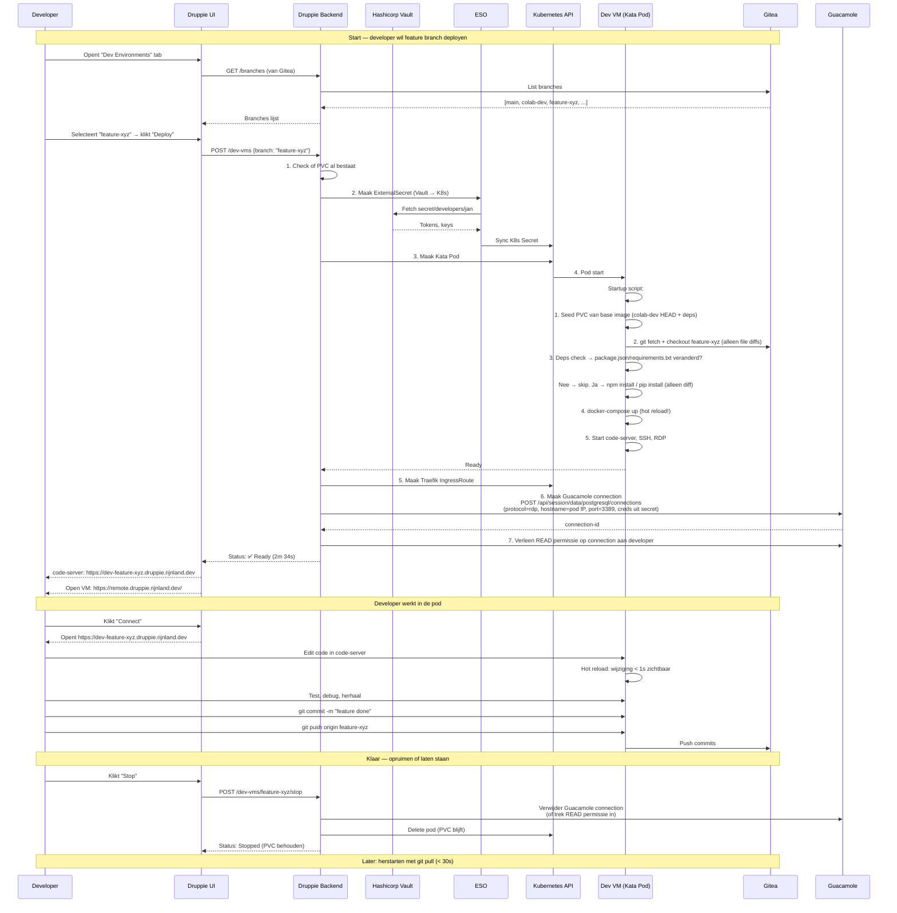

---

## Agent + Developer samenwerking

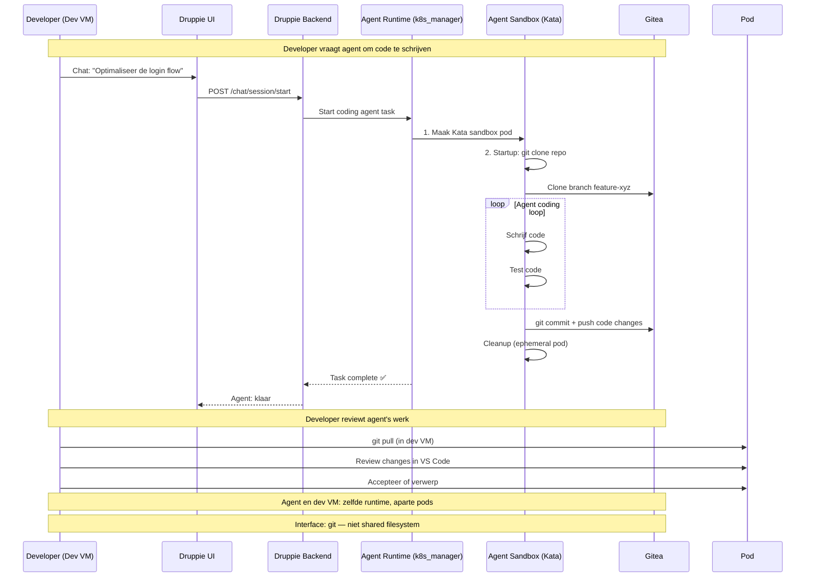

---

## Secrets Flow — 3-laags model

Dev VMs gebruiken **drie secret bronnen** met verschillende levensduren en doelen. De belangrijkste reden: Druppie init scripts maken repos aan in Gitea. Als elke dev VM prod Gitea gebruikt, vervuilt die. Daarom draait elke dev VM een **lokale Gitea** in Docker-in-Docker.

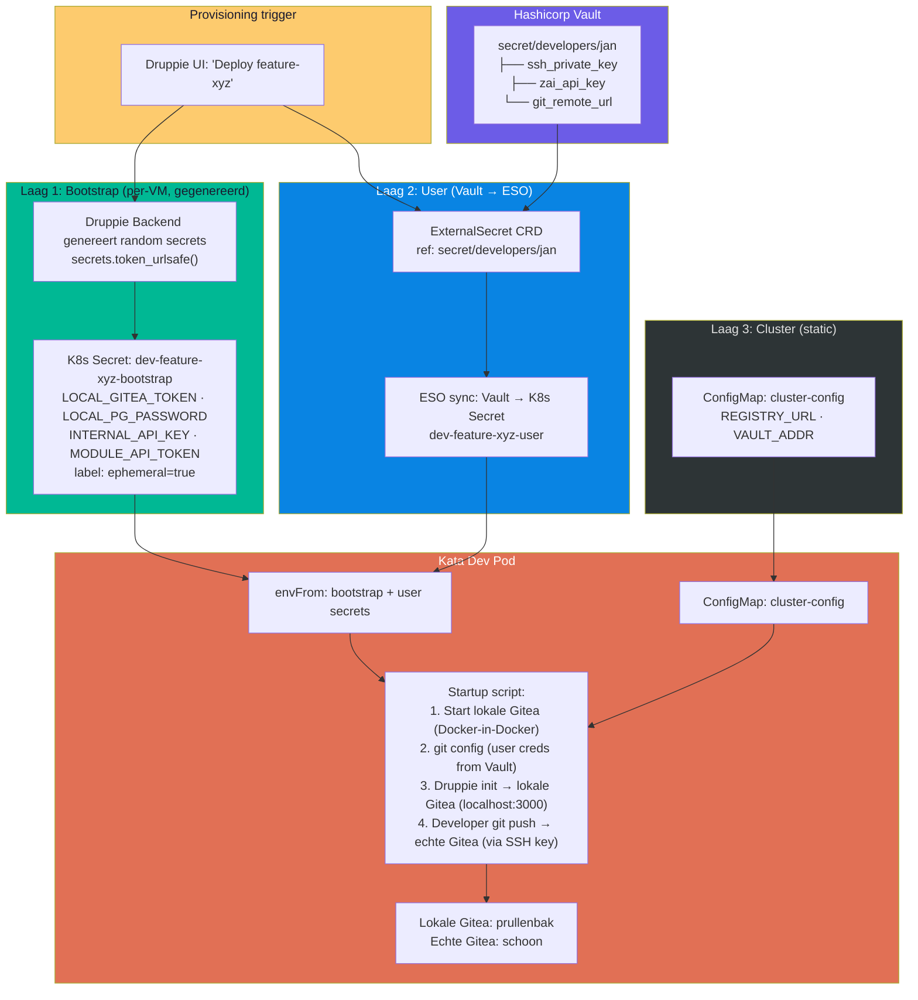

**Twee Gitea's in één pod:**

| Gitea | URL | Gebruikt door | Repos | Levensduur |
|-------|-----|--------------|-------|------------|
| **Lokale Gitea** (Docker-in-Docker) | `localhost:3000` | Druppie init scripts | Sample repos, test data | Ephemeral — weg bij pod delete |
| **Echte Gitea** (cluster) | `gitea.druppie.rijnland.dev` | Developer's git push/pull | Alleen echte Druppie code | Permanent — blijft schoon |

---

## Deploy Triggers — 3 typen

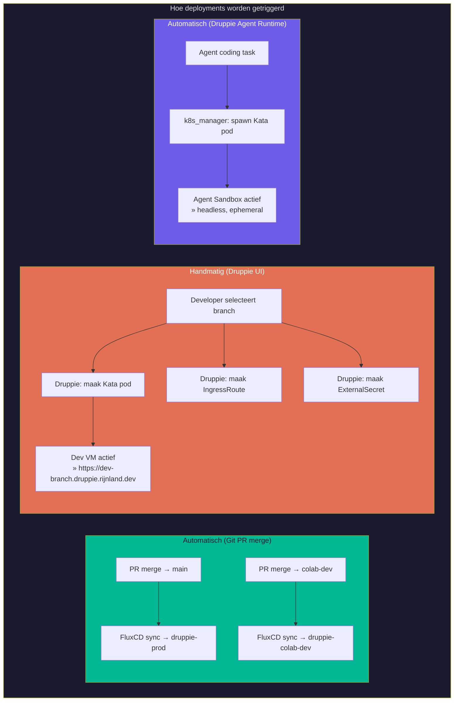

---

## Druppie varianten per omgeving

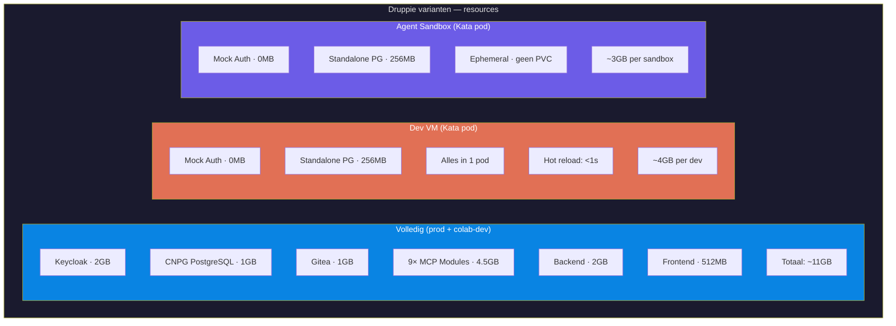

---

## Resource Budget (1TB RAM totaal)

| Omgeving | Type | RAM | vCPU | Storage | GPU |
|----------|------|-----|------|---------|-----|
| `druppie-prod` | Namespace | 32GB | 16 | Longhorn/NFS | — |
| `druppie-colab-dev` | Namespace | 16GB | 8 | Longhorn/NFS | — |
| Dev VMs (max 10) | Kata pods | 4GB × 10 = 40GB | 4 × 10 = 40 | 50Gi × 10 = 500Gi | 1× MIG |
| Agent Sandboxes (max 5) | Kata pods | 3GB × 5 = 15GB | 2 × 5 = 10 | Ephemeral | — |
| Infrastructuur (Vault, Prometheus, etc.) | System | 32GB | 16 | ~200Gi | — |
| **Subtotaal** | | **~135GB** | **~90** | **~700Gi** | **1 GPU** |
| **Vrij** | | **~865GB** | — | — | **3 GPUs** |

---

## Samenvatting

| Component | Technologie | Provisioning | Secrets |
|-----------|------------|-------------|---------|
| **druppie-prod** (namespace) | Volledige Druppie stack | FluxCD GitOps, auto op PR→main | Vault + Helm values |
| **druppie-colab-dev** (namespace) | Volledige Druppie stack | FluxCD GitOps, auto op PR→colab-dev | Vault + Helm values |
| **Dev VM** (Kata pod) | Alles in 1 pod, hot reload | Druppie UI, handmatig | 3-laags: bootstrap + Vault + cluster |
| **Agent Sandbox** (Kata pod) | Headless, ephemeral | Druppie agent runtime (k8s_manager.py) | Bootstrap only, geen user secrets |
| **Lokale Gitea** (in dev VM) | Docker-in-Docker, localhost:3000 | Pod startup script | Bootstrap random wachtwoord |
| **Echte Gitea** (extern) | Git repos + Gitea Actions CI | Extern (infra beheert) | Developer SSH key uit Vault |
| **Harbor** (in cluster) | Container registry + scanning | Zelf geïnstalleerd | Basic auth via Vault/ESO |
| **dev-vm-base** (in Harbor) | Shared base image voor alle dev VMs + agents | CI bouwt op colab-dev push | Deps in image, git checkout per branch |
| **FluxCD** (extern) | GitOps → cluster sync | Extern (infra beheert) | kubeconfig naar cluster |
| **Vault** (extern) | Secrets management | Extern (infra beheert) | ESO sync naar K8s secrets |

---

## Faseringsplan

| Fase | Week | Wat | Deliverable |
|------|------|-----|-------------|
| **1** | 1-2 | Fundering: node labels/taints, Kata operator, Harbor registry, LLM pod op GPU node, namespaces, FluxCD config, quotas | Cluster klaar voor workloads |
| **2** | 3-4 | Dev VMs: base image, Vault secrets structuur, Druppie provisioning API + UI, LLM config via prod URL, **Guacamole installeren** (remote access gateway) | Devs kunnen VM deployen + RDP/SSH via browser |
| **3** | 5-6 | Agent sandboxes: k8s_manager.py, zelfde image, git interface | Agents werken op K8s |
| **4** | 7-8 | CI/CD: Gitea Actions pipeline, monitoring, developer docs | Productie-klaar, gedocumenteerd |
| **Later** | — | RDPGW (native RDP client support) — alleen als team er om vraagt | Optioneel |

---

## Genomen beslissingen — definitief

| # | Beslissing | Keuze |
|---|-----------|-------|
| 1 | Cluster | Rancher RKE2 (containerd), 8 nodes (3 master + 1 GPU + 4 worker × 96GB), ~480GB worker RAM |
| 2 | Runtime dev pods + agent sandboxes | Kata Containers |
| 3 | Dev model | Model A: alles in 1 pod, hot reload lokaal |
| 4 | GitOps prod/dev namespaces | FluxCD (extern, door infra) |
| 5 | Dev VM provisioning | Druppie backend + UI, handmatig |
| 6 | Secrets injectie | 3-laags: bootstrap (per-VM) + Vault/ESO (per-user) + cluster (static) |
| 7 | Storage | Longhorn (al aanwezig) |
| 8 | Ingress + TLS | Traefik + cert-manager (al aanwezig) |
| 9 | Auth dev VMs | Mock auth (geen Keycloak) |
| 10 | Agent ↔ Dev interface | Git (geen shared filesystem) |
| 11 | Code lifecycle | Developer pull/push via git |
| 12 | Preview auto-deploy | Alleen prod + colab-dev via FluxCD |
| 13 | GPU node | Exclusief voor prod LLM pod (2× RTX 6000 Pro, 96GB VRAM, NoSchedule taint) |
| 14 | LLM toegang dev/colab-dev | Via prod LLM URL (OpenAI-compatible endpoint) |
| 15 | Node placement | Workers voor alles, GPU node alleen LLM |
| 16 | Cluster toegang | Druppie team heeft cluster-admin |
| 17 | Prod/dev isolatie | PriorityClasses (prod=10000, colab-dev=8000, CI=3000, dev VM=1000, agent=500) |
| 18 | Colab-dev | Zelfde stack als prod, alleen minder replicas en geen HA |
| 19 | Remote access | Apache Guacamole (RDP + SSH via 443 HTTPS, browser-based). RDPGW later indien native client gewenst |
| 20 | Container registry | Harbor (in cluster, zelf geïnstalleerd) — scanning, signing, UI |
| 21 | Gitea/Vault/FluxCD | Extern (infra beheert). Cluster = pure compute |
| 22 | Dev VM base image | Shared base vanuit colab-dev (in Harbor). Startup: image pull + git checkout feature branch. Eerste dev VM op node ~2-3 min, daarna <30s door containerd layer cache |
