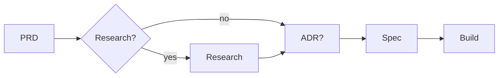

# Documentation framework — how it works

This is the practical guide to how we document decisions and specs in this repo. For the decision and rationale see [ADR 001](../adrs/001-adopt-documentation-standard.md).

## Start here (for the team)

**Why.** We write short docs so the decisions and requirements behind our features stay findable and reusable — future-you (and everyone else) shouldn't have to reverse-engineer *why* something is the way it is. Not every change needs docs: only the ones that add or change what the product does or how it was decided.

### Which doc do I write?

Pick based on your situation:

| Your situation | Write a… |
|----------------|----------|
| New or changed feature | **PRD** |
| A decision you want to remember | **ADR** |
| Weighing options before making a choice | **Research** (optional) |
| Pinning behaviour down as acceptance criteria | **Spec** |
| Bugfix, chore, or other small change | usually **nothing** (or mark it `docs-exempt`) |

Two quick examples:

- You add a new approval screen → write a **PRD** (and a **Spec** for its acceptance criteria).
- You choose Postgres instead of Mongo → write an **ADR** (and a **Research** doc if you weighed several options first).

### Start from a template

You don't write a doc from scratch — you **copy the matching template** to a new file and fill it in:

1. Copy the template into its type folder as `docs/<type>/NNN-kebab-title.md` (Specs: `docs/specs/NNN-kebab-title.feature`). Pick the next free `NNN` (3-digit) number in that folder — e.g. the next ADR after `033-…` is `034-…`.
2. Set the `id` in the frontmatter to the same number as a **zero-padded string**, e.g. `id: "014"` — it **must** match the filename prefix (Check B enforces this).
3. Fill in the rest of the frontmatter and body as the template comments explain.

The templates:

- [PRD template](../prds/TEMPLATE.md)
- [ADR template](../adrs/TEMPLATE.md)
- [Research template](../research/TEMPLATE.md)
- [Spec template](../specs/TEMPLATE.feature)

**Link your docs together.** Connect related docs via the `linked_*` frontmatter fields (ADR/PRD/Research, e.g. `linked_research`, `linked_adrs`) or the `@prd` / `@adr` Gherkin tags at the top of a Spec. Linked values are repo-root-relative paths to existing files (e.g. `docs/adrs/007-strict-layered-architecture.md`).

### How it's checked

**GitHub Actions ([Docs check](../../.github/workflows/docs.yml)) runs on every PR** and posts two checks:

- **Check A — mandatory-docs gate.** If your PR changes feature code (anything under `druppie/` or `frontend/src/`) but adds no doc, it flags the PR — unless you mark it `docs-exempt` (see below). Editing only a `TEMPLATE.md`, `CAS.md`, or `*.schema.json` does **not** count as a doc.
- **Check B — validity.** Every existing templated doc must be valid: correct frontmatter/schema, `id` matching the filename, resolvable `linked_*` / `@prd` / `@adr` links (existing files, no URLs), consistent `superseded_by`, and a fresh `docs/adrs/CAS.md`.

> **Warn-mode for now.** Both checks currently run with `continue-on-error`, so they appear as **annotations on the PR but do not block the merge** while existing docs are migrated. They become blocking later. (A third step — the validator's own regression tests — *is* already blocking.)

**Catch it before you push:**

- Local check: `docker compose --profile docs-validator run --rm docs-validator` (runs Check B).
- Optional git hook: run `./scripts/setup-hooks.sh` once to install the [lefthook](https://github.com/evilmartians/lefthook) pre-commit hook, which validates on every commit.

### Skipping docs

If a change genuinely needs none, mark it `docs-exempt` in any one of three ways:

- add the **`docs-exempt` label** to the PR, or
- tick a **`- [x] docs-exempt`** checkbox in the PR description, or
- add a **`docs-exempt: <reason>`** line to the PR description.

### Where the details live

The rest of this guide covers each type in depth, and [`Enforcement (checks)`](#enforcement-checks) has the full check reference. Pure naslag (subsystem/architecture overviews) has no template and lives in `docs/reference/`; how-to material like this guide lives in `docs/guides/`.

## The four document types

| Type | What it captures | When you write it | Template |
|------|------------------|-------------------|----------|
| **PRD** | The feature: the problem and goal from the user's side | Start of a non-trivial feature | `docs/prds/TEMPLATE.md` |
| **Research** | *All* options considered + their trade-offs / weighing | Only when the choice isn't obvious | `docs/research/TEMPLATE.md` |
| **ADR** | *Only* the decision that was made + its consequences, kept concise (Context / Decision / Consequences) — **no** weighing of alternatives | When you make a decision worth remembering | `docs/adrs/TEMPLATE.md` |
| **Spec** | Executable acceptance criteria (Gherkin) | Before implementing, to pin behaviour | `docs/specs/TEMPLATE.feature` |

> **ADR vs Research.** Keep them apart: the **comparison of alternatives and their trade-offs lives in the Research doc**, not in the ADR. The **ADR states only the decision that was taken and what follows from it** (Context / Decision / Consequences), briefly. If you catch yourself weighing options inside an ADR, that weighing belongs in a Research doc — link the ADR to it via `linked_research`.

## Orientation artefacts (no template, optional)

Next to the four *templated* types above (PRD / Research / ADR / Spec) there are two lightweight, **optional** "orientation" types. They have **no template and no schema**, and they are **not checked by the validator (Check B)**:

| Type | What it captures | Location |
|------|------------------|----------|
| **Guide** | How-to / explanation / conventions / runbooks — *"how do I do X"* | `docs/guides/` |
| **Reference** | Naslag / subsystem / architecture overview — *"what exists and how it hangs together"* | `docs/reference/` |

- They carry **no mandatory frontmatter/template** and are **not schema-validated**, but they **do count as valid documentation for the mandatory-docs gate (Check A)**.
- **Back-links:** a guide or reference doc **SHOULD** link back to the ADR/PRD/Spec that owns the underlying decision/requirement/behaviour. This is a recommendation, not a hard-enforced rule.

### Decompose first: pick As-1 or As-2

Before writing, decide which axis a doc sits on:

- **As-1 — templated (ADR / PRD / Spec):** if the doc records a **decision, a requirement, or testable behaviour**, use a templated type. This holds **even when you are describing how something already works today** — current behaviour does **not** disqualify an ADR or Spec. Lens ≠ time: an **ADR** is about an *already-taken decision*, and a **Spec** describes exactly *current/required behaviour*.
- **As-2 — orientation (guide / reference):** if the doc is **pure orientation or naslag**, use a **guide** (how-to / conventions) or a **reference** (subsystem / architecture overview), **with a back-link** to the owning ADR/PRD/Spec.

Decompose first: extract every decision into an ADR, every requirement into a PRD, and every testable behaviour into a Spec. A **guide** or **reference** doc is the **residue that is left after that extraction** — pure orientation with nothing templatable in it. It is **not an escape hatch** to avoid writing ADRs or Specs: a decision or a testable behaviour still needs its templated home.

## The flow

```
PRD  →  Research?  →  ADR?  →  Spec  →  build
```



- **PRD first** — know what you're building and why.
- **Research is optional** — skip it if the choice is obvious or an ADR already covers it.
- **ADR is conditional** — only for a *new* decision; skip if an existing ADR applies.
- **Specs** pin the acceptance criteria, link back to their PRD/ADR via `@prd` / `@adr` Gherkin tags, and carry lifecycle tags (`# @status`, `# @superseded_by`) just like the other doc types.

Not every change needs docs: a bugfix or chore usually needs none.

## Conventions

- **Format:** Markdown + YAML frontmatter.
- **Ids:** 3-digit zero-padded **string** (`"001"`); filenames `NNN-kebab-title.md`.
- **Status & lifecycle:** every doc carries a `status`, and a `superseded_by` once replaced. For ADR/PRD/Research these live in YAML frontmatter; for Specs they are `# @status` / `# @superseded_by` comment tags at the top of the file. Exact values differ per type — see each template.
- **Links:** use the `linked_*` frontmatter fields (ADR/PRD/Research) or the `@prd` / `@adr` Gherkin tags (Specs) to connect documents. Linked values **must** be repo-root-relative paths to existing files (e.g. `docs/research/004-agent-runtime.md`). Absolute URLs are rejected by the validator — external references belong in the document body as inline links, not in frontmatter (frontmatter links drive in-app cross-navigation).
- **DevOps link (PRD):** a PRD's frontmatter carries a `linked_workitem` field — a URL to the Azure DevOps user story / work item that motivates the PRD. It may be `null` when there is no work item.
- **Language:** English is the source of truth; ids, status and frontmatter are never translated.
- **Schemas:** `docs/{adrs,prds,research}/*.schema.json` define the required frontmatter fields; Spec `@prd` / `@adr` / `@status` / `@superseded_by` tags are checked by `scripts/validate_docs.py`.
- **Outdated docs:** never delete — always supersede (see [Migration Workflow](#migration-workflow)). Mark the old doc `superseded` and point `superseded_by` at the replacement so the *why* stays traceable.

## Migration Workflow

Living docs (`docs/TECHNICAL.md`, `docs/FEATURES.md`, ad-hoc behavioural notes) capture
decisions and features informally. As the content stabilises, migrate it into the typed
documents so it gets an id, a status, and cross-links. The golden rule: **never delete —
always supersede**, so the historical *why* stays traceable.

### Lifecycle tags

Every document records where it is in its lifecycle. The mechanism differs by type but the
shape is the same — a `status` plus a `superseded_by`:

| Type | Where the tags live | Example |
|------|---------------------|---------|
| ADR / PRD / Research | YAML frontmatter (`status`, `superseded_by`) | `status: accepted`, `superseded_by: "005-..."` |
| Spec (`.feature`) | comment tags at the top of the file | `# @status active`, `# @superseded_by <file>` |

- **ADR statuses:** `proposed | accepted | deprecated | superseded` (see `docs/adrs/TEMPLATE.md`).
- **Spec statuses:** `draft | active | superseded` (see `docs/specs/TEMPLATE.feature`).
- **PRD / Research** use the same frontmatter pattern — see their templates for the exact
  status values.
- `scripts/validate_docs.py` enforces this in CI: a `superseded` doc **must** name its
  replacement, and a `draft` / `active` doc must leave `superseded_by` empty.

### Migrating content

- **Decision buried in `TECHNICAL.md` → ADR.** Copy the decision, its context, and
  consequences into a new `docs/adrs/NNN-title.md`, filling in every required frontmatter
  field. Leave a one-line pointer to the new ADR at the old location, then supersede the
  old prose (below) rather than deleting it.
- **Feature description in a living doc → PRD.** Move the problem, goal, and user journey
  into `docs/prds/NNN-title.md`; connect it to its motivation via `linked_adrs` /
  `linked_research`.
- **Behavioural / acceptance notes → Spec.** Rewrite the behaviour as Gherkin scenarios in
  `docs/specs/NNN-name.feature`, starting from `TEMPLATE.feature`. Fill in the
  `# @status` / `# @superseded_by` block and the `@prd` / `@adr` tags so the spec links
  back to its PRD and ADR.

### Superseding a document

When a typed document replaces an older one (or a living-doc section), do **both** steps:

1. **Old doc — mark superseded.** Set `status: superseded` and `superseded_by: <new-doc>`
   (frontmatter), or `# @status superseded` + `# @superseded_by <new-file>` (Specs). For a
   Markdown doc, also add a banner at the very top of the body so a reader lands on it
   immediately:

   ```markdown
   > **Superseded** by [`005-new-title.md`](005-new-title.md).
   > Kept for history — follow the new doc.
   ```

2. **New doc — point back.** Link the replacement to the old one (ADR: `supersedes:
   "<old-id>"`) so the chain is navigable in both directions.

Never delete the old document. The validator guarantees a `superseded` doc always names its
replacement.

## Done

The PBI 9743 (existing doc migration) and PBI 9744 (validation + enforcement) are both
complete:

- **All existing docs** migrated to the formal ADR/PRD/Research/Spec structure, with pure orientation material kept as `docs/guides/` or `docs/reference/` docs.
- **`docs/reference/` retained** as an optional, un-templated orientation location for naslag / subsystem / architecture overviews (see [Orientation artefacts](#orientation-artefacts-no-template-optional)).
- **47 pytest tests** run in CI, covering frontmatter validation, lifecycle tags, link
  resolution, CAS freshness, spec references, and the mandatory-docs gate.
- **Link validation:** all `linked_*` fields must point to existing files — URLs are rejected.
- **Enforcement:** the validator runs in CI (`docs.yml`), blocking on errors. Lefthook
  pre-commit hook is available as opt-in local convenience.

Future improvements (agent-writer skills, in-core documentation portal) are tracked as
separate epics.

> This guide is written in the standard it describes, so it can later be converted into a
> writer-skill with minimal effort.

## Enforcement (checks)

Docs in `docs/{adrs,prds,research}` and `docs/specs` are checked automatically (PBI 9744):

- **Locally (optional):** `docker compose --profile docs-validator run --rm docs-validator` — or opt in to [lefthook](https://github.com/evilmartians/lefthook) via `./scripts/setup-hooks.sh` (or `lefthook install`) to run it before each commit. The lefthook hook is optional/opt-in local convenience only; CI is the binding gate.
- **CI (binding):** `.github/workflows/docs.yml` runs on every PR, with two checks:
  - **Validity** — docs that exist must have the required frontmatter/fields, a matching `id`, resolvable `linked_*` / `@prd` / `@adr` (must point to existing files; URLs are rejected), and a fresh `CAS.md`.
  - **Mandatory-docs** — a PR that changes feature code must include documentation, unless it is marked `docs-exempt`. The mandatory-docs gate treats changes under `druppie/` and `frontend/src/` as code that needs docs; tooling/infra paths are intentionally exempt.
- **Exempt** a change that genuinely needs no docs via the **`docs-exempt` label** or a **checked `docs-exempt` box** / a **`docs-exempt: <reason>` line** in the PR description.

> These checks currently run in **warn-mode** (they report but do not block) while existing docs are migrated. They become blocking once the baseline is clean and the team agrees.
