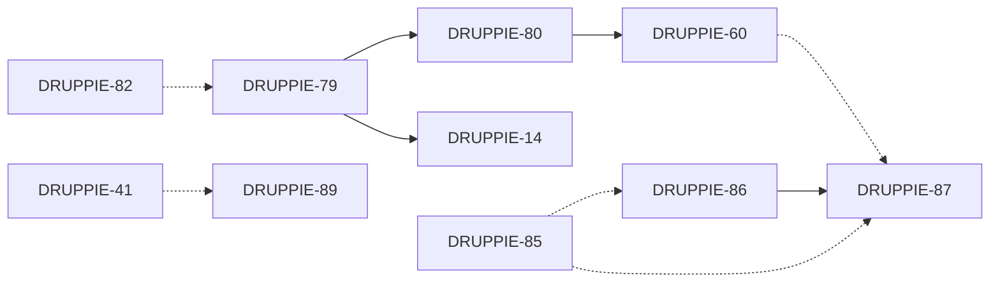

# Sprint 7 Planning (17 mrt – 2 apr 2026)

**Sprintdoel:** "Applicatie die door Druppie is gebouwd en waarmee vergunningen gevonden kunnen worden."

**Context:** Deze sprint verschuift de focus van intern fundament naar een zichtbaar resultaat: Druppie bouwt zelf een Vergunningvinder-applicatie. Dit is geen productierelease (productie: 31 dec 2026), maar een demonstratie dat het platform functioneel werkende software kan opleveren. De komende twee sprints ligt de nadruk op bouwblokken; na de zomer verschuift de focus naar het toevoegen van bedrijfsdata.

---

## DRUPPIE-86 (2 pts) – Functioneel Ontwerp Vergunningvinder

**Als** Business Analyst-agent
**wil ik** via de `create_project`-workflow een functioneel ontwerp (`functional_design.md`) opstellen voor de Vergunningvinder
**zodat** stakeholders en de Architect-agent een gevalideerd uitgangspunt hebben om het technisch ontwerp op te baseren.

### Scope & deliverables
- BA-agent doorloopt de standaard HITL-dialoog (funnelvragen, max 1 vraag tegelijk) met Gijsbert en stakeholders.
- Resultaat: `functional_design.md` in de Vergunningvinder-repo met Mermaid-diagrammen voor gebruikersflows.
- Minimaal beschreven: doelgebruiker, kernfunctionaliteit (zoeken op activiteit/locatie/branche), databronnen (overheid.nl / IPLO), UI-schetsen als wireframe-beschrijvingen.
- Het FO wordt goedgekeurd door een gebruiker met rol `business_analyst` of `admin` via het approval-workflow (tool approval gate).

### Acceptatiecriteria
- [ ] `functional_design.md` bestaat in de project-repo en bevat minimaal: probleemstelling, doelgroep, user stories, datamodel op hoofdlijnen, en Mermaid-diagrammen.
- [ ] BA-agent heeft minimaal 1 HITL-ronde doorlopen met de stakeholder.
- [ ] Het document is goedgekeurd via de approval-workflow in de Tasks-pagina.

### Technische context
- BA-agent definitie: `druppie/agents/definitions/business_analyst.yaml` — gebruikt HITL builtins (`hitl_question`, `hitl_multiple_choice`) en schrijft naar de workspace via MCP `module-coding` tools (`write_file`, `commit_and_push`).
- Workflow: `create_project` → Router → Planner → **Business Analyst** → Planner re-eval → Architect.

---

## DRUPPIE-87 (2 pts) – Technisch Ontwerp Vergunningvinder

> Blocked by: DRUPPIE-86

**Als** Architect-agent
**wil ik** op basis van het goedgekeurde functioneel ontwerp een technisch ontwerp (`technical_design.md`) schrijven
**zodat** de Builder Planner en Builder-agents een concrete blauwdruk hebben om de Vergunningvinder te implementeren.

### Scope & deliverables
- Architect-agent leest `functional_design.md`, toetst aan NORA-standaarden en schrijft `technical_design.md`.
- Afstemming met architecten (o.a. Arie) via HITL-dialoog.
- Beslissing over stack: frontend-framework, API-laag, dataopslag, eventuele externe API-integraties.
- Uitspraak: `APPROVE` (ga door naar Builder Planner) of `FEEDBACK` (terug naar BA).

### Acceptatiecriteria
- [ ] `technical_design.md` bevat: architectuurdiagram (Mermaid/ArchiMate), componentoverzicht, API-contract, datamodel, security-overwegingen, deploymentstrategie.
- [ ] Architect-agent heeft het FO gevalideerd en geen `REJECT` gegeven.
- [ ] Minimaal 1 HITL-ronde met een gebruiker met rol `architect`.
- [ ] Het TO refereert aan de module-conventie uit `docs/module-specification.md` als de Vergunningvinder als module gebouwd wordt.

### Technische context
- Architect-agent definitie: `druppie/agents/definitions/architect.yaml` — gebruikt `module-archimate` MCP voor ArchiMate-modellen, `module-coding` voor lezen/schrijven, HITL builtins.
- De architect kan `APPROVE_CORE_UPDATE` signaleren als er wijzigingen aan Druppie-core nodig zijn (triggert Update Core Builder flow).

---

## DRUPPIE-89 (2 pts) – Druppie als Agent-Bouwer voor Copilot Studio

**Als** platform-team
**wil ik** onderzocht hebben hoe Druppie vanuit de sandbox agents kan aanmaken en beheren in Microsoft Copilot Studio
**zodat** we een concreet pad hebben om de Vergunningvinder als Copilot Studio-agent uit te rollen.

### Scope & deliverables
- Onderzoeksrapport (markdown in `docs/`) met: Copilot Studio API-mogelijkheden, authenticatie (OBO-token exchange via Druppie's identityprovider), beperkingen, en een voorstel voor integratie.
- Proof-of-concept: minimaal 1 API-call vanuit een sandbox die een agent aanmaakt of bijwerkt in Copilot Studio.
- Vergelijking met het huidige deployer-pad (Docker-container op poort 9100-9199).

### Acceptatiecriteria
- [ ] Onderzoeksdocument in `docs/copilot-studio-integration.md`.
- [ ] Duidelijke conclusie: wel/niet haalbaar als pad voor de Vergunningvinder POC, met onderbouwing.
- [ ] Als haalbaar: architectuurvoorstel hoe de Deployer-agent (`deployer.yaml`) uitgebreid of aangevuld wordt.
- [ ] Identificatie van benodigde credentials/secrets en hoe deze via Vault (DRUPPIE-41) beheerd worden.

### Technische context
- Huidige deploy-flow: `deployer.yaml` bouwt Docker-images via `module-docker` MCP, runt containers, verifieert health.
- Sandbox heeft credential-proxying voor git, LLM en GitHub API — Copilot Studio credentials zouden een nieuw proxy-pad vereisen.
- Relevante docs: `docs/SANDBOX.md` (credential proxying, GitHub App setup).

---

## DRUPPIE-79 (3 pts) – Modules integreren (1/6): Fundament

> Status: In progress

**Als** ontwikkelaar
**wil ik** alle feature branches gemerged hebben en alle 6 MCP-servers getransformeerd naar de module-conventie uit `docs/module-specification.md`
**zodat** elke MCP-server een `MODULE.yaml`, versioned directories (`v1/`), en een standaard `server.py` heeft.

### Scope & deliverables
Per MCP-server (`module-coding`, `module-docker`, `module-filesearch`, `module-archimate`, `module-web`, `module-registry`) transformeren naar:
```
module-<name>/
├── MODULE.yaml          # id, latest_version, versions[]
├── server.py            # FastMCP app factory + versioned router
├── requirements.txt
├── Dockerfile
└── v1/
    ├── tools.py         # @mcp.tool() definities
    ├── module.py        # Business logic
    └── __init__.py
```

### Acceptatiecriteria
- [ ] Alle 6 MCP-servers in `druppie/mcp-servers/` volgen de structuur uit de module-specificatie.
- [ ] Elke server heeft een `MODULE.yaml` met correcte metadata (`id`, `latest_version`, `versions`).
- [ ] Tool-definities staan in `v1/tools.py` met standaard argumenten (`session_id`, `repo_name` waar van toepassing).
- [ ] `server.py` per module registreert de versioned router.
- [ ] Alle bestaande functionaliteit werkt ongewijzigd (regressietest via `pytest` en handmatig via docker compose).
- [ ] Feature branches zijn gemerged naar `colab-dev`.

### Technische context
- Module-specificatie: `docs/module-specification.md` — sectie "File Structure" en "Complete Example" (OCR module).
- Huidige modules: `druppie/mcp-servers/module-coding/`, `module-docker/`, `module-filesearch/`, `module-archimate/`, `module-web/`, `module-registry/`.
- HITL is een builtin tool, geen module — valt buiten scope.

---

## DRUPPIE-80 (1 pt) – Modules integreren (2/6): Registry herschrijven tot Platform MCP

> Blocked by: DRUPPIE-79

**Als** BA- of Architect-agent
**wil ik** module-gerichte tools (`list_modules`, `get_module`, `search_modules`) beschikbaar hebben via de `module-registry` MCP-server
**zodat** ik kan ontdekken welke modules beschikbaar zijn en hun capabilities kan begrijpen bij het opstellen van ontwerpen.

### Scope & deliverables
- `module-registry` herschrijven: tools lezen `MODULE.yaml`-bestanden van alle geregistreerde modules.
- Drie nieuwe tools in `module-registry/v1/tools.py`:
  - `list_modules` — overzicht van alle modules met id, naam, versie, beschrijving.
  - `get_module` — detail van één module incl. beschikbare tools en versies.
  - `search_modules` — zoek op keyword/capability.
- Backend API-route voor module discovery (zoals beschreven in module-specificatie sectie "Backend API").

### Acceptatiecriteria
- [ ] `module-registry/v1/tools.py` bevat de drie genoemde tools.
- [ ] Tools retourneren data gebaseerd op `MODULE.yaml`-bestanden van de overige modules.
- [ ] BA-agent en Architect-agent hebben `module-registry` in hun MCP-configuratie (agent YAML `mcp_servers` lijst).
- [ ] Integratie-test: `list_modules` retourneert minimaal de 6 getransformeerde modules.

### Technische context
- Module-specificatie: `docs/module-specification.md` — secties "Backend API" en "MCP Protocol".
- Agent YAML's bevatten een `mcp_servers`-lijst die bepaalt welke tools een agent kan aanroepen.
- Huidige `module-registry` code is de vertrekbasis.

---

## DRUPPIE-82 (5 pts) – Modules integreren (3/6): Module-creatieflow

**Als** Druppie-platform
**wil ik** dat de Architect → Builder Planner → Developer agentpipeline nieuwe modules kan aanmaken volgens de module-conventie
**zodat** Druppie zelfstandig uitbreidbare functionaliteit kan bouwen (zoals modules voor de Vergunningvinder).

### Scope & deliverables
- De Architect-agent kan in zijn `technical_design.md` specificeren dat een nieuwe module nodig is (incl. module-id, tools, versie).
- De Builder Planner leest deze spec en genereert een `builder_plan.md` met de module-structuur als onderdeel van het bouwplan.
- De Developer/Builder-agents creëren de module-bestanden in de sandbox:
  - `MODULE.yaml`, `server.py`, `v1/tools.py`, `v1/module.py`, `Dockerfile`, `requirements.txt`.
- Na creatie is de module registreerbaar via `module-registry`.

### Acceptatiecriteria
- [ ] End-to-end flow: Architect specificeert module → Builder Planner plant structuur → Builder/Developer creëert bestanden → module is geldig volgens `MODULE.yaml`-schema.
- [ ] Gegenereerde module voldoet aan de structuur uit `docs/module-specification.md`.
- [ ] Builder-agents gebruiken de `execute_coding_task` sandbox-flow voor het schrijven van module-code.
- [ ] Minimaal 1 testmodule succesvol aangemaakt via deze flow.
- [ ] De module-specificatie (`docs/module-specification.md`) is beschikbaar als skill of prompt-context voor de Architect en Builder Planner.

### Technische context
- Builder-agent (`builder.yaml`) delegeert via `execute_coding_task` naar de sandbox.
- Builder Planner (`builder_planner.yaml`) schrijft `builder_plan.md` met code standards, test framework, solution strategy.
- De Architect heeft toegang tot `module-archimate` en `module-coding` MCP tools.
- Skills systeem (`druppie/agents/definitions/skills/`) kan uitgebreid worden met een `module-creation` skill.

---

## DRUPPIE-60 (3 pts) – Architect-context van Druppie begrijpen

> Blocked by: DRUPPIE-80

**Als** Architect-agent
**wil ik** een sub-agent (of skill) hebben die de Druppie-core analyseert
**zodat** mijn technische ontwerpen aansluiten bij de bestaande architectuur, conventies en module-specificatie.

### Scope & deliverables
- Een mechanisme (skill of sub-agent) dat de Architect-agent voorziet van:
  - Overzicht van bestaande modules (via `module-registry` tools uit DRUPPIE-80).
  - Architectuurpatronen: Repository → Domain Model → Service → API Route.
  - Module-specificatie samenvatting: versioning, database-eigenaarschap, MCP-protocol.
  - Bestaande agent-pipeline en workflow-definities.
- De context wordt dynamisch opgehaald (niet hardcoded), zodat het meegroeit met de codebase.

### Acceptatiecriteria
- [ ] Architect-agent kan bij het schrijven van een TO de actuele module-lijst en hun capabilities opvragen.
- [ ] Het TO van de Vergunningvinder (DRUPPIE-87) maakt aantoonbaar gebruik van deze context.
- [ ] Context bevat: module-overzicht, data-flowpatroon (Summary/Detail), sandbox-architectuur, en beschikbare MCP-tools.
- [ ] Implementatie als skill in `druppie/agents/definitions/skills/` of als extra prompt-context in `architect.yaml`.

### Technische context
- Skills systeem: `druppie/agents/definitions/skills/` — reusable prompt packages met tool access.
- Architect YAML: `druppie/agents/definitions/architect.yaml` — heeft al ArchiMate en coding MCP.
- Domeinmodel-patroon: `druppie/domain/` — Summary/Detail naming, exports via `__init__.py`.
- `module-registry` tools (uit DRUPPIE-80) zijn de runtime-bron voor module-informatie.

---

## DRUPPIE-85 (5 pts) – Compliance & Risk agents + advies productie POC

**Als** platform-team
**wil ik** Compliance- en Risk-agents toevoegen aan het FO/TO-proces en een adviesrapport genereren voor productiegang
**zodat** de Vergunningvinder voldoet aan wet- en regelgeving en we risico's vroegtijdig identificeren.

### Scope & deliverables

#### Nieuwe agents
- **Compliance-agent**: toetst FO en TO aan relevante wet- en regelgeving (AVG, Woo, AI Act, BIO).
  - Wordt aangeroepen door de Planner na BA (FO-toets) en na Architect (TO-toets).
  - Output: `compliance_review.md` met bevindingen en adviezen.
- **Risk-agent**: identificeert risico's (technisch, juridisch, organisatorisch) en classificeert op impact/kans.
  - Wordt aangeroepen na de Compliance-agent.
  - Output: `risk_assessment.md` met risicomatrix.

#### Adviesrapport
- Samengesteld rapport dat de output van Compliance- en Risk-agents combineert tot een productie-advies voor de Vergunningvinder POC.

### Acceptatiecriteria
- [ ] Agent YAML-definities voor `compliance.yaml` en `risk.yaml` in `druppie/agents/definitions/`.
- [ ] Agents geregistreerd in de Planner-logica (`planner.yaml`) als optionele stappen na BA en Architect.
- [ ] Compliance-agent heeft toegang tot relevante regelgeving (via `module-web` MCP of als prompt-context).
- [ ] Risk-agent produceert een gestructureerde risicomatrix.
- [ ] Agents gebruiken HITL voor escalatie van onduidelijke gevallen.
- [ ] Gecombineerd adviesrapport als deliverable.
- [ ] Planner-update: agent-sequenties uitgebreid met compliance/risk-stappen.

### Technische context
- Nieuwe agent YAML's volgen het patroon van bestaande agents (zie `business_analyst.yaml` als voorbeeld).
- Planner (`planner.yaml`, 376 regels) moet uitgebreid met nieuwe agent-stappen en re-evaluatie-triggers.
- System prompts in `druppie/agents/definitions/system_prompts/` — hergebruik `summary_relay`, `done_tool_format`, `tool_only_communication`.
- LLM profiel: waarschijnlijk `standard` (niet `cheap`) vanwege complexiteit van compliance-analyse.

---

## DRUPPIE-67 (5 pts) – Packages library (shared dependency cache)

**Als** platform-team
**wil ik** een shared dependency cache voor sandboxes
**zodat** npm/pip packages niet bij elke sandbox-run opnieuw gedownload worden en builds sneller zijn.

### Scope & deliverables
- Gedeelde package cache (npm cache, pip wheel cache) als Docker volume gemount in sandbox-containers.
- Configuratie in de sandbox-control-plane (`background-agents/`) zodat elke sandbox dezelfde cache gebruikt.
- Cache-invalidatie strategie (TTL of versie-based).
- Geen wijzigingen aan de module-conventie — cache is transparant voor modules.

### Acceptatiecriteria
- [ ] Sandbox-containers mounten een shared volume voor npm en pip caches.
- [ ] Tweede run van dezelfde project is meetbaar sneller (packages komen uit cache).
- [ ] Cache werkt correct bij concurrent sandbox-runs (geen lock-conflicten).
- [ ] Configuratie gedocumenteerd in `docs/SANDBOX.md`.
- [ ] Geen regressie in sandbox-isolatie of security (cache is read-write maar bevat alleen packages, geen credentials).

### Technische context
- Sandbox-architectuur: `docs/SANDBOX.md` — sandbox-control-plane (8787), sandbox-manager (8000).
- Background-agents repo: `background-agents/` — branch `druppie`.
- Sandbox-containers draaien in Docker (optioneel Kata Containers voor VM-isolatie).
- Credential-proxying en Gitea service accounts mogen niet beïnvloed worden.

---

## DRUPPIE-41 – Integratie Vault voor secret management

**Als** platform-team
**wil ik** API-keys, database credentials en gevoelige prompts ophalen uit een beveiligde Vault
**zodat** secrets niet in environment variables of `.env`-bestanden staan en we voldoen aan security-eisen.

### Scope & deliverables
- Integratie met HashiCorp Vault (of vergelijkbaar).
- Druppie-backend haalt secrets op bij startup en bij sandbox-creatie.
- Sandbox credential-proxying (git, LLM, GitHub API) gebruikt Vault als bron in plaats van `.env`.
- Migratie van bestaande secrets uit `.env` naar Vault.

### Acceptatiecriteria
- [ ] Vault-service draait als onderdeel van de docker compose stack (of extern geconfigureerd).
- [ ] Druppie-backend leest `ZAI_API_KEY`, `GITEA_TOKEN`, en andere secrets uit Vault.
- [ ] Sandbox credential-proxy haalt tokens uit Vault in plaats van environment variables.
- [ ] `.env` bevat alleen niet-gevoelige configuratie (URLs, feature flags).
- [ ] Fallback naar `.env` voor lokale development (optioneel).
- [ ] Documentatie in `docs/TECHNICAL.md` over Vault-setup en secret-rotatie.

### Technische context
- Huidige secrets: `.env` met `LLM_PROVIDER`, `ZAI_API_KEY`, `GITEA_TOKEN` (zie `CLAUDE.md`).
- Sandbox credential-proxying: `docs/SANDBOX.md` — git, LLM, GitHub API proxy.
- DRUPPIE-89 (Copilot Studio) introduceert mogelijk nieuwe credentials → Vault is voorwaarde.

---

## DRUPPIE-14 (1 pt) – Eerste module bouwen als proof of concept (3/3)

> Blocked by: DRUPPIE-79

**Als** platform-team
**wil ik** handmatig één module bouwen volgens de module-conventie
**zodat** we valideren dat de structuur, `MODULE.yaml`, versioning en registry-integratie werkbaar zijn voordat we de geautomatiseerde flow (DRUPPIE-82) bouwen.

### Scope & deliverables
- Eén concrete module (bijv. een eenvoudige OCR-module of een utility-module) volledig gebouwd volgens `docs/module-specification.md`.
- Geregistreerd en vindbaar via `module-registry` (als DRUPPIE-80 af is, anders handmatig gevalideerd).
- Documenteert eventuele pijnpunten of aanpassingen aan de conventie.

### Acceptatiecriteria
- [ ] Module-directory in `druppie/mcp-servers/` met volledige structuur: `MODULE.yaml`, `server.py`, `v1/tools.py`, `v1/module.py`, `Dockerfile`.
- [ ] Module draait standalone via `docker compose`.
- [ ] Tools zijn aanroepbaar via MCP-protocol.
- [ ] Eventuele feedback op de module-specificatie is vastgelegd als issue of als update in `docs/module-specification.md`.

### Technische context
- Module-specificatie: `docs/module-specification.md` — complete OCR-voorbeeld in sectie "Complete Example".
- Standaard tool-argumenten: `session_id`, `repo_name` (zie module-spec sectie "MCP Protocol").

---

## Dependencies



**Legenda:** `-->` = hard blocked, `-.->` = soft dependency / verrijkt het resultaat.

## Capaciteit

| Ticket | Punten | Status |
|--------|--------|--------|
| DRUPPIE-86 | 2 | To Do |
| DRUPPIE-87 | 2 | Blocked |
| DRUPPIE-89 | 2 | To Do |
| DRUPPIE-79 | 3 | In Progress |
| DRUPPIE-80 | 1 | Blocked |
| DRUPPIE-82 | 5 | To Do |
| DRUPPIE-60 | 3 | Blocked |
| DRUPPIE-85 | 5 | To Do |
| DRUPPIE-67 | 5 | To Do |
| DRUPPIE-41 | - | To Do |
| DRUPPIE-14 | 1 | Blocked |
| **Totaal** | **29+** | |
