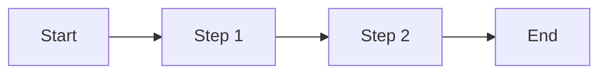

# Functioneel Ontwerp

## 1. Doel en Achtergrond

[Brief description of the project — what problem does it solve, what is
the context, who are the stakeholders.]

## 2. Huidige Situatie

[Description of the current situation and why a change or new solution
is needed.]

## 3. Gewenste Situatie

[Description of the desired outcome after the project is delivered.]

## 4. Functionele Eisen

Numbered list of functional requirements. Each requirement should be
specific, testable, and unambiguous.

- FR-01: [requirement]
- FR-02: [requirement]
- FR-03: [requirement]

## 5. User Stories

Use the "Als ... wil ik ... zodat ..." format.

- Als [rol] wil ik [actie] zodat [doel]
- Als [rol] wil ik [actie] zodat [doel]

## 6. Gegevensmodel

List the main data entities and their attributes.

### [Entity Name]
- [field]: [type] — [description]
- [field]: [type] — [description]

### [Entity Name]
- [field]: [type] — [description]

## 7. API Endpoints

List the REST endpoints if applicable.

| Method | Path | Description |
|--------|------|-------------|
| GET | /api/[resource] | [description] |
| POST | /api/[resource] | [description] |

## 8. Processtroom

Include a Mermaid diagram showing the main process flow.



## 9. Niet-functionele Eisen

- NFR-01: [Performance — e.g., response time < 200ms for 95% of requests]
- NFR-02: [Security — e.g., data encryption at rest with AES-256]
- NFR-03: [Availability — e.g., uptime > 99.5%]
- NFR-04: [Scalability — e.g., support 100 concurrent users]

## 10. Acceptatiecriteria

- AC-01: [criterion]
- AC-02: [criterion]

## 11. Aannames en Beperkingen

[List any assumptions made during the analysis and any constraints
that limit the solution space.]

## 12. Openstaande Vragen

[List any questions that still need to be answered by the user or
other stakeholders.]

---

## Formatting Rules

- Write in English — the platform handles Dutch translation automatically
- Use Mermaid diagrams for process flows and data models
- Use ```mermaid code blocks (never raw text diagrams)
- Keep requirements atomic — one requirement per line
- Number requirements sequentially (FR-01, FR-02, NFR-01, etc.)
- Use tables for API endpoints and structured data
- Keep the document concise — aim for 80-150 lines
- All section headings use ## (level 2)
- The document title uses # (level 1)
