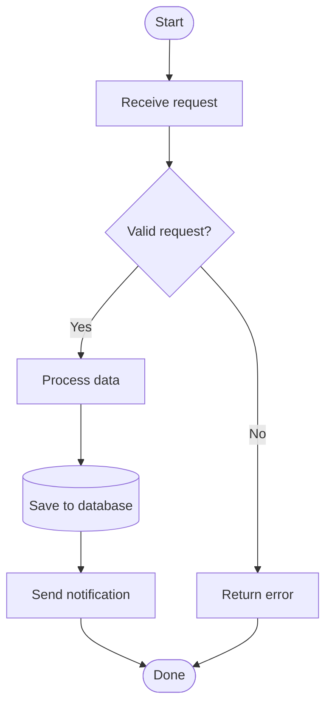

# Making Mermaid Diagrams

Create a diagram when a process has branching logic, multiple components
interact, or the text alone would be ambiguous. Do not create a diagram
for linear processes, trivial structures (2-3 nodes), or abstract
concepts better described in text.

## STOP — Backslash Quotes

Never write `\"` in Mermaid. Mermaid has NO escape characters.
A backslash before a quote (`\"`) is a syntax error that breaks the
entire diagram.

CORRECT:
```
A["My Label"]
A -->|"Label text"| B
subgraph sg["Group Name"]
```

WRONG — every `\"` breaks the diagram:
```
A[\"My Label\"]
A -->|\"Label text\"| B
subgraph sg[\"Group Name\"]
```

This applies everywhere: node labels, edge labels, and subgraph titles.
Use plain `"` — never `\"`.

## STOP — Database Nodes

The #2 most common Mermaid syntax error is writing database nodes wrong.

**Database/storage shape = cylinder = `[("Label")]`**

CORRECT — cylinder:
```
DB[("PostgreSQL")]
```

WRONG — nested delimiters, parse error:
```
DB[(("PostgreSQL"))]
```

The wrong version nests `((` inside `[(`, producing TWO shapes on one
node. Mermaid cannot parse this. If you write a database node, the
delimiter is `[("label")]` — nothing more, nothing less.

CORRECT examples for databases:
```
DB[("My Database")]
store[("Save to DB")]
cache[("Redis Cache")]
```

## One Shape Per Node

Each node gets EXACTLY ONE shape delimiter from the table below.
Never combine or nest delimiters. The opening and closing delimiters
must be a single matched pair from this table — no exceptions.

## Node Shapes — Complete Reference

| Syntax | Shape | Use for |
|--------|-------|---------|
| `["Label"]` | Rectangle | Process steps, actions, components |
| `("Label")` | Rounded rectangle | General steps |
| `(["Label"])` | Stadium | Start / end / terminal events |
| `{"Label"}` | Diamond | Decision points, conditions |
| `{{"Label"}}` | Hexagon | Preparation steps |
| `[["Label"]]` | Subroutine | Sub-processes |
| `(("Label"))` | Circle | Stop / end points |
| `[("Label")]` | Cylinder | **Database / storage** |

These eight are the ONLY valid delimiters. Copy the pattern exactly.
Do not combine them. If you catch yourself writing more than one pair
of brackets around a label, STOP and look up the correct single shape
from this table.

Common wrong combinations and what they should be:
```
WRONG: [(("Label"))]   →  CORRECT: [("Label")]   (cylinder)
WRONG: ([("Label")])   →  CORRECT: (["Label"])    (stadium)
WRONG: ([["Label"]])   →  CORRECT: [["Label"]]    (subroutine)
WRONG: {("Label")}     →  CORRECT: {"Label"}      (diamond)
```

## Node Planning (do this BEFORE writing diagram code)

Before writing any Mermaid code, plan each node in a list:

```
Nodes:
- start: stadium (["Label"])
- validate: diamond {"Label"}
- process: rectangle ["Label"]
- db: cylinder [("Label")]
- finish: stadium (["Label"])
```

Then write the diagram using ONLY the delimiters from your plan. This
prevents mixing shapes during writing.

## Diagram Type Selection

| What to visualize | Mermaid keyword |
|-------------------|-----------------|
| Process with decisions / user journey | `flowchart TD` |
| Component relationships | `flowchart TD` or `flowchart LR` |
| Data flow between systems | `flowchart LR` |
| Interaction sequence between actors | `sequenceDiagram` |
| System states and transitions | `stateDiagram-v2` |

Use **TD** (top-down) for processes and workflows. Use **LR**
(left-right) for data flows and component architectures.

## Edges and Arrows

| Syntax | Type |
|--------|------|
| `A --> B` | Solid arrow |
| `A --- B` | Solid line (no arrow) |
| `A -.-> B` | Dotted arrow |
| `A ==> B` | Thick arrow |
| `A <--> B` | Bidirectional arrow |

Label edges with `A -->|"Label text"| B`. Always quote the label text.

## Subgraphs

```
subgraph sg1["Group Name"]
    A["Step 1"] --> B["Step 2"]
end
```

## Syntax Rules

1. **Never use `end` as a node ID.** It is reserved. Use `finish` or
   similar instead.

2. **Always quote labels** with plain ASCII double quotes: `A["Label"]`.
   Mermaid does not support backslash escaping — `\"` is a parse error.
   Never use backticks in labels — they trigger markdown parsing and
   break rendering.

3. **Parentheses in labels** break shape delimiters. Always use quotes
   around labels that contain `(` or `)`:
   WRONG: `A(Step (optional))` — inner `)` closes the shape early.
   CORRECT: `A["Step (optional)"]` — use rectangle with quotes.

4. **Node IDs must be alphanumeric** (`A-Z`, `a-z`, `0-9`, `_`).
   Avoid node IDs starting with lowercase `o` or `x` — when placed
   directly after an edge (`A-->oNode`), Mermaid reads `o`/`x` as a
   circle/cross edge marker. Safe alternatives: capitalize the ID
   (`Output`), use a prefix (`node_output`), or ensure a space before
   the ID in edges.

5. **Arrows need double dashes minimum.** `->` is NOT valid Mermaid.
   Always use `-->` (two dashes). This is a common mistake.

6. **Use ASCII characters only.** No smart quotes, em dashes, or unicode
   arrows.

7. **Unique node IDs.** Reuse the same ID to reference a node in
   multiple edges.

8. **Line breaks** in labels: use `<br/>` inside quoted labels.

9. **Max 15 nodes** per diagram. Split into multiple diagrams if larger.

## Functional vs Technical Diagrams

**Functional diagrams** visualize what happens from the user's
perspective. Include user actions, system responses, decision points, and
success/failure paths. Exclude implementation details — the diagram
should be solution-agnostic.

**Technical diagrams** visualize how the system is built. Include
components, data flows with direction and content, security boundaries,
and deployment topology. Exclude abstract reasoning better suited to text.

## Complete Example

Node plan:
- start: stadium `([""])`
- input: rectangle `[""]`
- validate: diamond `{""}`
- process: rectangle `[""]`
- reject: rectangle `[""]`
- store: cylinder `[("")]` ← database, NOT `[((""))]`
- notify: rectangle `[""]`
- finish: stadium `([""])`



## Self-Verification (MANDATORY before outputting any diagram)

Go through EVERY node in your diagram and do these checks. If any check
fails, fix the node BEFORE outputting the diagram.

**Check 1 — No backslash quotes (most common error):**
Scan your entire diagram for `\"`. If you find even ONE backslash-quote,
the diagram is BROKEN. Replace every `\"` with `"`. This applies to
node labels, edge labels, and subgraph titles.

**Check 2 — Database nodes:**
Search for any database/storage node. The delimiter MUST be
`[("Label")]`. If you see `[(("Label"))]` or any other nesting, it is
WRONG. Fix it to `[("Label")]`.

**Check 3 — One shape per node:**
For every node, verify the delimiters match exactly one entry from the
Node Shapes table. Valid delimiters (and ONLY these):
`[""]`  `("")`  `([""])` `{""}` `{{""}}` `[[""]]` `((""))` `[("")]`
If a node has more characters around the label than any entry above,
it has nested delimiters and is broken.

**Check 4 — Quotes:**
All labels use plain ASCII `"` (straight quotes, not curly/smart quotes).

**Check 5 — Edge labels:**
All decision edges have labels: `-->|"label"|`

**Check 6 — Arrows:**
All arrows use double dashes minimum: `-->` not `->`.

**Check 7 — Reserved words:**
No node ID is the bare word `end`.

**Check 8 — Node IDs:**
All alphanumeric only (`A-Z`, `a-z`, `0-9`, `_`). None start with
`o` or `x`.
