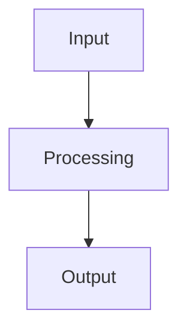

# Technical Design

> Platform standards: conforms to [docs/platform-technical-standards.md](./platform-technical-standards.md) rev `<revision>`.

**First line is MANDATORY.** Copy the revision from the standards file. Do not restate anything it covers (stack, template, modules, DB, API layering, frontend conventions, testing, Druppie auth, deployment, git) — those are givens.

## Introduction

### Subject
[Brief description]

### Problem Summary
[Description of the problem from FD]

### Functional Question (from FD by Business Analyst)
[What is the business question?]

### Research
Gebaseerd op [docs/technical-research.md](./technical-research.md). Gekozen
benadering: **[A / B / C — naam]**. Zie het onderzoeksdocument voor de
vergelijking van alternatieven en de externe-koppelingen analyse.

## Solution

### Applied Principles (per NORA layer)
Only the NORA/WILMA layers that matter for this project. Skip layers
fully covered by the platform defaults.
* **Foundations:** [Which laws/principles are relevant?]
* **Organization:** [Water authority context]
* **Information:** [Data flows specific to this project]
* **Application:** [Project-specific components only — the template
  scaffold is a given]
* **Security & Privacy:** [PII / data classification for THIS project.
  Druppie-level auth is the platform standard and is not restated here.]

### Requirements
| ID | Source | Requirement | Verification Method |
|----|--------|-------------|---------------------|
| FR-01 | BA | [Functional requirement from FD] | Functional test |
| FR-02 | BA | [Functional requirement from FD] | Functional test |
| NFR-01 | BA | [Non-functional requirement from FD] | Performance test |
| TR-01 | AR | [Technical requirement from architecture] | Code inspection |
| TR-02 | AR | [Technical requirement from architecture] | Config check |

Source: BA = from Business Analyst (FR/NFR) | AR = from Architect (TR)

### Architectural Solution

#### 1. Component Structure (Logical)
* New Components: [Logical components — names and responsibilities, not file paths]
* Reuse: [Existing modules / template pieces referenced]
* Responsibilities: [Description]
* Impact Analysis: [Impact on existing code]
* NFRs: [Project-specific specifications]

#### 2. Data Architecture & Integration
* Data Model: [Entities, relationships, and classification (PII, confidentiality).
  Follow the DB rules from platform-standards §5. Exact column types are builder_planner's call.]
* Data Flows: [Which data moves between which components, and why]
* Integration Points: [External systems and trust boundaries. Contracts
  with external consumers (other Druppie agents, user-facing apps, 3rd party
  APIs) are pinned here. Internal endpoint signatures are builder_planner's call.]

  Voor elke externe koppeling MOET de TD een expliciete modulekeuze
  opnemen (overgenomen uit docs/technical-research.md):

  | Extern systeem | Categorie | Beslissing | Module | Toelichting |
  |----------------|-----------|------------|--------|-------------|
  | ... | organizational / other | REUSE / EXTEND / NEW / PROJECT-SPECIFIC | `<module_id>` of "n.v.t." | ... |

  Regels voor deze tabel:
  - `organizational` koppelingen (waterschap bronsystemen, zaaksysteem,
    DMS, archiefsysteem, referentiedata, waterschap-auth, …) MOETEN één
    van REUSE / EXTEND / NEW hebben. PROJECT-SPECIFIC is hier niet
    toegestaan.
  - PROJECT-SPECIFIC is alleen toegestaan bij `other`, en vereist een
    sectie "Direct integration rationale" direct onder de tabel met
    (a) waarom niet herbruikbaar, (b) waarom geen module, (c) welk
    hergebruik-risico geaccepteerd wordt.
  - "Niet van toepassing" / "geen modules nodig" als verdict over de
    koppelingen is niet acceptabel als er één of meer organizational
    koppelingen in scope zijn — noem dan expliciet welke modules
    (REUSE/EXTEND/NEW) elke koppeling afdekken.

(Deployment / hosting / infra is the platform default — do not restate it
unless this project deviates.)

### Security & Compliance (project-specific only)
Druppie-level auth is a platform standard — do not describe it.
Only include rows here when they differ from the default "authenticated
Druppie user accesses their own data".

| Aspect | Project-specific measure | Explanation |
|--------|--------------------------|-------------|
| Data Protection | ... | ... |
| PII handling | ... | ... |

Compliance rows (GDPR legal basis, retention, DPIA, BIO) only when the
project handles data that triggers them — otherwise omit the table.

### Platform standard deviations
List every place this project intentionally breaks with
`docs/platform-technical-standards.md`, with a short rationale. Use an
empty list if there are no deviations:

| Section | Deviation | Rationale |
|---------|-----------|-----------|
| (none) | | |

### Visualization

Include: Overview, Components, File Structure, Technology Choices.
Only use diagram types covered by the making-mermaid-diagrams skill.
Detailed enough for builder_planner to plan implementation — framework, versions, endpoint signatures and file layout are their call, not the TD's.

### Module Samenvatting (alleen bij een nieuwe module)
Only include this section when the design introduces a new Druppie MCP
module — i.e. when BUILD_PATH=CORE_UPDATE with at least one NEW module
(see Step 2b). Keep this concise — the update_core_builder reads the
full module convention from docs/module-specification.md.

- **Module ID:** <name>
- **Type:** core | module | both
- **Stateful/Stateless:** <yes/no>
- **Beschrijving:** <korte beschrijving van wat de module doet>
- **Tools:**
  | Tool naam | Beschrijving |
  |-----------|-------------|
  | tool_1 | Wat deze tool doet |
  | tool_2 | Wat deze tool doet |
