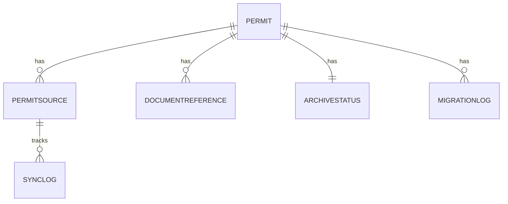
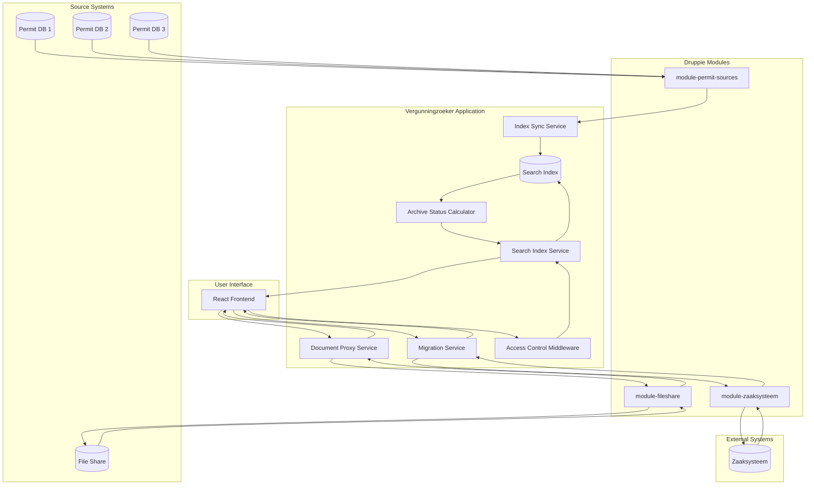
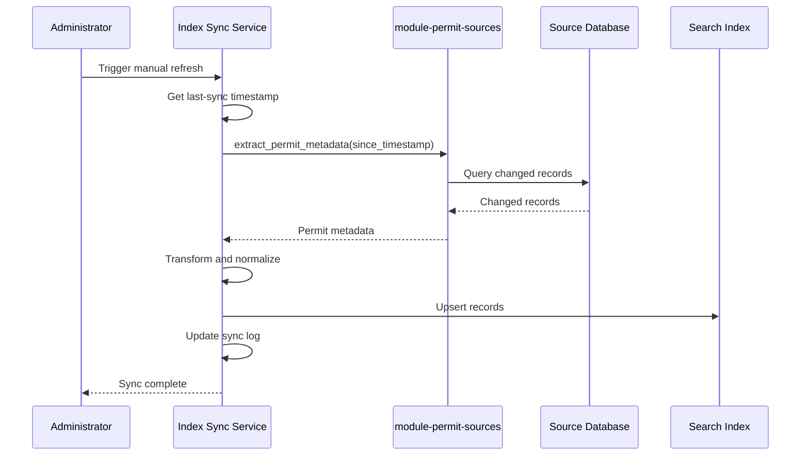
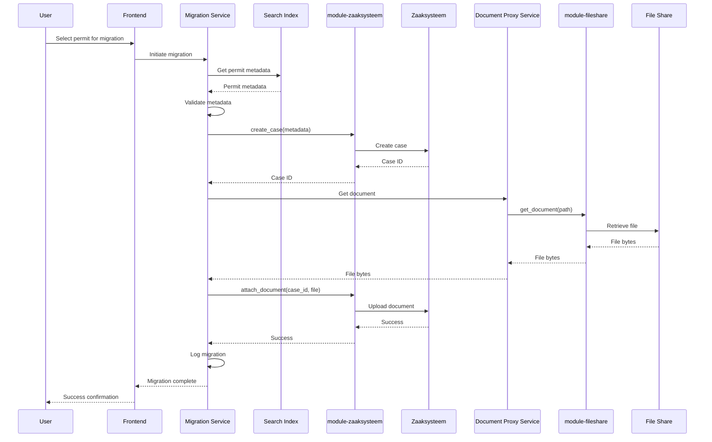

# Technical Design

> Platform standards: conforms to [docs/platform-technical-standards.md](./platform-technical-standards.md) rev 2026-06-01.

> **Disclaimer:** Dit document is gegenereerd met behulp van AI. Controleer de inhoud zorgvuldig voor gebruik. / This document was generated with the help of AI. Please review the content carefully before use.

## Introduction

### Subject

Permit Metadata Search (vergunningzoeker) — a unified search interface for historical and current water authority permits, enabling metadata search across multiple legacy databases, document access, archive status tracking, and migration to a case management system.

### Problem Summary

The water authority currently has fragmented permit data stored in multiple legacy databases with different numbering systems and search interfaces. Historical permits (pre-2018) can only be searched by K/L-number, while newer permits support location-based search. Knowledge about where and how to search is dependent on experienced staff, creating a single point of failure. The organization lacks a complete overview of all permits and their archive status, risking non-compliance with the Archives Act.

### Functional Question (from FD by Business Analyst)

How can we provide a single, intuitive search interface that enables all authorized staff to find permits across all historical periods and source systems, view their archive status, and migrate them to the case management system?

### Research

Based on [docs/technical-research.md](./technical-research.md). Chosen approach: **Approach C — Hybrid Index with Incremental Updates**. See the research document for the comparison of alternatives and the external connections analysis.

## Solution

### Applied Principles (per NORA layer)

* **Foundations:** Archives Act (Archiefwet) requires complete overview of permit locations and retention periods. Waterschappen Selectielijst 2012 provides the framework for archive nominations and retention.
* **Organization:** Water authority context with multiple departments (vergunningen, planning, archief) requiring controlled access. Principle 3 (Every primary data element has an owner) applies — source system owners remain responsible for data quality.
* **Information:** Principle 13 (A data element has one source) — permit data remains in source systems; the search index is a derived view for performance. Data flows from source databases → index → search results, and from index → zaaksysteem for migration.
* **Application:** Principle 11 (Standard before custom, joint before individual) — new Druppie modules are proposed for reusable integration with legacy systems. Principle 12 (One application per type of functionality) — Vergunningzoeker is the single search interface for permits.
* **Security & Privacy:** Principle 20 (Information security and business continuity) — access restricted to authorized departments. Principle 22 (Privacy by Design and Default) — personal data (names, addresses) is protected through department-based access control and audit logging.

### Requirements

| ID | Source | Requirement | Verification Method |
|----|--------|-------------|---------------------|
| FR-01 | BA | The system provides a single search box that searches across all metadata fields simultaneously. | Functional test |
| FR-02 | BA | The system provides an advanced search option with filters for specific metadata fields. | Functional test |
| FR-03 | BA | The system indexes and searches metadata of: applicant name, permit holder name, issuer name, location, dates, permit number (K, L, etc.), applicable law, work type, surface water type, dike type. | Functional test |
| FR-04 | BA | The system displays all available metadata fields for each permit in search results. | Functional test |
| FR-05 | BA | The system allows users to view detailed permit information. | Functional test |
| FR-06 | BA | The system displays which source system each permit originates from. | Functional test |
| FR-07 | BA | The system allows users to open or download original permit documents (PDFs, scans). | Functional test |
| FR-08 | BA | The system provides access restriction so only users from specific departments (e.g., permits, planning) have access. | Functional test |
| FR-09 | BA | The system displays the archive nomination (preserve or destroy) for each permit based on document type per the Waterschappen Selectielijst 2012. | Functional test |
| FR-10 | BA | The system displays the retention period for each permit if the archive nomination is "destroy" (per Waterschappen Selectielijst 2012). | Functional test |
| FR-11 | BA | The system displays the current archive status of each permit (to preserve indefinitely, or retention period expired/not expired). | Functional test |
| FR-12 | BA | The system allows users to migrate permit documents and their metadata to the case management system. | Functional test |
| NFR-01 | BA | The system must return search results within 5 seconds. | Performance test |
| NFR-02 | BA | The system must be accessible to 20+ concurrent users. | Load test |
| NFR-03 | BA | The system must be available during regular office hours. | Monitoring |
| NFR-04 | BA | The user interface must be intuitive and require no training for new employees. | Usability test |
| NFR-05 | BA | The system must protect personal data (names, addresses, contact details) from unauthorized access. | Security test |
| NFR-06 | BA | The system must maintain audit logs of who performs which searches and migrations. | Test |
| NFR-07 | BA | Migrations must guarantee data integrity: metadata and documents must be transferred completely and correctly. | Test |
| TR-01 | AR | The search index must support full-text search across all metadata fields. | Code inspection |
| TR-02 | AR | Incremental sync must identify and update only changed records since last sync. | Code inspection |
| TR-03 | AR | Manual refresh must complete within 2 minutes for typical dataset sizes. | Performance test |
| TR-04 | AR | Document proxy must cache frequently accessed documents to reduce file share load. | Code inspection |
| TR-05 | AR | Archive status must be calculated automatically based on document type and issue date. | Code inspection |
| TR-06 | AR | Access control must restrict search and document access to authorized departments. | Security test |

Source: BA = from Business Analyst (FR/NFR) | AR = from Architect (TR)

### Architectural Solution

#### 1. Component Structure (Logical)

**New Components:**
- **Search Index Service** — Manages the centralized permit metadata index in Postgres, handles full-text search queries, and returns ranked results.
- **Index Sync Service** — Background service that performs incremental updates from source databases using `module-permit-sources`, tracks last-sync timestamps, and supports manual refresh triggers.
- **Document Proxy Service** — Proxies document access to file shares via `module-fileshare`, implements caching for frequently accessed documents, and generates time-limited access URLs.
- **Migration Service** — Coordinates permit migration to the zaaksysteem via `module-zaaksysteem`, validates data integrity before and after transfer, and logs migration status.
- **Archive Status Calculator** — Calculates archive nomination and retention status based on document type (from embedded Selectielijst 2012 reference data) and issue date.
- **Access Control Middleware** — Enforces department-based access control using Druppie-provided user attributes, logs all access attempts, and blocks unauthorized requests.

**Reuse:**
- Platform template (FastAPI + React + Postgres)
- Druppie authentication (Keycloak-based, department attributes in headers)
- `module-permit-sources` (NEW) — for legacy database access
- `module-fileshare` (NEW) — for document storage access
- `module-zaaksysteem` (NEW) — for case management system integration

**Responsibilities:**
- Search Index Service: Query optimization, relevance ranking, result pagination
- Index Sync Service: Change detection, conflict resolution, error handling
- Document Proxy Service: Access control, cache management, URL generation
- Migration Service: Data validation, transaction management, status tracking
- Archive Status Calculator: Rule evaluation, status computation, expiry detection
- Access Control Middleware: Authorization enforcement, audit logging

**Impact Analysis:**
- No impact on existing code — this is a new project
- New modules (`module-permit-sources`, `module-fileshare`, `module-zaaksysteem`) will be created as part of CORE_UPDATE
- Application follows platform template conventions

**NFRs:**
- Search latency < 5 seconds achieved through local index and optimized queries
- 20+ concurrent users supported by connection pooling and async processing
- Department-based access control enforced at middleware level
- Audit logging captures all search and migration actions

#### 2. Data Architecture & Integration

**Data Model:**

The application maintains the following core entities in Postgres:

- **Permit** — Central indexed permit record with all searchable metadata fields
- **PermitSource** — Reference to the source system and original record identifier
- **DocumentReference** — Link to original document in file share storage
- **ArchiveStatus** — Calculated archive nomination, retention period, and current status
- **SyncLog** — Track index synchronization history and last-sync timestamps
- **MigrationLog** — Track migration history to zaaksysteem



**Data Flows:**

1. **Indexing Flow:** Source databases → `module-permit-sources` → Index Sync Service → Search Index (Postgres)
2. **Search Flow:** User query → Search Index Service → Search Index → Ranked results → Frontend
3. **Document Access Flow:** User request → Document Proxy Service → `module-fileshare` → File Share → Cached response
4. **Migration Flow:** User selection → Migration Service → `module-zaaksysteem` → Case Management System
5. **Archive Status Flow:** Permit data → Archive Status Calculator → Selectielijst rules → Archive Status

**Integration Points:**

| External system | Category | Decision | Module | Explanation |
|----------------|-----------|------------|--------|-------------|
| Legacy permit databases (vergunningen, planning, archief) | organizational | NEW | module-permit-sources | Reusable access to legacy permit databases across water authority projects |
| File shares (document storage) | organizational | NEW | module-fileshare | Reusable access to organizational file shares with centralized security |
| Custom zaaksysteem (case management system) | organizational | NEW | module-zaaksysteem | Reusable integration with custom zaaksysteem for case creation and migration |
| Waterschappen Selectielijst 2012 (reference data) | organizational | PROJECT-SPECIFIC | n/a | Static reference data embedded as application configuration |
| Druppie authentication (Keycloak) | organizational | REUSE | n/a | Platform standard — auth handled centrally |

**Direct integration rationale for Selectielijst 2012:**
(a) The Selectielijst 2012 is a static, published standard that does not change frequently. Embedding it as configuration is sufficient.
(b) A module would add overhead (module infrastructure, MCP calls) for data that is essentially a lookup table.
(c) Future reuse risk is low: the reference data is stable and well-documented; other projects can embed the same data if needed.

#### 3. RAG choices

This design does not include a RAG component. The search functionality is based on structured metadata indexing and full-text search in Postgres, not on semantic search over unstructured documents. Document content (PDFs, scans) is served as-is without vectorization or semantic retrieval.

### Security & Compliance (project-specific only)

| Aspect | Project-specific measure | Explanation |
|--------|--------------------------|-------------|
| Data Protection | Department-based access control | Only users from authorized departments (vergunningen, planning, archief) can search and view permits. Access enforced at middleware level using Druppie-provided department attributes. |
| PII handling | Audit logging and access restriction | Personal data (names, addresses) is logged in audit trails. All access attempts are recorded with user identity, timestamp, and accessed record IDs. |
| Data integrity | Migration validation | Before and after migration to zaaksysteem, metadata and document hashes are compared to ensure complete and correct transfer. |
| Document security | Time-limited URLs | Document access URLs generated by Document Proxy Service are time-limited and include user-specific tokens to prevent unauthorized sharing. |

**Compliance:**
- **GDPR legal basis:** Public task (wettelijke taak) — the water authority has a statutory duty to manage permits under the Water Act.
- **Retention:** Archive status and retention periods are calculated based on the Waterschappen Selectielijst 2012. The system does not automatically delete data; destruction is a separate administrative process.
- **DPIA:** Not required — the system processes existing permit data for internal administrative purposes with no novel processing activities.
- **BIO:** The system complies with the Baseline Informatiebeveiliging Overheid through department-based access control, audit logging, and secure document proxying.

### Platform standard deviations

| Section | Deviation | Rationale |
|---------|-----------|-----------|
| (none) | | |

### Visualization

**Application Architecture:**

```archimate
view-id: id-9574ef33afe4438a97eb66e6eeec4057
file: docs/architecture.archimate
```

**Data Flow:**



**Index Sync Process:**



**Migration Process:**



### Module Summary (only when introducing a new module)

This project introduces three new Druppie MCP modules as part of CORE_UPDATE:

#### Module: module-permit-sources

- **Module ID:** module-permit-sources
- **Type:** module
- **Stateful/Stateless:** stateless
- **Description:** Provides reusable access to legacy permit databases across water authority projects, enabling metadata extraction and schema discovery.
- **Tools:**
  | Tool name | Description |
  |-----------|-------------|
  | list_permit_sources | Lists all configured permit databases with connection details |
  | get_permit_schema | Returns schema/metadata for a specific source database |
  | extract_permit_metadata | Extracts permit metadata records changed since a given timestamp |
  | test_connection | Verifies connectivity to a source database |

#### Module: module-fileshare

- **Module ID:** module-fileshare
- **Type:** module
- **Stateful/Stateless:** stateless
- **Description:** Provides reusable access to organizational file shares with centralized security and access logging.
- **Tools:**
  | Tool name | Description |
  |-----------|-------------|
  | list_documents | Lists documents in a file share path matching a pattern |
  | get_document | Retrieves document bytes from a file share |
  | get_document_url | Generates a time-limited, proxied URL for document access |

#### Module: module-zaaksysteem

- **Module ID:** module-zaaksysteem
- **Type:** module
- **Stateful/Stateless:** stateless
- **Description:** Provides reusable integration with the custom zaaksysteem for case creation and document migration.
- **Tools:**
  | Tool name | Description |
  |-----------|-------------|
  | create_case | Creates a new case in the zaaksysteem with provided metadata |
  | attach_document | Attaches a document to an existing case |
  | get_case_status | Retrieves the current status of a case |
