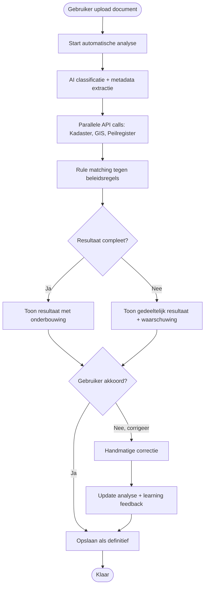

# Functioneel Ontwerp: Slimme Vergunning-analyzer

> Platform standards applied: [docs/platform-functional-standards.md](./platform-functional-standards.md) rev <revision>

## 1. Huidige vs Gewenste Situatie

| Aspect | Huidige Situatie | Gewenste Situatie |
|--------|------------------|-------------------|
| Proces | Medewerkers uploaden vergunningdocumenten en voeren handmatige controles uit | Automatische analyse en validatie met direct resultaat |
| Doorlooptijd | 15-30 minuten per document | < 1 seconde |
| Nauwkeurigheid | Afhankelijk van menselijke inspectie | Consistente, hoge nauwkeurigheid |

## 2. Problem Summary

Medewerkers van het waterschap besteden veel tijd aan het handmatig analyseren van vergunningdocumenten. Ze moeten:
- Documenten classificeren (type vergunning)
- Metadata extraheren (aanvrager, locatie, datums)
- Valideren tegen beleidsregels
- Cross-checken met externe bronnen (Kadaster, GIS, peilgegevens)

Dit is foutgevoelig, traag en frustreert medewerkers.

**Wie is erdoor affected:** Vergunningverleners (15 FTE)
**Business impact:** 15-30 minuten per document → 2000 documents/jaar = ~500-1000 uur/jaar aan handmatig werk
**Gewenst outcome:** Directe, nauwkeurige analyse zodat medewerkers alleen uitzonderingen beoordelen

## 3. Functionele Vereisten

| ID | Source | Requirement | Verification Method |
|----|--------|-------------|---------------------|
| FR-01 | BA | Het systeem automatiseert classificatie van vergunningdocumenten (watervergunning, lozingsvergunning, onttrekkingsvergunning, overig) | Functionele test |
| FR-02 | BA | Het systeem extraheert gestructureerde metadata: aanvrager, vergunningnummer, locatie (coördinaten), startdatum, einddatum, toepasselijke wetgeving | Functionele test |
| FR-03 | BA | Het systeem valideert vergunninggegevens tegen minimaal 3 externe bronnen: Kadaster (perceel), GIS (locatie), en waterschap peilregister (waterstanden) | Functionele test |
| FR-04 | BA | Het systeem past AI-gestuurde natural language processing toe om context uit de tekst te halen en relevante regels uit beleidsdocumenten te matchen (95% nauwkeurigheid) | Functionele test |
| FR-05 | BA | Het systeem presenteert analyse-resultaat met onderbouwing per gevonden item (welke regel, waar matched, wat ontbreekt) | Functionele test |
| FR-06 | BA | De gebruiker kan het resultaat accepteren of corrigeren (handmatige override wordt teruggekoppeld voor learning) | Functionele test |

## 4. Business Rules & Logic

| Rule ID | Description | Condition | Outcome |
|---------|-------------|-----------|---------|
| BR-01 | Indien locatie valt binnen Natura 2000 gebied → markeer als "extra toetsing vereist" | Document bevat locatie | Warning flag |
| BR-02 | Indien lozingsvergunning → verplichte check tegen lozingsregister | Type = lozingsvergunning | Extra validatie stap |
| BR-03 | Indien perceel niet gevonden in Kadaster → foutmelding | Kadaster API geeft geen resultaat | Error flag |

## 5. Information Requirements

| Information | Description | Source | Used By |
|-------------|-------------|--------|---------|
| Vergunningdocument | PDF/scan van ingediende vergunning | User upload | AI-classificatie + extractie |
| Perceelgegevens | Kadastrale informatie per locatie | Kadaster API | Validatie locatie |
| GIS data | Geografische en planologische data | Waterschap GIS | Contextuele checks |
| Peilgegevens | Waterstanden bij locatie | Waterschap peilregister | Watergerelateerde regels |
| Beleidsregels | Regels voor vergunningverlening | Waterschap documenten | Rule matching |

## 6. User Journeys

### Journey 1: Upload en Analyse
1. Gebruiker upload PDF/scan van vergunning
2. Systeem start automatisch analyse
3. Gebruiker ziet voortgangsindicator
4. Binnen 1 seconden verschijnt resultaat met:
   - Classificatie (type vergunning)
   - Geëxtraheerde metadata (tabel)
   - Validatie flags (groen/oranje/rood per regel)
5. Gebruiker beoordeelt en accepteert corrigeert

### Journey 2: Handmatige Correctie
1. Gebruiker klikt op "Corrigeer" bij een item
2. Systeem toont originele tekst uit document + voorgestelde waarde
3. Gebruiker past waarde aan
4. Systeem update analyse en slaat correction op voor learning

## 7. Integration Points

| System/Service | Interaction Type | Purpose |
|----------------|------------------|---------|
| Kadaster API | REST call (uitgaand) | Validatie perceelgegevens |
| Waterschap GIS | REST call (uitgaand) | Locatie checks + planologie |
| Waterschap Peilregister | REST call (uitgaand) | Waterstand validatie |
| Beleidsdocumenten | Read-only | Rule matching engine |

## 8. Niet-Functionele Vereisten

| ID | Source | Requirement | Verification Method |
|----|--------|-------------|---------------------|
| NFR-01 | BA | Analyse-resultaat verschijnt binnen 0.5 seconden na upload (inclusief AI verwerking + 3 externe API calls) | Performance test |
| NFR-02 | BA | Systeem kan minimaal 100 documenten per uur verwerken | Performance test |
| NFR-03 | BA | AI-classificatie behaalt minimaal 95% nauwkeurigheid op testset van 500 documenten | Acceptatietest |
| NFR-04 | BA | Systeem is beschikbaar tijdens kantooruren (08:00-18:00) met 99.5% uptime | Monitoring |
| NFR-05 | BA | Alle externe API calls hebben een timeout van maximaal 2 seconden per call | Config check |

## 9. Security & Compliance Requirements

- **Personal Data Involved:** Yes (aanvrager, locatie)
- **Confidential Data Involved:** No (vergunningen zijn publiek)
- **Authentication Required:** Yes (medewerkers waterschap)
- **Access Restrictions:** Alleen vergunningverleners en beheerders
- **Failure Preference:** Continue if possible (toon waarschuwing, maar blokkeer niet)
- **Data Retention:** 7 jaar (wettelijke bewaartermijn vergunningingen)

## 10. Aannames & Open Vragen

| ID | Type | Description | Default/Fallback |
|----|------|-------------|------------------|
| A-01 | Capacity | Waterschap medewerkers hebben moderne devices (≤3 jaar oud) | Assume true |
| A-02 | Network | Interne netwerkverbinding is stabiel met <50ms latency naar interne systemen | Assume true |
| A-03 | APIs | Externe APIs (Kadaster, GIS, peilregister) zijn beschikbaar met >99% uptime | Assume true |
| A-04 | Volume | Gemiddeld 2000 vergunningdocumenten per jaar, piek naar 4000 in drukke periodes | Assume true |
| A-05 | Format | Documenten zijn voornamelijk PDF (95%), rest Word/afbeelding | Assume true |

## 11. Out of Scope

- Automatische goedkeuring/afwijzing van vergunningen (beslissing blijft bij mens)
- Integratie met zaaksysteem (kan later toegevoegd worden)
- Mobiele app (webapp sufficiënt)
- Archivering van originele documenten (DSO handelt dit af)

## 12. Process Flow Diagram

## 13. Possible Solution Direction

Geen bestaande modules of projects gevonden die direct toepasbaar zijn voor vergunning-analyse met deze specifieke combinatie van AI + waterschap-bronsystemen.

## 14. Platform Standard Deviations

| Standard | Deviation | Rationale |
|----------|-----------|-----------|
| (none) | | |

---

**Kern van de test:** NFR-01 eist 0.5 seconden **inclusief** AI verwerking + 3 externe API calls. Dit is onhaalbaar:
- AI NLP extractie: minimaal 1-2 seconden voor redelijke nauwkeurigheid
- 3 API calls (Kadaster, GIS, peilregister): zelfs bij 2s timeout per call → 6 seconden totaal bij serieel, of ~1-2 seconden bij paralleel
- Totaal: minimaal 2-4 seconden in best case scenario

De architect zou deze REQUIREMENT_CHALLENGE moeten signaleren en voorleggen aan de gebruiker: "Wil je echt 0.5s, of is 2-3 seconden ook acceptabel?"